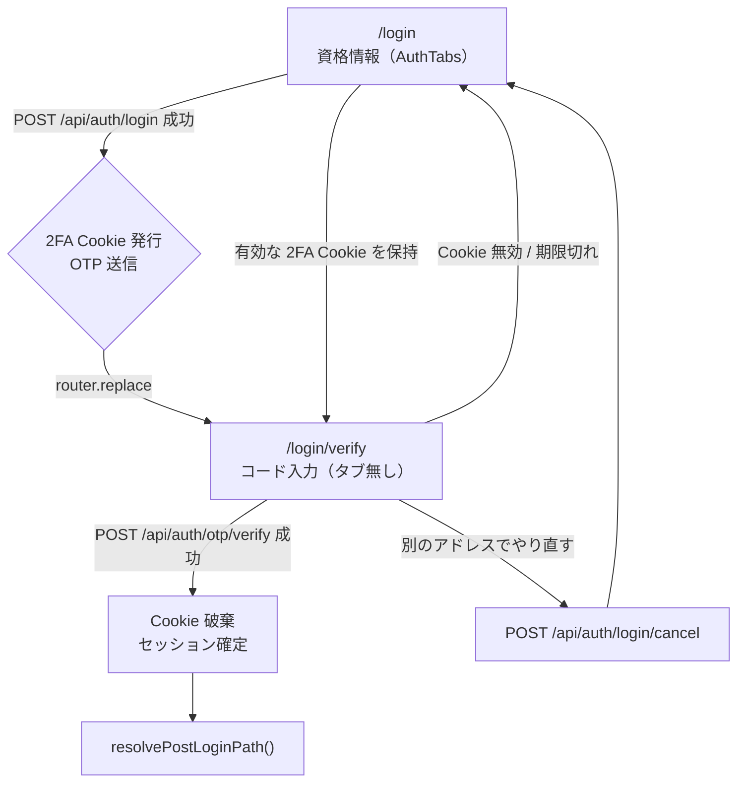
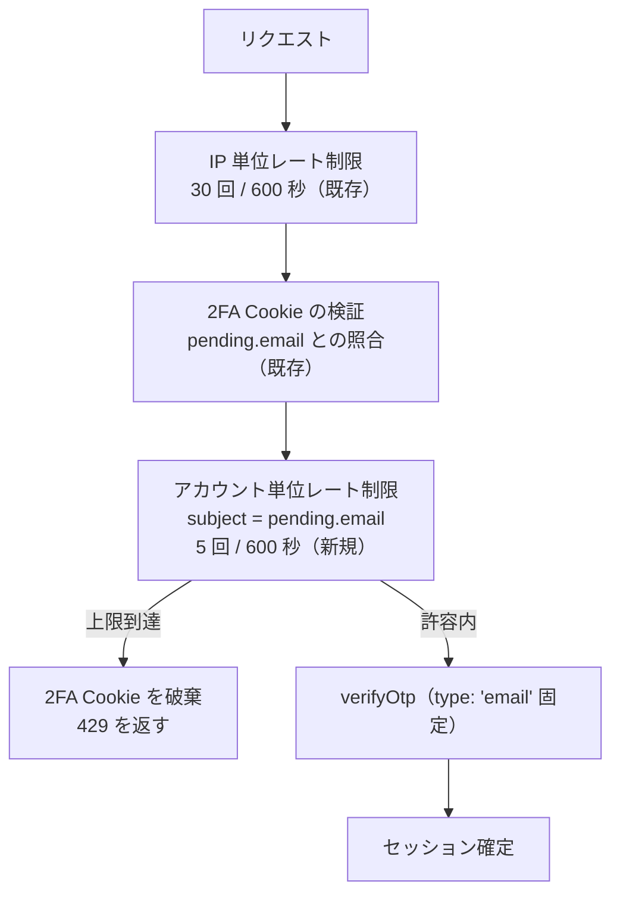

# ログインの 2 要素目を専用画面へ分離する設計

> 対象: `/login`（AuthTabs / LoginModal）、`/api/auth/login`、`/api/auth/otp/verify`
> 関連: [spec.md](../../2_Specs/spec.md) FREQ-334 / FREQ-335
> 作成日: 2026-09-04

---

## 概要

ログインの第 2 要素（メール OTP）の入力を、ログイン / 会員登録タブの中の一状態から、専用ルート `/login/verify` へ切り出す。あわせて、この分離によって悪化する OTP 検証側の 2 つの穴を塞ぐ。

| 項目           | 内容                                                                                                              |
| -------------- | ----------------------------------------------------------------------------------------------------------------- |
| 主目的         | OTP 入力を独立した画面にし、リロード・戻る・タブ切り替えで詰む状態を構造的に消す                                  |
| 新ルート       | `/login/verify`（Server Component でゲート）                                                                      |
| ゲート方式     | 既存の署名 Cookie `sb-login-2fa-session` をサーバーで検証。無効なら `/login` へリダイレクト                       |
| 新規 API       | `POST /api/auth/login/cancel`（2FA Cookie の破棄）、`POST /api/auth/login/resend`（Cookie 由来の宛先へ OTP 再送） |
| 併せて直す穴 1 | `/api/auth/otp/verify` にアカウント単位のレート制限が無い（FREQ-335）                                             |
| 併せて直す穴 2 | `verifyOtp` が `email` / `magiclink` / `signup` を総当たりしている（FREQ-335）                                    |
| 宛先の表示     | ローカル部をマスクして表示（`14***56@gmail.com`）                                                                 |
| スコープ外     | Google サインイン経路、会員登録フロー、`?next=` によるリダイレクト先指定                                          |

### 解決する欠陥

| #   | 欠陥                                 | 現状の影響                                                                                                                                              |
| --- | ------------------------------------ | ------------------------------------------------------------------------------------------------------------------------------------------------------- |
| 1   | OTP ステップが React state のみ      | リロードすると資格情報フォームに戻る。2FA Cookie は生きているので、再ログインすると 2 通目の OTP が飛び、アカウント制限（5 回 / 600 秒）を 1 回消費する |
| 2   | 検証中もタブが押せる                 | 「会員登録」を押すと LoginModal がアンマウントされ、OTP 入力が消える。戻る導線が無い                                                                    |
| 3   | URL が状態を表さない                 | 両ステップとも `/login`。解析・問い合わせ対応でどちらにいるか区別できない                                                                               |
| 4   | OTP 検証にアカウント単位の制限が無い | IP を分散すれば試行を積める                                                                                                                             |
| 5   | `verifyOtp` の type 総当たり         | 1 回の入力で Supabase 側の検証を最大 3 回消費し、別目的のトークンも受理しうる                                                                           |

---

## 1. 現状

### 1.1 画面

`/login` は [AuthTabs](../../../src/components/AuthTabs.tsx) を描画する。tablist（ログイン / 会員登録）の下の tabpanel に [LoginModal](../../../src/components/LoginModal.tsx) が入り、LoginModal が資格情報ステップと OTP ステップを同一の `<form>` で切り替える（`onSubmit={otpSent ? handleVerifyOtp : handleLogin}`）。Email 欄は `disabled` のまま残り、送信ボタンの文言だけが「ログイン」から「サインイン」へ変わる。

LoginModal は [Header](../../../src/components/Header.tsx) からも本物のモーダルとして開かれる。

### 1.2 サーバー

サーバー側は既に 2 段階に分離されている。

| エンドポイント              | 役割                                                                                             |
| --------------------------- | ------------------------------------------------------------------------------------------------ |
| `POST /api/auth/login`      | パスワード検証 → OTP 送信 → 署名 Cookie `sb-login-2fa-session` を発行。セッションは発行しない    |
| `POST /api/auth/otp/verify` | 2FA Cookie を必須とし、`pending.email !== email` も照合したうえで OTP を検証し、セッションを確定 |

Cookie は `httpOnly` / `SameSite=Strict`、TTL 10 分（[login-2fa-session.ts](../../../src/features/auth/services/login-2fa-session.ts)）。

このため、専用ルート化にあたって新しいサーバー状態は必要ない。

---

## 2. 全体フロー

最後の経路（`/login` に有効な Cookie がある場合に `/login/verify` へ送る）が、欠陥 1 の再発を閉じる。

---

## 3. ルートと画面

### 3.1 `src/app/login/verify/page.tsx`（Server Component）

| 項目     | 内容                                                                                          |
| -------- | --------------------------------------------------------------------------------------------- |
| 責務     | 2FA Cookie の検証とゲートのみ。UI は持たない                                                  |
| 処理     | `cookies()` から `sb-login-2fa-session` を読み、`verifyLoginTwoFactorSessionToken` で検証する |
| 無効時   | 不在・改竄・期限切れをすべて同じく `redirect("/login")` にする。アカウントの存在を示唆しない  |
| 有効時   | `<VerifyOtpClient email={session.email} />` を描画                                            |
| metadata | `robots: { index: false, follow: false }`（`/auth/password-reset/verify` と同じ）             |

ゲートをサーバーに置く理由は、判定前に HTML を送らないため。クライアント判定にすると、リダイレクトされるまでの一瞬フォームが見える。Supabase の MFA サンプル（[Multi-Factor Authentication (Phone)](https://supabase.com/docs/guides/auth/auth-mfa/phone) の `AppWithMFA`）も、チャレンジをアプリ全体と差し替える画面として書いており、この方針と整合する。

### 3.2 `src/app/login/verify/VerifyOtpClient.tsx`

LoginModal から OTP 関連を移設する。

| 要素       | 内容                                                                                                                    |
| ---------- | ----------------------------------------------------------------------------------------------------------------------- |
| コード入力 | 8 桁の分割入力。ペースト対応、矢印キー移動、1 桁目に `autoComplete="one-time-code"`（移設時に落とさない）               |
| 宛先       | マスクした宛先を表示（第 6 章）                                                                                         |
| 有効期限   | 「コードは 5 分間有効です」を明示                                                                                       |
| 再送       | 60 秒のカウントダウンと再送ボタン。`POST /api/auth/login/resend` を叩く（第 5.4 章）。パスワードも Turnstile も要らない |
| やり直し   | 「別のアドレスでやり直す」→ `POST /api/auth/login/cancel` の後に `/login` へ                                            |
| 画面構成   | `/auth/password-reset` の結果画面と同じ順序（図 → 見出し → 補足 → 入力 → 主アクション → 逃げ道）を反復する              |

`resolvePostLoginPath` は LoginModal からこのコンポーネントへ移す。`?next=` によるリダイレクト先指定は導入しない。

### 3.3 `/login` 側の逆方向ガード

`/login` を Server Component 側で判定し、有効な 2FA Cookie を持っていれば `/login/verify` へ `redirect` する。これにより、ブラウザバックで資格情報フォームに戻って 2 通目の OTP を発射する経路が閉じる。

---

## 4. LoginModal の縮小

| 区分 | 内容                                                                                                                         |
| ---- | ---------------------------------------------------------------------------------------------------------------------------- |
| 削除 | `otpSent` / `otpDigits` / `otpSentTime` / `timeRemaining` の各 state、OTP ハンドラ、OTP マークアップ、`resolvePostLoginPath` |
| 変更 | `handleLogin` 成功時に `onClose?.()` してから `router.replace("/login/verify")`                                              |

`router.push` ではなく `router.replace` を使う。`push` だとブラウザバックで `/login` に戻れてしまい、欠陥 1 が形を変えて残る。

AuthTabs は変更しない。タブが押せる問題（欠陥 2）はルート分離で自動的に消える。

---

## 5. サーバー側の変更

### 5.1 `POST /api/auth/login/cancel`（新規）

| 項目       | 内容                                                                                              |
| ---------- | ------------------------------------------------------------------------------------------------- |
| 処理       | `sb-login-2fa-session` を `maxAge=0` で破棄する                                                   |
| CSRF       | FREQ-327 により `/api` 配下の POST は既定で Origin 検査対象。個別実装は不要                       |
| レート制限 | 不要。副作用は Cookie の破棄のみ                                                                  |
| 監査ログ   | `action: "login"`, `outcome: "cancelled"` を残す。中断が多発すれば OTP 配送の問題を示す信号になる |

現状は「メールアドレスを変更」がクライアント state を戻すだけで、2FA Cookie が 10 分残る。この口はその穴も塞ぐ。

### 5.2 `POST /api/auth/login/resend`（新規）

現状の再送は `login(email, password, turnstileToken)` を呼び直しており、**パスワードを必要とする**。専用画面にパスワードは存在しないし、持たせてもいけない。パスワード検証済みであることは 2FA Cookie が既に証明しているので、Cookie だけで再送できる口を作る。

| 項目          | 内容                                                                                                                            |
| ------------- | ------------------------------------------------------------------------------------------------------------------------------- |
| 前提          | 2FA Cookie が有効であること。無ければ 401 を返し、クライアントは `/login` へ戻す                                                |
| 処理          | `signInWithOtp({ email: pending.email, options: { shouldCreateUser: false } })`。宛先は Cookie 由来で、リクエスト本文は取らない |
| Cookie の扱い | 成功時に 2FA Cookie を再発行して TTL を延ばす。延ばさないと、再送した直後に Cookie が切れて入力できない                         |
| レート制限    | `endpoint: "auth:login"`, `subject: pending.email`, 5 回 / 600 秒。`POST /api/auth/login` と**同じ枠を共有**する                |
| Turnstile     | 不要。パスワード検証を通過した Cookie が前提であり、bot 濫用は Cookie ゲートとアカウント単位のレート制限で抑える                |
| 監査ログ      | `action: "login"`, `outcome: "otp_resent"`                                                                                      |

レート制限の枠を `POST /api/auth/login` と共有するのは、抑えたいのが「1 アカウントへ送るメールの総量」だからである。枠を分けると、ログイン 5 通 + 再送 5 通で 10 通送れてしまう。

### 5.3 `POST /api/auth/otp/verify` の堅牢化（FREQ-335）

| 変更                       | 内容                                                                                      | 根拠                                                                                                                                                                                                                                              |
| -------------------------- | ----------------------------------------------------------------------------------------- | ------------------------------------------------------------------------------------------------------------------------------------------------------------------------------------------------------------------------------------------------- |
| アカウント単位のレート制限 | `subject` を **Cookie 由来の `pending.email`** とし、5 回 / 600 秒。Cookie 検証の後に置く | OWASP ASVS v4.0.3 V2.2.1（anti-automation）。`subject` にクライアント入力の email を使うと、他人のアカウントの枠を故意に潰す DoS になる                                                                                                           |
| 上限到達時の扱い           | 2FA Cookie を破棄し、`/login` からやり直させる                                            | 試行回数を 1 回のログイン試行に閉じる                                                                                                                                                                                                             |
| `verifyOtp` の type        | `['email', 'magiclink', 'signup']` の総当たりをやめ、`type: 'email'` に固定               | Supabase の公式サンプル（[Passwordless email sign-in](https://supabase.com/docs/guides/auth/auth-email-passwordless)）は `type: 'email'` のみ。総当たりは 1 回の入力で Supabase 側の検証を最大 3 回消費し、別目的で発行されたトークンも受理しうる |

### 5.4 2FA Cookie の TTL

`LOGIN_2FA_SESSION_MAX_AGE_SECONDS` を 10 分から **5 分（300 秒）** へ短縮し、Supabase の Email OTP Expiration と一致させる。

現状は Cookie 10 分に対し OTP 側が 5 分で、**Cookie が生きているのにコードが切れている 5 分の窓**ができる。利用者から見ると「入れても無効」にしか見えない。長い側に合わせる理由が無いため、短い側へ揃える。

運用で Supabase 側の Email OTP Expiration を変更する場合は、この定数も同じ値へ合わせる。

---

## 6. 宛先メールアドレスのマスク表示

ローカル部（`@` より前）をマスクし、ドメインはそのまま表示する。

| ローカル部の長さ | 規則                              | 例                                         |
| ---------------- | --------------------------------- | ------------------------------------------ |
| 5 文字以上       | 先頭 2 文字 + `***` + 末尾 2 文字 | `14masa56@gmail.com` → `14***56@gmail.com` |
| 4 文字以下       | 先頭 1 文字 + `***`               | `abcd@example.com` → `a***@example.com`    |

マスク部は**常に 3 文字固定**とし、ローカル部の長さを漏らさない。`@` を含まない値や空文字を渡された場合は空文字を返し、画面には宛先行そのものを出さない（マスクし損ねた生の値を表示しない）。

password-reset の結果画面では宛先そのものを表示しない方針を採ったが、ログインでは「どのアカウントに送ったか」の手がかりが必要な場面があるため、マスクしたうえで表示する。肩越しに見られてもアドレス全体は復元できない。

マスク処理は `src/lib/mask-email.ts` に切り出し、単体テストを付ける。

---

## 7. テスト方針

### 7.1 前提が 1 つ壊れる

既存の e2e は `/api/auth/login` をネットワーク層でモックしており、**2FA Cookie が実在しない**（[account-test-utils.ts](../../../e2e/account-test-utils.ts) ほか）。サーバーゲートを入れると `/login/verify` から弾かれる。

対処として `e2e/auth-2fa-test-utils.ts` を新設し、`createLoginTwoFactorSessionToken` を spec 側から import して `context.addCookies` で本物の署名 Cookie を置く。`tsconfig.json` の `@/*` → `./src/*` は e2e にも効き、`JWT_SECRET` は `.env.local` にあって `playwright.config.ts` の `loadEnvConfig` で読まれる。

このヘルパは「認証前段の有効な状態」を偽造できるため、**CI では本番の `JWT_SECRET` を使わない**こと。

### 7.2 影響する既存 spec

| ファイル                                              | 対応                                                                 |
| ----------------------------------------------------- | -------------------------------------------------------------------- |
| `e2e/account-test-utils.ts`                           | 共通ヘルパ。ここを直せば FR-ACCOUNT-007 / FR-CHECKOUT-012 は追従する |
| `e2e/FR-LOGIN-001-otp-turnstile.spec.ts`              | 個別に修正                                                           |
| `e2e/FR-LOGIN-006-otp-resend-countdown.spec.ts`       | 個別に修正                                                           |
| `e2e/FR-LOGIN-008-password-otp-2fa.spec.ts`           | 個別に修正                                                           |
| `e2e/FR-LOGIN-026-turnstile-token-single-use.spec.ts` | 個別に修正                                                           |

### 7.3 新規 spec

| ファイル                                                                                                                  | 検証内容                                                                                                                                                                                                                                                                                        |
| ------------------------------------------------------------------------------------------------------------------------- | ----------------------------------------------------------------------------------------------------------------------------------------------------------------------------------------------------------------------------------------------------------------------------------------------- |
| `e2e/FR-LOGIN-027-otp-dedicated-screen.spec.ts`                                                                           | 2FA Cookie 無しで `/login/verify` を開くと `/login` へ飛ぶ。ステップ 1 成功後に `/login/verify` へ着地する。リロードしてもコード入力が残る。タブ（ログイン / 会員登録）が存在しない。「別のアドレスでやり直す」で Cookie が消えて `/login` に戻る。mobile 390px / tablet 768px / desktop 1280px |
| `e2e/FR-LOGIN-028-otp-verify-hardening.spec.ts`                                                                           | アカウント単位の上限到達で 2FA Cookie が破棄され `/login` へ戻ること。宛先がマスク表示されること                                                                                                                                                                                                |
| `tests/unit/lib/mask-email.test.ts`                                                                                       | マスク規則の境界（ローカル部 1 / 4 / 5 文字、`@` を含まない不正入力）                                                                                                                                                                                                                           |
| `tests/integration/api/auth/otp-verify.test.ts`（新規。同ディレクトリに `login.test.ts` はあるが OTP 検証の spec は無い） | `verifyOtp` が `type: 'email'` で 1 回だけ呼ばれること。レート制限の `subject` が Cookie 由来であり、クライアント入力の email ではないこと。上限到達時に 2FA Cookie が破棄されること                                                                                                            |

---

## 8. 要求管理

| FREQ     | 内容                                                                                                                                                  |
| -------- | ----------------------------------------------------------------------------------------------------------------------------------------------------- |
| FREQ-334 | ログインの第 2 要素を専用画面 `/login/verify` に分離すること（ルート、ゲート、逆方向ガード、cancel API、マスク表示）                                  |
| FREQ-335 | OTP 検証の堅牢化（アカウント単位のレート制限、上限到達時の Cookie 破棄、`verifyOtp` の type 固定、2FA Cookie の TTL を OTP 有効期限に一致させること） |

FREQ を 2 つに分けるのは、FREQ-335 が画面分離とは独立した既存の穴の修正であり、片方だけを差し戻せるようにするため。

---

## 9. スコープ外

| 項目                                      | 理由                                                                                                                      |
| ----------------------------------------- | ------------------------------------------------------------------------------------------------------------------------- |
| Google サインイン経路                     | OTP を経由しないため今回の分離の対象外                                                                                    |
| 会員登録フロー                            | 確認メール方式で、OTP 入力画面を持たない                                                                                  |
| `?next=` によるリダイレクト先指定         | オープンリダイレクト検証が必要になりスコープが膨らむ。`resolvePostLoginPath` の既存挙動を維持する                         |
| Supabase 側の Email OTP Expiration の変更 | ダッシュボード設定であり、コード変更では扱わない。仕様としては「2FA Cookie の TTL を OTP 有効期限に合わせる」までを定める |
