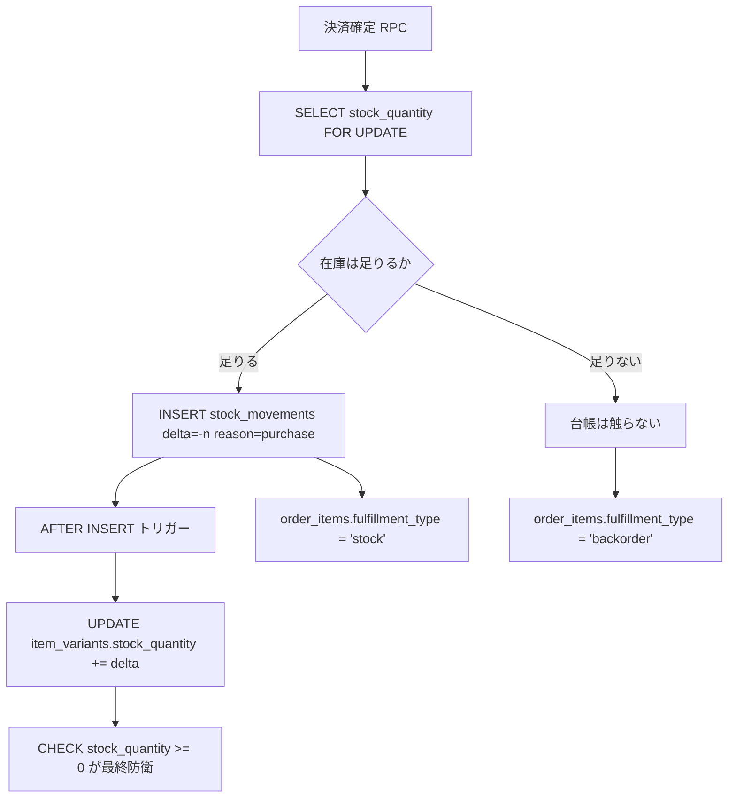
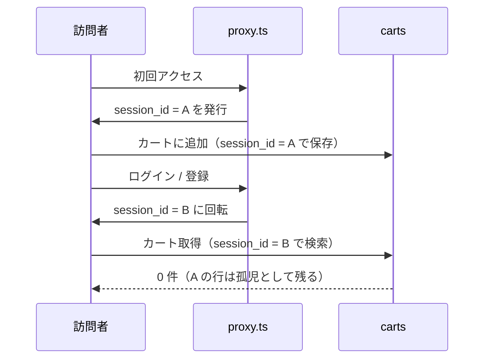
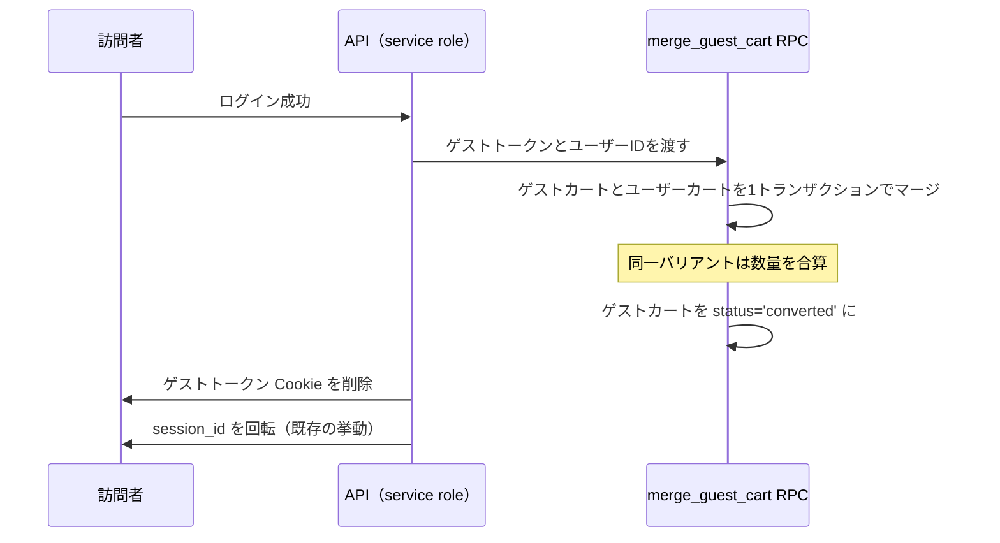

# バリアント在庫・カート所有権・ウィッシュリスト設計

> 対象システム: Le Fil des Heures 公式オンラインストア
> 関連ドキュメント: [brand.md](../../01_Planning/brand.md) / [spec.md](../../02_Requirements/requirements.md)
> 作成日: 2026-09-06

---

## 概要

サイズとカラーの組み合わせ単位で在庫を管理できるようにし、在庫切れの組み合わせは受注生産として購入できるようにする。あわせて、カートとウィッシュリストの所有者の持ち方を作り直す。

本システムは未公開のため、**過去のデータ形式との互換は考慮しない**。互換のためだけに残す列・分岐は作らない。

### 決定事項

| 論点 | 決定 |
|------|------|
| 在庫の単位 | 商品（item）ではなくバリアント（item × color × size） |
| 在庫の真実 | `stock_movements`（追記専用の在庫台帳）。バリアントの数量列はトリガー由来のキャッシュ |
| 受注数の真実 | 注文明細（`order_items.fulfillment_type = 'backorder'`）。集計ビューで参照し、実体列は持たない |
| 受注の上限 | 設けない（無制限） |
| お届け時期 | 商品単位の日数（`items.made_to_order_lead_days`） |
| 在庫か受注かの判定 | 決済確定時。カート投入時は在庫を確保しない |
| カートの所有者 | ゲストトークンまたはユーザーの排他。CHECK 制約で構造的に単一化 |
| ゲストカートの識別子 | カート専用トークン。DB には SHA-256 ハッシュのみ保存 |
| ウィッシュリスト | ログイン必須。所有者は `user_id` のみ。粒度は商品単位 |

### 章構成

| 章 | 内容 |
|----|------|
| [1](#1-バリアント在庫と受注) | バリアント在庫・在庫台帳・受注 |
| [2](#2-カートの所有権) | カートの所有権とゲストからの引き継ぎ |
| [3](#3-ウィッシュリスト) | ウィッシュリスト（ログイン必須） |
| [4](#4-共通のセキュリティ修正) | カート・ウィッシュリスト共通のセキュリティ修正 |
| [5](#5-移行) | 移行 |
| [6](#6-実装順序) | 実装順序 |

---

## 1. バリアント在庫と受注

### 1.1 現状の問題

| 問題 | 内容 |
|------|------|
| 在庫の粒度 | `items.stock_quantity` の単一カウンタのみ。サイズ別・カラー別の在庫を表現できない |
| 在庫の競合 | [checkout/complete/route.ts](../../../src/app/api/checkout/complete/route.ts) が read-modify-write で減算しており、同時購入で lost update が起きる |
| 下限の欠如 | RPC 内の減算に在庫下限のチェックがなく、負の在庫になりうる |
| 在庫判定のヒューリスティック | `isItemInStock` が商品説明文に "sold out" / "在庫切れ" が含まれるかで在庫を判定している |
| 表示順の固定 | サイズの表示順が `SIZE_ORDER` としてコードにハードコードされている |
| 選択肢の二重管理 | `items.colors`（jsonb）と `items.sizes`（text[]）が配列で、バリアントと整合を取る手段がない |

### 1.2 スキーマ

```sql
-- 色の選択肢
CREATE TABLE public.item_colors (
  id       bigint GENERATED BY DEFAULT AS IDENTITY PRIMARY KEY,
  item_id  bigint NOT NULL REFERENCES public.items(id) ON DELETE CASCADE,
  name     text   NOT NULL,
  hex      text   NOT NULL CHECK (hex ~ '^#[0-9a-fA-F]{6}$'),
  position integer NOT NULL DEFAULT 0,
  UNIQUE (item_id, name)
);

-- サイズの選択肢。position が表示順の真実（SIZE_ORDER のハードコードを廃止）
CREATE TABLE public.item_sizes (
  id       bigint GENERATED BY DEFAULT AS IDENTITY PRIMARY KEY,
  item_id  bigint NOT NULL REFERENCES public.items(id) ON DELETE CASCADE,
  label    text   NOT NULL,
  position integer NOT NULL DEFAULT 0,
  UNIQUE (item_id, label)
);

-- バリアント（在庫の単位）
CREATE TABLE public.item_variants (
  id             bigint GENERATED BY DEFAULT AS IDENTITY PRIMARY KEY,
  item_id        bigint NOT NULL REFERENCES public.items(id) ON DELETE CASCADE,
  color_id       bigint REFERENCES public.item_colors(id) ON DELETE RESTRICT,
  size_id        bigint REFERENCES public.item_sizes(id)  ON DELETE RESTRICT,
  sku            text UNIQUE,
  stock_quantity integer NOT NULL DEFAULT 0 CHECK (stock_quantity >= 0),
  is_active      boolean NOT NULL DEFAULT true,
  created_at     timestamptz NOT NULL DEFAULT now(),
  updated_at     timestamptz NOT NULL DEFAULT now()
);

-- NULL を含む UNIQUE 制約は Postgres では重複を許すため、式インデックスで一意性を担保する
CREATE UNIQUE INDEX item_variants_combo_key
  ON public.item_variants (item_id, coalesce(color_id, 0), coalesce(size_id, 0));

-- 在庫台帳（追記専用）
CREATE TABLE public.stock_movements (
  id            bigint GENERATED BY DEFAULT AS IDENTITY PRIMARY KEY,
  variant_id    bigint NOT NULL REFERENCES public.item_variants(id) ON DELETE RESTRICT,
  delta         integer NOT NULL CHECK (delta <> 0),
  reason        text    NOT NULL CHECK (reason IN
                  ('purchase','restock','adjustment','cancel','refund')),
  order_id      uuid REFERENCES public.orders(id) ON DELETE SET NULL,
  order_item_id uuid REFERENCES public.order_items(id) ON DELETE SET NULL,
  note          text,
  created_by    uuid REFERENCES public.profiles(user_id) ON DELETE SET NULL,
  created_at    timestamptz NOT NULL DEFAULT now()
);
```

`items` への変更:

| 操作 | 列 | 理由 |
|------|-----|------|
| 削除 | `stock_quantity` | 在庫の真実がバリアントに移るため。互換目的で残さない |
| 削除 | `colors`（jsonb） | `item_colors` へ正規化 |
| 削除 | `sizes`（text[]） | `item_sizes` へ正規化 |
| 追加 | `made_to_order_lead_days integer` | 受注時のお届け目安（商品単位） |

`order_items` への変更:

| 操作 | 列 | 理由 |
|------|-----|------|
| 追加 | `variant_id bigint REFERENCES item_variants(id) ON DELETE RESTRICT` | どのバリアントを売ったかの参照 |
| 追加 | `fulfillment_type text NOT NULL CHECK (fulfillment_type IN ('stock','backorder'))` | 受注数の真実 |
| 変更 | `item_id integer` → `bigint` | `items.id` と型を揃える |
| 維持 | `item_name` / `item_price` / `item_image_url` / `color` / `size` | 注文時点のスナップショット。バリアントが変更・削除されても注文履歴が壊れない |

### 1.3 在庫台帳とキャッシュの関係

台帳への追記でしか在庫が動かないようにし、アプリが台帳を書き忘れることを構造的に不可能にする。



- 行ロック（`FOR UPDATE`）により同時購入は直列化される。lost update は起きない
- `stock_movements` は `UPDATE` / `DELETE` を `REVOKE` とトリガーで禁止する
- 在庫のキャッシュと台帳の整合は検算関数 `verify_stock_integrity()` で照合できる。`sum(stock_movements.delta)` と `item_variants.stock_quantity` を突き合わせ、差があるバリアントを返す

削除の含意:

| 参照元 | ON DELETE | 帰結 |
|--------|-----------|------|
| `order_items.variant_id` | RESTRICT | 販売実績のあるバリアント、およびそれを持つ商品は物理削除できない。取り下げは `items.status = 'private'` と `item_variants.is_active = false` で行う |
| `stock_movements.variant_id` | RESTRICT | 在庫が動いたバリアントは物理削除できない |
| `cart_items.variant_id` | CASCADE | 取扱終了のバリアントは他人のカートに残っていても削除できる |

### 1.4 削除の運用

販売実績のある商品・バリアントは物理削除しない。取り下げは非公開化で行う。

| 操作 | 手段 |
|------|------|
| 商品の取り下げ | `items.status = 'private'` |
| バリアントの取り下げ | `item_variants.is_active = false` |
| 未販売の商品・バリアントの削除 | 物理削除できる（RESTRICT は発動しない） |

物理削除を許すと、売上のバリアント別内訳と在庫台帳の参照先が失われ、返品・交換でどのバリアントが戻ったかを追えなくなる。一方、削除できないことで生じる不便は「一覧から消したい」だけで、非公開化で足りる。Shopify のアーカイブ、Medusa の論理削除と同じ考え方であり、本システムでは `status` と `is_active` がその役割を担う。

管理画面は販売実績の有無で操作を出し分ける。実績がある場合は削除を提示せず、非公開化のみを見せる。

### 1.5 在庫と受注で扱いを変える理由

非対称は意図的である。

| | 在庫 | 受注数 |
|---|------|--------|
| 判定の要否 | 引当時に「足りるか」を原子的に判定する必要がある | 上限がないため判定不要 |
| 持ち方 | 実体列（行ロックの対象） | 実体列を持たず集計ビュー |

```sql
CREATE VIEW public.variant_backorder_summary
WITH (security_invoker = true) AS
SELECT oi.variant_id, sum(oi.quantity)::integer AS backorder_quantity
FROM public.order_items oi
WHERE oi.fulfillment_type = 'backorder'
GROUP BY oi.variant_id;
```

### 1.6 表示仕様

| 画面 | 表示 |
|------|------|
| ITEM 詳細 | 選択した COLOR × SIZE の在庫状態。在庫0の組み合わせは「受注生産」と `made_to_order_lead_days` から算出したお届け目安 |
| ITEM 詳細（モバイル選択シート） | 上と同じ表示を FREQ-347 のシート内にも出す |
| カート | 明細行ごとに「在庫あり」または「受注生産（お届け目安）」 |
| 管理画面 | 色 × サイズのマトリクスで在庫を入力。入庫・調整は台帳に記録 |

---

## 2. カートの所有権

### 2.1 現状の問題



- [cart/route.ts](../../../src/app/api/cart/route.ts) は `session_id` のみで読み書きし、`user_id` を使っていない
- [proxy.ts](../../../src/proxy.ts) が発行した `session_id` を、[register.ts](../../../src/features/auth/services/register.ts) がログイン・登録時に回転させる
- 回転自体は正しい（OWASP Session Management Cheat Sheet「権限レベルが変わったらセッション ID を更新する」）。問題は、回転する識別子に業務データを直接ぶら下げていること

### 2.2 スキーマ

```sql
CREATE TABLE public.carts (
  id               uuid PRIMARY KEY DEFAULT gen_random_uuid(),
  user_id          uuid REFERENCES public.profiles(user_id) ON DELETE CASCADE,
  guest_token_hash bytea,
  status           text NOT NULL DEFAULT 'active'
                     CHECK (status IN ('active','converted','abandoned')),
  created_at       timestamptz NOT NULL DEFAULT now(),
  updated_at       timestamptz NOT NULL DEFAULT now(),
  -- 所有者は必ずどちらか一方。二重持ちを構造的に不可能にする
  CONSTRAINT carts_single_owner CHECK (num_nonnulls(user_id, guest_token_hash) = 1)
);

CREATE UNIQUE INDEX carts_active_user_key
  ON public.carts (user_id) WHERE status = 'active' AND user_id IS NOT NULL;
CREATE UNIQUE INDEX carts_active_guest_key
  ON public.carts (guest_token_hash) WHERE status = 'active' AND guest_token_hash IS NOT NULL;

CREATE TABLE public.cart_items (
  id         uuid PRIMARY KEY DEFAULT gen_random_uuid(),
  cart_id    uuid   NOT NULL REFERENCES public.carts(id) ON DELETE CASCADE,
  variant_id bigint NOT NULL REFERENCES public.item_variants(id) ON DELETE CASCADE,
  quantity   integer NOT NULL CHECK (quantity > 0),
  added_at   timestamptz NOT NULL DEFAULT now(),
  updated_at timestamptz NOT NULL DEFAULT now(),
  UNIQUE (cart_id, variant_id)
);
```

旧 `carts` の `session_id` / `color` / `size` 列、および `coalesce` を並べた UNIQUE インデックスは廃止する。

### 2.3 ゲストからユーザーへの引き継ぎ



マージを Cookie 回転より前に完了させることで、孤児化が構造的に起きない。

### 2.4 セキュリティ設計

| 論点 | 設計 | 根拠 |
|------|------|------|
| ゲスト識別子 | `session_id` とは別のカート専用トークン。CSPRNG 128 bit 以上、httpOnly / Secure / SameSite=Lax / Path=/ | セッション ID を業務データの所有権キーに流用しない。寿命と回転を分離できる |
| DB への保存 | SHA-256 ハッシュのみ（`guest_token_hash`）。平文は Cookie だけに置く | 旧実装は `session_id` を平文で保存しており、DB 閲覧でカートを乗っ取れた。`refresh_token_history` で既に使っている `tokenHashSha256` と同じ規律を適用する |
| 権限昇格時 | マージ後にゲストトークンを破棄し、`session_id` を回転する | OWASP Session Management Cheat Sheet |
| マージ処理 | `SECURITY DEFINER` の RPC 1本、単一トランザクション。`EXECUTE` は `service_role` のみ（`anon` / `authenticated` から REVOKE） | [lock_down_guest_cart_rpc](../../../supabase/migrations/20260901120426_lock_down_guest_cart_rpc.sql) の方針を踏襲し、レート制限・監査ログ・Origin 検査を迂回する経路を作らない |
| IDOR | クライアントから `cart_id` を受け取らない。所有者判定は必ず Cookie 由来。API は `cart_items.id` のみ受け取り、親カートの所有者を照合する | OWASP A01: Broken Access Control |
| RLS | `carts` / `cart_items` に RESTRICTIVE の deny ポリシー（`checkout_drafts` と同形）。アクセスは service role 経由に一本化 | 多層防御。PostgREST から直接触れる面を消す |
| 保持期間 | 未使用のゲストカートは 30 日で purge | データ最小化 |
| 衝突解決 | マージ（同一バリアントは数量を合算）。上書きはしない | Supabase 公式が挙げる3戦略のうち、顧客の意図を最も損なわない |

---

## 3. ウィッシュリスト

### 3.1 カートと同じ扱いにしない理由

| 軸 | カート | ウィッシュリスト |
|----|--------|------------------|
| ゲスト対応 | 必須 | 不要（ログイン必須）。ゲストトークン・ハッシュ保存・マージ RPC・TTL purge がすべて不要になる |
| 取引との結合 | 金銭と在庫引当の入力 | 個人のブックマーク。冪等な追加・削除のみ |
| 粒度 | バリアント（色・サイズ確定済み） | 商品単位。サイズは後で決める |

カート側の複雑さはすべて「ゲスト」と「取引」に由来する。ウィッシュリストはそのどちらも持たないため、同じ機構を持ち込まない。

バリアント単位のウィッシュリストは「再入荷通知」のためにのみ価値があるが、受注が無制限で常に購入できるため通知の意味が消える。したがって商品単位とする。

### 3.2 スキーマ

```sql
CREATE TABLE public.wishlist (
  id       uuid PRIMARY KEY DEFAULT gen_random_uuid(),
  user_id  uuid   NOT NULL REFERENCES public.profiles(user_id) ON DELETE CASCADE,
  item_id  bigint NOT NULL REFERENCES public.items(id) ON DELETE CASCADE,
  added_at timestamptz NOT NULL DEFAULT now(),
  UNIQUE (user_id, item_id)
);
CREATE INDEX wishlist_user_id_idx ON public.wishlist (user_id);
```

- `session_id` 列を削除し、`user_id` を `NOT NULL` にする
- `UNIQUE (user_id, item_id)` により追加は `ON CONFLICT DO NOTHING` で冪等になる
- 既存のゲスト行（`user_id IS NULL`）は移行時に破棄する

### 3.3 RLS

```sql
CREATE POLICY "wishlist_select_own" ON public.wishlist
  FOR SELECT TO authenticated
  USING ((select auth.uid()) = user_id);

CREATE POLICY "wishlist_insert_own" ON public.wishlist
  FOR INSERT TO authenticated
  WITH CHECK ((select auth.uid()) = user_id);

CREATE POLICY "wishlist_delete_own" ON public.wishlist
  FOR DELETE TO authenticated
  USING ((select auth.uid()) = user_id);

-- 将来 Anonymous Sign-In が有効化されても匿名ユーザーに開かないための保険
CREATE POLICY "wishlist_permanent_users_only" ON public.wishlist
  AS RESTRICTIVE FOR ALL TO authenticated
  USING ((select (auth.jwt()->>'is_anonymous')::boolean) IS NOT TRUE);
```

| 設計 | 根拠 |
|------|------|
| `TO authenticated` を明示 | anon ロールではポリシー式を評価させない（Supabase RLS パフォーマンス推奨） |
| `(select auth.uid())` で包む | initPlan により1クエリ1回の評価になる（lint `0003_auth_rls_initplan`） |
| `user_id` にインデックス | ポリシーが filter する列（Supabase RLS パフォーマンス推奨） |
| 匿名ユーザーを RESTRICTIVE で排除 | 匿名ユーザーも `authenticated` ロールを使うため、既存ポリシーが意図せず開く（lint `0012_auth_allow_anonymous_sign_ins`） |

API は service role のまま維持し、レート制限・監査ログ・Origin 検査の強制点をアプリ側に一本化する。RLS は多層防御として機能させる。未ログインは 401 を返し、UI はログイン導線へ誘導する。ログイン後の戻り先は相対パスのみ許可する（オープンリダイレクト対策）。

---

## 4. 共通のセキュリティ修正

| 項目 | 現状 | 修正 |
|------|------|------|
| RLS の `current_setting('app.session_id', true)` 分岐 | API が service role で叩くため誰もこの GUC を設定しておらず、常に空。将来どこかで設定する実装が入ると `user_id IS NULL` の行が横断的に見える口になる | 削除する。カートは deny + service role、ウィッシュリストは `auth.uid()` のみ |
| `TO PUBLIC` + 素の `auth.uid()` | Supabase が挙げるアンチパターン2つに該当 | `TO authenticated` + `(select auth.uid())` に書き直す |
| CSRF 検証 | admin / auth / checkout / profile には実装済みだが、cart と wishlist の状態変更 API には無い | 既存の `csrfCookieName` / `generateCsrfToken` 機構を両 API にも適用する。`SameSite=Lax` は緩和であり単独で依存しない |
| IDOR | 行 ID を受け取る `[id]` ルート | 所有者一致を API と RLS の両方で判定する |

---

## 5. 移行

未公開システムのため互換レイヤは作らない。旧列は同一マイグレーション内で `DROP` する。

| 対象 | 移行方法 |
|------|----------|
| `items.colors` / `items.sizes` | `item_colors` / `item_sizes` へ展開。`position` は配列の並び順を初期値とする |
| バリアント | `item_colors × item_sizes` の直積を `item_variants` に生成。片方が空の場合は NULL 側で1行 |
| `items.stock_quantity` | 色 × サイズへ機械的に按分できないため、`item_colors.position` と `item_sizes.position` がともに最小のバリアントに全量を寄せる。正しい配分は管理画面で入力し直す |
| `carts` | 旧行は破棄する。ゲストの `session_id` は新しいカートトークンへ移せない（平文保存をやめるため） |
| `wishlist` | `user_id IS NOT NULL` の行のみ移行。ゲスト行は破棄する |
| `order_items` | `color` / `size` の一致で `variant_id` を後埋め。一致しない行は NULL のまま残す。`fulfillment_type` は既存行をすべて `'stock'` とする |

---

## 6. 実装順序

各段階は単体で検証可能な単位に分ける。

| 段階 | 内容 | 検証 |
|------|------|------|
| 1 | スキーマ・移行・在庫台帳のトリガー・検算関数 | マイグレーション適用後に検算関数が整合を報告する |
| 2 | 引当 RPC・checkout complete の置き換え・カート API のバリアント対応 | 同時購入で在庫が負にならない。在庫0で受注明細が作られる |
| 3 | カート所有権（`carts` / `cart_items` / マージ RPC / Cookie） | ゲストでカートに入れてログインしてもカートが保持される |
| 4 | ウィッシュリストのログイン必須化と RLS 書き直し | 未ログインで 401。他人の行を読めない |
| 5 | ITEM 詳細・カートの表示（在庫状態・お届け目安） | 3 ビューポートで在庫あり／受注生産の表示が切り替わる |
| 6 | 管理画面のバリアント在庫編集 | 入庫・調整が台帳に記録される |

### 検証方針

| 種別 | 対象 |
|------|------|
| DB | 在庫の同時引当、CHECK 制約、台帳の追記専用性、RLS ポリシー |
| ユニット | 在庫状態の判定、お届け目安の算出、マージのマージ規則 |
| E2E | ITEM 詳細の在庫表示、受注の購入、ゲストからログインへのカート引き継ぎ、ウィッシュリストのログイン必須 |
