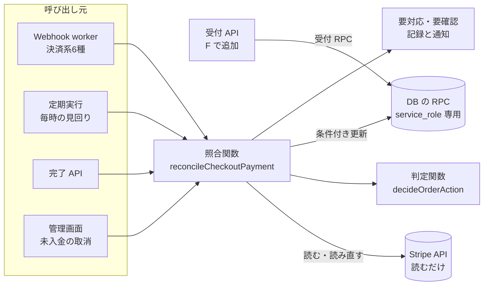
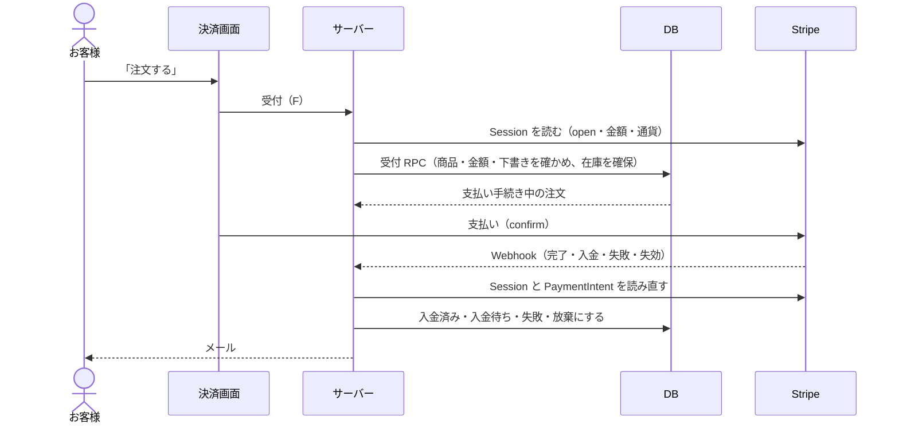
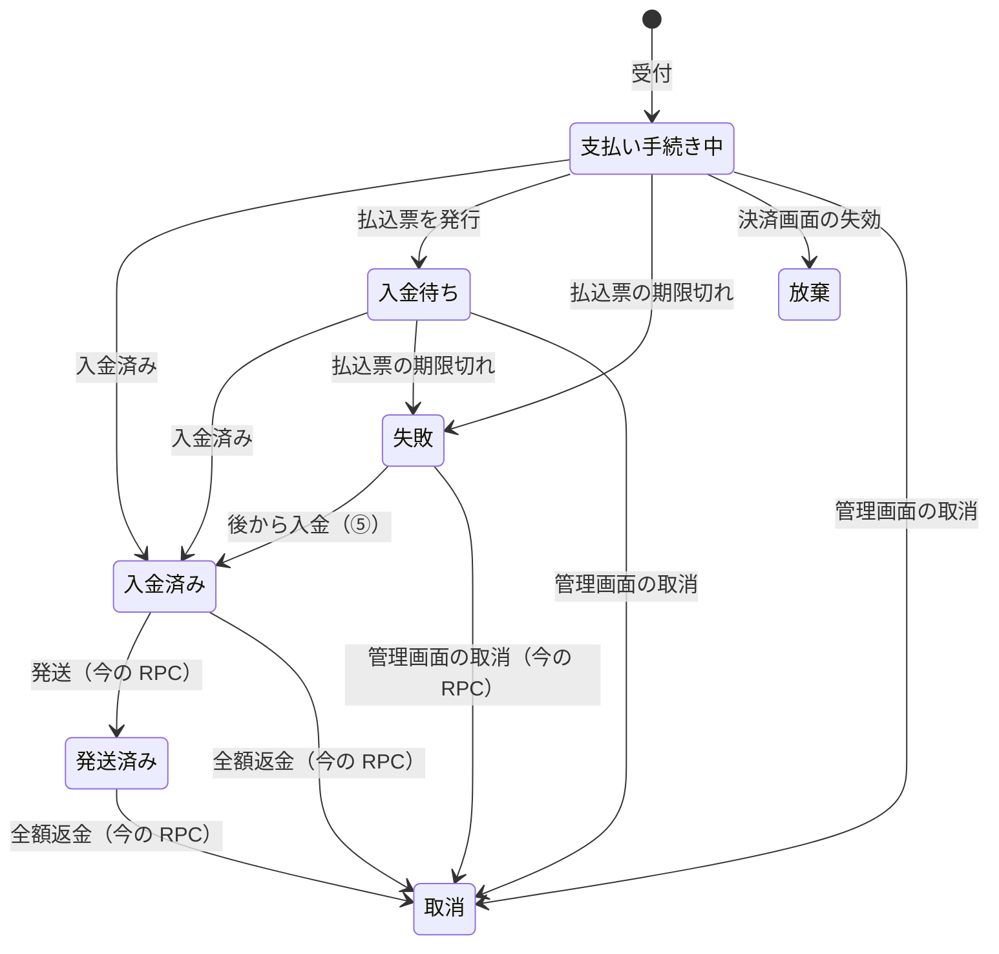

# 支払い状態の照合と注文の先受付 設計書（グループ A）

> 日付: 2026-09-26（設計の議論と節ごとの承認: 2026-09-25。書いた後の論点1〜8の確認: 2026-09-27。コンビニ払いの期限と削除ボタンの見せ方の決定: 2026-09-27）
> 分類: architectural（注文の状態・支払いの流れ・DB の RPC が変わるため）
> 対象の指摘: R-01, R-02, R-04, R-18, R-25（Webhook 側）, R-41, R-42, R-43, R-44, R-57（[レビュー台帳](../../05_Quality/reviews/code/2026-09-25-working-diff-security-review.md)）
> 関連: [Stripe注文・売上取引の整合性設計](2026-08-09-stripe-order-reconciliation-design.md)、[checkout 1画面化 設計書](2026-09-11-checkout-single-step-design.md)、後続グループ B〜H（台帳の「対処計画」）

---

## 概要

注文と在庫を Stripe の現在の支払い状態に合わせる仕組みを1つにまとめ、支払いの前に注文を受け付ける形に変える。Webhook の順番や重複、画面からの離脱があっても、注文・在庫・メールは同じ結果に収まる。人の作業は、不具合・改ざん・在庫不足のときだけ管理画面に出る。

| 項目 | 決定 |
|---|---|
| 正とするもの | Stripe の現在値（Checkout Session と PaymentIntent）。イベントの種類と届いた順番は判定に使わない |
| 仕組み | 照合関数を1つだけ置く。読む → 判定 → 条件付き更新 → 読み直し（最大3回）。Webhook・定期実行・完了 API・管理画面の取消が同じ関数を呼ぶ |
| 注文を作る時点 | 「注文する」で先に受け付ける。「支払い手続き中」の注文を作り、在庫を確保してから支払う（画面と受付 API は F） |
| 在庫 | カートでは確保しない。受付で確保し、Stripe が失敗・放棄を確定したら、確保した分だけ戻す |
| 期限 | 決済画面は開いてから30分ちょうどまで有効で、30分を超えたら失効して在庫を戻す（Webhook が届かなくても最長90分で戻す）。コンビニ払いは7日（FREQ-106。決済画面の作成と /legal が同じ定数を読む。根拠は 5-7） |
| 人の作業 | 要対応（不具合・改ざん・矛盾）と要確認（在庫を確保できない）だけ。管理画面の ORDER タブで解決済み・確認済みにする |
| お客様へのメール | 注文確定・お支払い待ち・入金確認・期限切れ・取消・受付を通らない支払いの案内。返金系は E |
| 自動返金の設定（E） | 支払額が注文と違う注文を自動で全額返金して取り消す（既定はオフ）。取り消した注文への入金を自動で全額返金する（既定はオン） |
| 公開 | enum 値の追加だけのマイグレーション → 本体 → MCP で読み戻す。R-04 の第2段階は保留中の SQL に足し、別途承認を得て適用 |

---

## 1. 目的

### 1-1 直す指摘

| ID | 内容 | この設計での直し方 |
|---|---|---|
| R-01 | 非同期決済のイベントが順不同だと、注文の状態が取り残される | 判定にイベントを使わず、Stripe の現在値だけで決める（第3章） |
| R-02 | `payment_intent.payment_failed` を最終失敗とみなして在庫を戻す | 失敗が確定した状態でだけ戻す。カードの試行失敗は「手続き中」として扱う |
| R-04 | 注文を Data API で直接書き換えられる | 状態の変更を RPC だけにし、保留中の第2段階に不足分を足す（4-7） |
| R-18 | 管理者が未入金の注文を取り消しても、実行者が注文履歴に残らない | 取消の RPC に実行者を渡して履歴に残す |
| R-25 | Session の期限が既定の24時間のまま。支払後に注文確定を断る経路がある | 期限を30分にし、注文を支払いの前に受け付ける |
| R-41 | 確保の記録が無い古い明細を取り消すと、在庫が台帳に湧く | 明細ごとに、確保した分だけ戻す |
| R-42 | 注文確定とカート数量変更のロック順が逆で、デッドロックし得る | 商品行のロックを `FOR KEY SHARE` にする |
| R-43 | 注文履歴の起因イベント ID が常に空 | 状態を変える RPC に Stripe のイベント ID を渡す |
| R-44 | 在庫を動かした商品を削除すると汎用の500になる | 理由付きの409にして非公開へ誘導する（自動化①と同じ API） |
| R-57 | コンビニ払いの期限が /legal（7日以内）と Stripe の設定（3日）で食い違う | 7日にし、決済画面の作成と /legal が同じ定数を読む（2026-09-27 決定） |

### 1-2 設計中に決まった要望

- 人の作業を減らす（自動化①⑤。4-6）。
- 通知は管理画面に出し、要確認を管理者が「確認済み」にできる。
- 非公開・削除の商品では注文を作らない。
- 期限切れ・取消・返金をメールで知らせる（返金は E）。
- 支払いと注文作成を一体にし、「支払ったのに注文が無い」を起こさない（Shopify と同じ）。
- 在庫の確保は「注文する」の時点から始める。
- 支払額と注文の合計を食い違わせない（Shopify と同じく、金額はサーバーだけが決める。F）。
- 取消の画面は Shopify に合わせる（理由の選択、お知らせは既定で送り外せる）。
- プロモーションコードは管理画面で管理する（H）。

### 1-3 成功の基準

- 判定表のすべてのマスを単体テストで確かめる。イベントの順番・重複・同時実行で結果が変わらない。
- 通常の流れでは「支払い済みで注文が無い」が起きない。起きたら要対応として記録し、店とお客様に1回だけ知らせる。
- 在庫は確保した分だけ戻り、台帳から湧かない。
- 人の作業は第5章の要対応・要確認だけ。

---

## 2. 全体構成



### 2-1 部品

| 部品 | 役割 | 置き場所 |
|---|---|---|
| 照合関数 `reconcileCheckoutPayment` | 読む → 判定 → 反映 → 読み直しを最大3回くり返す。同じ支払いについて何度呼ばれても、同時に呼ばれても結果は同じ | `src/lib/stripe/checkout-payment-reconciler.ts`（新規） |
| Stripe の読み取り | Session と PaymentIntent を取り直し、判定に使う項目だけの形にそろえる。Stripe へは書き込まない | 同上（内部） |
| 判定関数 `decideOrderAction` | Stripe の状態と注文の状態から、行動を1つ返す。外部に依存しない純関数 | `src/lib/stripe/checkout-payment-decision.ts`（新規） |
| 受付 RPC `place_order_from_checkout_draft` | 注文を受け付け、在庫を確保する。今の注文確定 RPC `finalize_order_from_checkout_draft` を置き換える | マイグレーション |
| 状態を変える RPC | 条件付き更新で注文の状態を変える（4-1） | マイグレーション |

- 照合関数は Stripe を読むだけ。Stripe へ書き込むのは、Session の失効（管理画面の取消と見回り）と E の自動返金だけで、どれも照合関数の外で行ってから照合関数を呼ぶ。

照合関数の入出力:

```ts
type ReconcileInput = {
  checkoutSessionId?: string; // 優先して使う
  paymentIntentId?: string; // Session ID を持たない古い注文と payment_intent 系のイベント
  sourceEventId?: string; // Stripe のイベント ID（R-43）
  adminCancel?: {
    // 管理画面の取消と、要対応の「注文を取り消して解決」（R-18）
    actorId: string;
    reason: 'stock_unavailable' | 'customer_request' | 'suspected_fraud' | 'other';
    note?: string; // 「その他」と要対応の解決では必須
    notifyCustomer: boolean; // 取消の画面のチェックボックス（既定 true）
  };
};

type ReconcileResult =
  | { kind: 'ok'; action: OrderAction; orderId: string | null }
  | { kind: 'needs_review'; orderId: string } // 要確認
  | { kind: 'needs_action'; exceptionId: string; reason: PaymentExceptionReason }; // 要対応
// 一時的な失敗は ReconcileTransientError を投げる（cause: 'stripe_unavailable' | 'db_unavailable' | 'not_converged'）
```

### 2-2 呼び出し元の変更

| 呼び出し元 | 変更 |
|---|---|
| Webhook（`checkout.session.completed`・`async_payment_succeeded`・`async_payment_failed`・`expired`、`payment_intent.succeeded`・`payment_failed`） | イベントから Session か PaymentIntent の ID を取り出し、照合関数を呼ぶだけにする。イベントの中身は ID 以外使わない。返金系と会計同期は変えない（返金は E） |
| 定期実行（今の `/api/cron/expire-pending-orders`） | 照合の見回りに変える。毎時、決済画面を開いてから30分を超えた支払い手続き中の注文と、入金待ちの全件を照合する。まだ開いている決済（30分を超え、Stripe の失効時刻の前）は、その場で失効させる。これで Webhook が届かなくても、在庫は最長90分で戻る（2026-09-27 承認）。1回50件・45秒まで（今の上限を引き継ぐ）。要対応の店へのメールで未送信のものも送り直す |
| 完了 API `/api/checkout/complete` | 今の確定 RPC を直接呼ぶ処理を、照合関数の呼び出しに替える（Stripe の手引きどおり、Webhook と戻り先のページから同じ関数を呼ぶ。2026-09-27 承認）。画面との入出力は変えない。ログイン客への注文の紐付け（今は注文が既にあるときだけ走る）は、照合の後に毎回走らせる。完了 API を通る分の R-24 はこれで直る。Webhook だけで終わる場合は C で直す |
| 管理画面の未入金取消 | Session を失効させた後（今の処理）、`adminCancel`（実行者・理由・メモ・通知の有無）を付けて照合関数を呼ぶ（R-18。取消の画面は 5-2） |
| 受付 API（F で追加） | 「注文する」で受付 RPC を呼ぶ。A は RPC と、受付を通らない支払いの予備処理を用意する |
| 決済の開始 API `/api/checkout/create-session` | Session の `expires_at` を作成から30分30秒後にする（R-25）。規則は「開いてから30分ちょうどまで有効、30分を超えたら失効」。Stripe は30分未満の値を受け付けないので、通信の遅れと時計のずれがあっても下限を割らないよう30秒の余裕を足す。30分を少し過ぎて払い終えたお客様は、そのまま購入できる（2026-09-27 承認） |
| 管理画面の商品 API（非公開・削除） | 自動化①の決済の失効と、削除できない商品の409（R-44）を加える（4-6） |
| 注文の直接 UPDATE 2か所 | RPC に置き換える（[webhook-processor.ts](../../../src/lib/stripe/webhook-processor.ts) 501行、[expire-pending-orders/route.ts](../../../src/app/api/cron/expire-pending-orders/route.ts) 227行）。これで R-04 の第2段階を当てられる状態になる |

- Session ID を持たない古い注文は、PaymentIntent から Session を引く（今の [checkout-session-expiry.ts](../../../src/lib/stripe/checkout-session-expiry.ts) と同じ方法）。
- Checkout の下書きを持たない支払い（Stripe 上で直接作った決済など）は注文にしない。2026-08-09 の設計どおり、会計の照合（`stripe-reconcile`）が不一致として検出する。

### 2-3 同時に動いても壊れない理由

支払い単位のロックは使わない。

- 注文を動かすのは、Stripe 上の状態が確定したとき（入金済み・失敗の確定・放棄）と、入金待ちになったときだけ。古い状態を読んでも、行動は「何もしない」になる。
- DB への書き込みは、すべて今の状態を条件にした更新にする。先に誰かが動かしていれば0件で終わる。
- 書いた後に Stripe を読み直し、ずれていればやり直す（返金の同期 [order-refund-sync.ts](../../../src/lib/stripe/order-refund-sync.ts) と同じ方式）。Stripe の注文処理の手引きが求める「何度・同時に呼ばれても安全」を満たす。

### 2-4 注文を先に受け付ける流れ



- **カードが通らない**: 画面でやり直す。注文は支払い手続き中のまま。
- **払わずに離れた**: 決済画面を開いてから30分を超えて失効したら、自動で「放棄」にして在庫を戻す。メールは送らない。
- **受付を通らずに支払われた**（改ざんした画面など）: 照合関数が同じ受付 RPC で注文の作成を試み、作れなければ要対応にする。
- Stripe の手動キャプチャー（確保してから売上を確定する方式）は、コンビニ払い・PayPay・銀行振込で使えないため採らない。

---

## 3. 判定表

### 3-1 Stripe の状態の分け方

| Stripe の状態 | 条件 |
|---|---|
| 入金済み | Session が `complete` かつ `payment_status=paid` |
| 入金待ち | Session が `complete` かつ `unpaid`、PaymentIntent が `requires_action`・`processing` |
| 払込票の期限切れ | Session が `complete` かつ `unpaid`、PaymentIntent が `requires_payment_method`・`canceled` |
| 決済画面の放棄 | Session が `expired`（一度も完了していない） |
| 手続き中 | Session が `open` |
| 0円で完了 | Session が `complete` かつ `no_payment_required`（受付 RPC が0円を断るので、通常は起きない） |
| Stripe に無い | 注文が指す Session・PaymentIntent が `resource_missing` |
| 対象外・想定外 | 下書き ID が無い（当店の Checkout 以外の支払い）、または上のどれにも当たらない |

### 3-2 判定表

行が Stripe の状態、列が注文の状態。「起きない」のマスは仕組みで起きない。起きたら要対応（注文と支払いの矛盾）として警報を出す。

| Stripe ＼ 注文 | 注文なし | 支払い手続き中 | 入金待ち | 入金済み・発送済み | 失敗 | 放棄 | 取消 |
|---|---|---|---|---|---|---|---|
| 入金済み | 受付 RPC で作り入金済みにする（予備）。注文確定メール。作れなければ要対応とお客様への案内 | 入金済みにする。注文確定メール | 入金済みにする。入金確認メール | 何もしない | 入金済みにする（⑤）。入金確認メール | 起きない | 全額返金済みなら何もしない。それ以外は要対応（設定がオンなら自動で全額返金） |
| 入金待ち | 受付 RPC で作り入金待ちにする（予備）。お支払い待ちメール。作れなければ要対応とお客様への案内 | 入金待ちにする。お支払い待ちメール | 何もしない | 起きない | 起きない | 起きない | 起きない |
| 払込票の期限切れ | 何もしない | 在庫を戻して失敗にする。期限切れメール | 在庫を戻して失敗にする。期限切れメール | 起きない | 何もしない | 何もしない | 何もしない |
| 決済画面の放棄 | 何もしない | 在庫を戻して放棄にする（メールなし） | 起きない | 起きない | 何もしない | 何もしない | 何もしない |
| 手続き中 | 何もしない | 何もしない（支払い中） | 起きない | 起きない | 何もしない | 何もしない | 何もしない |
| 0円で完了 | 記録のみ（FREQ-389） | 要対応（支払額の違い） | 要対応（支払額の違い） | 要対応（支払額の違い） | 要対応（支払額の違い） | 要対応（支払額の違い） | 要対応（支払額の違い） |
| Stripe に無い | 記録のみ | 要対応 | 要対応 | 要対応 | 要対応 | 要対応 | 要対応 |
| 対象外・想定外 | 記録のみ | 要対応（想定外） | 要対応（想定外） | 要対応（想定外） | 要対応（想定外） | 要対応（想定外） | 要対応（想定外） |

- 下の3行は、注文があれば要対応にする。注文を確保したまま黙って残さないため。Stripe がこれらの状態から動かないので、要対応の解決で未入金の注文を取り消して在庫を戻せるようにする（5-2。2026-09-27 承認）。

- **入金済みにするとき**: Session の金額・通貨を注文と照らす。違えば入金済みにして要対応（支払額の違い）を付け、注文確定メールは送らない（店が確かめてから連絡する）。この要対応が開いている間は発送できない（2026-09-27 承認）。食い違いそのものは F で起きなくする（割引コードをサーバーが確かめて付ける）ので、残る原因は当店の不具合だけになる。自動で全額返金して取り消す設定（既定はオフ）は E で作る。在庫扱いで確保中が0の明細は確保する。足りなければ要確認にする（4-5）。
- **取消の注文に入金があったとき**: 全額返金済みかは、DB の記録ではなく Stripe の返金額で判断する（返金の反映が遅れても誤って要対応にしない）。未返金の分があれば要対応（`cancelled_order_paid`）にする。設定「取り消した注文への入金は自動で全額返金する」（既定はオン。変えられるのは店長だけ。E で作る）がオンなら、自動で全額返金し、取消と返金のメールを送り、要対応を「システムが自動で解決」と記録する。Stripe での返金が失敗した分は、自動でやり直さず要対応に残す（2026-09-27 承認）。
- **管理画面の取消として呼ばれた場合**（`adminCancel`）: 在庫を戻す行動の行き先を「取消」にし、理由を `orders.cancel_reason` に残す。取消のお知らせは `notifyCustomer` が真のときだけ送る。入金済みなら取り消さず、通常どおり入金済みにする。入金待ちは、Stripe が払込票の期限切れを確定するまで取り消せない（払込期限を過ぎても、確定するまでは取り消せない。4-1・5-2）。
- **在庫を戻す**: 注文で実際に確保した分だけを1回戻す（R-41。4-5）。

### 3-3 イベントの順番による違い（R-01・R-02）

| 届く順番 | 今 | 変更後 |
|---|---|---|
| 入金成功が注文作成より先 | 入金済みでも入金待ちのまま残る | 注文は受付で先にある。どの順で届いても入金済みを読み、入金済みにする |
| 期限切れの失敗が注文作成より先 | 後から入金待ちの注文ができ、在庫を確保したまま残る | どちらで読んでも「払込票の期限切れ」なので、在庫を戻して失敗にする |
| カードの試行が失敗した後に成功 | 入金待ちの注文があれば失敗にされ、在庫が戻る | 失敗の時点では「手続き中」なので何もしない |
| 同じイベントが重複・同時に届く | 条件付き更新で重複は防げるが、状態の判断がずれる | 条件付き更新と読み直しで同じ結果に収まる |

---

## 4. データベース

### 4-1 状態の変化と RPC



| 変化 | きっかけ | RPC | 在庫 | お客様へのメール |
|---|---|---|---|---|
| 注文なし → 支払い手続き中 | 「注文する」、または受付を通らない支払いの予備処理 | `place_order_from_checkout_draft`（新規） | 在庫のある明細を確保 | なし |
| 支払い手続き中 → 入金済み | Stripe が入金済み | `mark_order_paid`（新規） | 変えない | 注文確定 |
| 支払い手続き中 → 入金待ち | 払込票を発行 | `mark_order_awaiting_payment`（新規） | 変えない | お支払い待ち |
| 入金待ち → 入金済み | Stripe が入金済み | `mark_order_paid` | 確保中が0の在庫明細を確保（足りなければ要確認） | 入金確認 |
| 失敗 → 入金済み（⑤） | Stripe が入金済み | `mark_order_paid` | 確保し直す（足りなければ要確認） | 入金確認 |
| 支払い手続き中・入金待ち → 失敗 | 払込票の期限切れ | `release_stock_for_unpaid_order`（変更） | 確保した分だけ戻す | 期限切れ |
| 支払い手続き中 → 放棄 | 決済画面の失効 | 同上 | 同上 | なし |
| 支払い手続き中・入金待ち → 取消 | 管理画面の取消。支払い手続き中は Session を失効させた後、入金待ちは Stripe が期限切れを確定した後（払込票が有効な間は取り消せない） | 同上（実行者・理由付き） | 同上 | 取消（既定で送る。取消の画面で外せる） |
| 失敗 → 取消 | 管理画面の取消 | `admin_cancel_failed_order`（取消の理由とメモを受け取る形に変える） | 変えない（戻し済み） | なし（期限切れで知らせ済み） |
| 支払い手続き中・入金待ち → 取消 | 要対応の「注文を取り消して解決」（Stripe の状態がどれにも当たらず、Stripe 側で確かめられない場合） | `resolve_payment_exception`（取消付き。中で `release_stock_for_unpaid_order` を実行者・メモ付きで呼ぶ） | 確保した分だけ戻す | 取消（既定で送る。取消の画面で外せる） |
| 入金済み → 発送済み、全額返金による取消 | 店の操作・返金 | 今の RPC のまま | — | 返金系は E |

- どの変化も「今の状態が左の値のとき」だけ変える条件付き更新にする。先に動いていれば0件で終わる。
- 発送の RPC `admin_ship_paid_order` は、支払額の違い（`paid_amount_mismatch`）の要対応が開いている注文を断る。金額の一致を確かめてから発送する（OWASP の決済連携の手引き）。
- 状態を変える RPC は、Stripe のイベント ID（R-43）・実行者（R-18）・変更理由を、今の注文履歴の仕組み（`app.order_source_event_id`・`app.order_actor_id`・`app.order_change_reason`）で残す。注文の作成（INSERT）は履歴の対象外なので、受付 RPC には渡さない。
- `mark_order_paid` と `mark_order_awaiting_payment` は、`payment_intent_id` が空なら値を入れる（4-2）。

### 4-2 列・型・表の変更

| 対象 | 変更 |
|---|---|
| `order_status`（enum） | `payment_in_progress`（支払い手続き中）と `abandoned`（放棄）を加える。別のマイグレーションに分ける（4-8） |
| `orders.payment_intent_id` | NOT NULL を外す。一意の制約は残す。PaymentIntent は Session の支払いの確定時にできる（Stripe API 2022-08-01 以降）ため、受付の時点では無い |
| 法定の不変条件トリガー `protect_legal_order_immutable_fields` | `payment_intent_id` の「空から値へ1回だけ」を許す。それ以外の保護は変えない |
| `orders.checkout_session_id` | 一意にする（空は複数可）。照合はこの列で注文を引く。本番16件に重複が無いことを確認済み（2026-09-25） |
| `orders` の要確認の列 | `review_reason`（値は `stock_not_reserved` だけ）、`review_marked_at`、`reviewed_at`、`reviewed_by` |
| `orders.cancel_reason` | 管理画面で取り消したときの理由（`stock_unavailable`・`customer_request`・`suspected_fraud`・`other`）。自動の失敗・放棄では空。メモと実行者・通知の有無は注文履歴に残す |
| `payment_exceptions`（新しい表） | 要対応の記録（4-4） |
| メールの送信権 `private.order_emails.kind` | `payment_expired`（期限切れ）と `canceled`（取消）を加える。E で `refunded`・`canceled_refunded` を足す |

### 4-3 受付 RPC `place_order_from_checkout_draft`

受付 API（F）と、照合関数の予備処理の両方から呼ぶ。サーバーが Stripe から取り直した Session の金額・通貨を引数で受け取る。

| 確かめること | 失敗の理由コード |
|---|---|
| 下書きがあり、この Session とお客様（ログイン利用者かゲストのセッション）のものである | `draft_not_found` |
| 商品がすべて存在し、公開中である。商品行は `FOR KEY SHARE` でロックする（R-42） | `item_unavailable` |
| 金額・通貨が Session の合計（割引を含む）と一致する | `amount_mismatch`・`currency_mismatch` |
| 合計が0円でない（FREQ-389 の方針） | `zero_amount` |

- Session が `open` であることは、受付 API が Stripe から読んで確かめる（F）。予備処理では Session は `complete` なので確かめない。
- 同じ Session の注文が既にあれば、それを返す（一意の制約で重複しない。在庫を二重に確保しない）。
- 在庫の確保は今の確定 RPC と同じ。バリアントを ID の昇順でロックし、在庫が足りる明細は在庫扱いで確保し、足りない明細は受注生産扱いにする。
- `FOR KEY SHARE` が衝突するのは `FOR UPDATE`（削除など）だけ（PostgreSQL の行ロック）。カートの数量変更（`FOR SHARE`）とも商品の非公開（キー以外の UPDATE）とも衝突しないので、デッドロックが消える。削除だけは受付の完了まで待たせる。
- 受付の後に商品が非公開になっても注文は残す（受け付けた注文は在庫を確保済み。Shopify と同じ）。
- 失敗したときは理由コードを返す。お金は動いていないので、画面が支払いの前に案内する（F）。

### 4-4 要対応の記録 `payment_exceptions`

| 列 | 内容 |
|---|---|
| `id` | uuid |
| `payment_ref` | Session ID（無ければ PaymentIntent ID）。`reason` と組で一意 |
| `checkout_session_id`・`payment_intent_id`・`draft_id`・`order_id` | 分かる範囲で入れる |
| `reason` | 下の表のどれか |
| `detail` | 理由の補足コード（例: `item_unavailable`）。個人情報は入れない |
| `first_detected_at`・`last_detected_at`・`detection_count` | 検知の記録。同じ支払い・同じ理由は1行にまとめる |
| `shop_notified_at`・`customer_notified_at` | 通知の送信権。送る前に条件付き更新で押さえ、送れなければ戻す |
| `resolved_at`・`resolved_by`・`resolution_note` | 解決の記録。メモは500文字まで |

| `reason` | 内容 | お客様への案内 |
|---|---|---|
| `order_not_creatable` | 受付を通らない支払いで、注文を作れない（商品・金額・通貨・下書き） | 送る（5-4） |
| `paid_amount_mismatch` | 支払額と注文の金額・通貨が違う（0円で完了した場合を含む） | 送らない |
| `cancelled_order_paid` | 取り消した注文に、未返金の入金がある | 送らない（自動返金の設定がオンなら、E の取消と返金のメールが届く） |
| `state_conflict` | 注文と支払いの矛盾（判定表の「起きない」マス） | 送らない |
| `unexpected_state` | 注文があるのに、Stripe の状態が判定表のどの行にも当たらない | 送らない |
| `stripe_object_missing` | 注文が指す Session・PaymentIntent が Stripe に無い | 送らない |

- RLS を有効にし、`anon`・`authenticated` の権限を剥がす。読み書きは service_role の RPC と管理 API だけ。
- 解決済みの行は、同じ理由で再び検知しても開き直さない（最後の検知時刻と回数だけ更新する）。
- 要確認は表を作らず、`orders.review_reason` で表す（4-2）。

### 4-5 在庫の確保と戻し（R-41・⑤）

- **明細ごとの「確保中の数」**: その明細について台帳に記録された、確保（マイナス）と戻し（プラス）の合計の符号を反転したもの。種類の欄（在庫・受注生産）の既定値は信用しない。
- **戻す**: 確保中の数が1以上の明細だけ、その数を戻す。確保の記録が無い明細は戻さない。本番の古い明細（種類の欄を足したときに既定値で「在庫」になったもの）はここに当たるので、在庫は増えない。
- **確保し直す**: 入金済みにするとき、在庫扱いで確保中が0の明細を、在庫が足りれば確保する。足りなければ確保せず、要確認にする。当てはまるのは⑤（失敗の後の入金）と古い明細の2つだけ。
- ロックは今と同じく、バリアントを ID の昇順で取る。

### 4-6 人の作業を減らす自動化

| 自動化 | 中身 |
|---|---|
| ① 商品の非公開・削除 | 店が商品を非公開・削除したら、その商品を含み、まだ受付の済んでいない開いている決済を Stripe で失効させる。決済中・注文済み・在庫を動かした商品は削除させず、理由付きの409で非公開へ誘導する（R-44）。管理画面の商品一覧の削除ボタンは、削除できない商品にも常に出す。押した時点で、同じ判定の理由と非公開への誘導を出す（無効化・非表示にしない。2026-09-27 決定）。お客様の画面の案内は F |
| ⑤ 失敗の後の入金 | 失敗にした注文に後から入金があれば、自動で入金済みにし、在庫を確保し直す。足りないときだけ要確認にする |

①のために、商品 ID から「その商品を含み、受付の済んでいない開いている決済の下書き」を引く RPC を加える。

残る人の作業:

- 改ざんされた画面から支払われ、注文を作れなかった（要対応）。
- 支払額が注文と違う（要対応。F の後は当店の不具合のときだけ起きる。E の設定をオンにすれば自動で返金して取り消す）。
- 失敗の後の入金で在庫が足りない（要確認）。
- 取り消した注文への入金（E の設定が既定のオンなら自動で返金する。オフなら要対応）。
- 注文と支払いの矛盾・Stripe に無い・想定外の状態（仕組みで起きない。起きたら要対応。未入金の注文は「注文を取り消して解決」で閉じる）。

### 4-7 権限

- 新しく作る関数・変える関数は、すべて `SECURITY DEFINER`、`search_path=''`、完全修飾名にする。`PUBLIC`・`anon`・`authenticated` から実行権限を剥がし、`service_role` だけに与える（Supabase Database Functions の例どおり）。
- 引数を変える関数は古い定義を削除し、同名の関数を重複させない。`release_stock_for_unpaid_order` は注文 ID を受け取る形に変える（支払い手続き中の注文は PaymentIntent を持たないため）。呼び出し元はすべて同じ変更で置き換える（本番アプリは未公開なので、古い定義を残す必要が無い。同名の関数を並べると PostgREST が呼び分けられないこともある（PGRST203）。2026-09-27 承認）。本番公開の後に同じような変更をするときは、広げる → 移す → 縮めるの3段階（Parallel Change）で行う。
- `finalize_order_from_checkout_draft` は受付 RPC に置き換えて削除する。
- R-04 の第2段階（保留中の [harden_order_state_transitions.sql](../../../supabase/pending/harden_order_state_transitions.sql)。アプリの公開と確認の後に、承認を得て適用する）に次を足す:
  - `orders`・`order_items` の INSERT・DELETE・TRUNCATE（`order_items` は UPDATE も）の剥奪と、該当する policy の削除。
  - 不変条件トリガーに、RPC が設定する変更理由が無い状態の変更を拒否する条件と、4-1 の表に無い状態の遷移を拒否する条件を足す。

### 4-8 マイグレーションの分け方

| 順 | 中身 | 理由 |
|---|---|---|
| ① | enum の値の追加だけ（`ALTER TYPE ... ADD VALUE IF NOT EXISTS`） | Postgres では、追加した値はそのトランザクションをコミットするまで使えない。enum の値は後から消せない（Supabase: Managing Enums）ので、名前はこの設計で確定する |
| ② | 列・制約・表・RPC・メールの種類・古い未入金2件の送信権の登録（第7章） | ①の値を使う |

- 冪等に書く（`IF NOT EXISTS`・`CREATE OR REPLACE`・`DROP ... IF EXISTS`。R-46 の規約）。

---

## 5. 失敗時の扱いと通知

### 5-1 照合の結果の分け方

| 結果 | 当てはまるもの | その後 |
|---|---|---|
| 正常 | 注文の作成・状態の変更・何もしない | メールを送信権どおりに送る。イベントは完了 |
| 要確認 | 入金済みにしたが、在庫扱いの明細を確保できなかった | 注文に要確認の印を付け、管理画面に出す。イベントは完了 |
| 要対応 | 4-4 の理由 | `payment_exceptions` に記録する（重複なし）。管理画面に出し、店へメールを1回送る。必要ならお客様へ案内する（5-4）。イベントは完了にして、永久に再試行しない |
| 一時的な失敗 | Stripe の通信・5xx・回数制限、DB の接続・タイムアウト・デッドロック、読み直しが3回で収まらない | 例外を投げてイベントを失敗にし、キューが間隔を空けて再試行する。原因コード（`stripe_unavailable`・`db_unavailable`・`not_converged`）を残す（R-33 の一部。試行の上限と退避は B） |

- 定期実行と管理画面から呼んだ場合も、同じ4分類を返す。定期実行は件数を集計する。管理画面は、一時的な失敗なら「時間をおいて再試行」、要対応なら理由を表示する。

### 5-2 管理画面の「要対応・要確認」欄

- ORDER タブの注文一覧の上に置く。店長（admin）も対応担当（supporter）も見られる唯一のタブのため。
- サイドナビの ORDER に未処理の件数を出す。最初に開く KPI 画面の上部に「要対応N件・要確認N件（ORDER で確認）」の1行を出す（admin だけが見る画面）。
- 注文一覧に「要確認」の印と「要確認のみ」の絞り込みを加える。状態の絞り込みに「支払い手続き中」を加え、「放棄」は既定の一覧に出さない（絞り込みで選べる）。

| 種類 | 対象 | 管理者の操作 | 記録 |
|---|---|---|---|
| 要確認 | 在庫を確保できなかった注文 | 内容を見て「確認済みにする」 | 確認した日時と実行者（注文履歴にも残る） |
| 要対応 | 注文を作れなかった支払い、矛盾など | Stripe で返金などをした後に「解決済みにする」（短いメモを任意で残せる）。未入金（支払い手続き中・入金待ち）の注文が付いていれば、「注文を取り消して解決」も選べる（メモ必須） | 解決した日時・実行者・メモ。取り消した場合は在庫を確保した分だけ戻し、注文履歴に実行者と理由を残す |

- 確認済み・解決済みは手動の操作でだけ付く。発送や返金で自動では付かない。
- 支払額の違いの要対応が開いている注文は、「発送済みにする」を押せず、理由を表示する。
- **取消の画面**（管理画面の取消と、要対応の「注文を取り消して解決」で共通。Shopify の取消画面に合わせる。2026-09-27 承認）:
  - 取消の理由を選ぶ（必須）: 在庫切れ・お客様の依頼・不正の疑い・その他。
  - メモ: 任意。「その他」と要対応の解決では必須。店内だけに残る。
  - 「お客様に取消のお知らせを送る」: 既定でオン、外せる（電話で連絡済み、テストの注文、改ざんされた注文など）。失敗の注文の取消では出さない。
  - 在庫は常に戻す（未入金の注文は発送していないので、選択肢は置かない）。返金方法の選択も置かない（取り消せるのは未入金の注文だけ）。
  - 払込票が有効な入金待ちの注文では「取り消す」を押せず、払込期限と「期限を過ぎると自動で期限切れになる」旨を表示する。
- 操作できるのは `admin.orders.manage` の権限を持つ利用者（店長と対応担当）。
- RPC を2つ加える: `mark_order_reviewed`（確認済み）と `resolve_payment_exception`（解決済み）。どちらも service_role 専用で、実行者 ID を受け取り、注文履歴・監査ログに残す。
- 管理 API を3つ加える（未処理の一覧と件数、確認済み、解決済み）。今の管理 API と同じ防御をかける: 検証済みの JWT、権限（ACL）、2要素認証済み（aal2）、Origin の確認、CSRF トークン、zod による入力検証。メモは500文字までにし、画面では文字列として表示する（XSS 対策）。

### 5-3 店へのメール

- 要対応だけ、店のアドレス（新しい環境変数 `SHOP_ALERT_EMAIL`）へ、今のメール送信（Resend）で送る。要確認は管理画面だけに出す。
- 1件につき1回。送る前に `shop_notified_at` を条件付き更新で押さえ、送れなければ戻す。未送信分は毎時の見回りで送り直す。二重にも0通にもならない。
- 内容: 種類、理由、注文番号（あれば）、Stripe の支払い ID、検知時刻、次にやること（例: Stripe ダッシュボードで返金）。お客様の氏名・住所・メールは入れない（個人情報の最小化）。
- 今の `ALERT_AUDIT_URL` は監査ログを全件転送するので、重要な通知が埋もれる。使わない（R-05 は B）。
- D でメールの送信待ち記録（outbox）を作ったら、この通知もそこへ移す。

### 5-4 お客様へのメール

すべて1件につき1回。二重送信は送信権で防ぐ。

| メール | 送る時点 | 送信権 | 内容・備考 |
|---|---|---|---|
| 注文確定 | 支払い手続き中 → 入金済み（カード・PayPay） | `paid` | 今の仕組みを移す |
| お支払い待ち | 支払い手続き中 → 入金待ち（払込票を発行） | `awaiting_payment` | 今の仕組み。払込票の案内 |
| 入金確認 | 入金待ち・失敗 → 入金済み | `paid` | 今の仕組み。⑤では、取り消しの案内の後に入金を確認したことを書く |
| 期限切れのお知らせ | 払込票の期限切れで失敗にしたとき | `payment_expired`（新規） | 「お支払い期限が過ぎたため、ご注文を取り消しました」。支払い方法を問わない作りにする |
| 取消のお知らせ | 管理画面で支払い手続き中・入金待ちの注文を取り消し、「お客様に取消のお知らせを送る」がオンのとき（既定はオン）。要対応の「注文を取り消して解決」も同じ | `canceled`（新規） | 失敗 → 取消では送らない（期限切れで知らせ済み）。支払い手続き中の注文では最初のメールになるので、「お手続き中のご注文を取り消しました」と書く |
| 受付を通らない支払いの案内 | 要対応 `order_not_creatable` を記録したとき | `payment_exceptions.customer_notified_at` | 入金済み:「お支払いは受け付けました。ご注文の登録で確認が必要になりました。担当者からご連絡します。再度のお支払いは不要です」。入金待ち:「ご注文の登録で確認が必要になりました。お支払いはお控えください。担当者からご連絡します」。送り先は下書きのアドレス |

- 支払額の違い・矛盾・想定外の状態・Stripe に無い場合は、お客様の操作と関係が無いので案内しない（店だけに知らせる）。
- 件名と本文は固定の文面で作り、外から来た値はヘッダーに入れない（メールヘッダーの注入を防ぐ）。
- 取消と返金のお知らせ・返金のお知らせは E で作る。

### 5-5 お客様の画面

- 注文履歴と注文詳細の API は、支払い手続き中と放棄の注文を返さない。メールで知らせた注文だけを見せる（Shopify も、放棄された決済を注文として見せない）。
- 今の状態の表示名は変えない。

### 5-6 記録

- すべての判定と行動を監査ログに残す: 判定の理由、行動、支払い・Session・注文・イベントの ID。個人情報は入れない。
- 状態を変えた場合は、注文履歴にイベント ID・実行者・変更理由が残る（4-1）。

### 5-7 参考先との比較

| 観点 | この設計 | Shopify | ZOZOTOWN |
|---|---|---|---|
| カードが通らない | 画面でやり直す。注文は支払い手続き中のまま | 支払いの送信時だけ在庫を確保し、失敗なら解放する | 公開情報なし |
| コンビニ払いの期限 | 7日（期限日の23:59まで）と Stripe の猶予 | 決済業者しだい。保留中の支払いは約1週間で期限切れ | 注文の翌日0:00から3日目の23:59まで |
| 期限切れの扱い | Stripe が失敗を確定したら、自動で失敗にして在庫を戻す | 支払い状態が Expired になり、店が手動で取り消す | 自動でキャンセル |
| 期限切れの連絡 | 期限切れのお知らせ | 店が取り消すと取消メール（既定でオン） | 公開ページに明記なし |
| 支払い後に注文を作れない | 通常は起きない（注文が先）。改ざん時は要対応 | 起きない（支払いと注文作成が同時） | 起きない（注文完了の後に支払う） |
| 店への通知 | ORDER タブの要対応・要確認と件数。要対応はメールも | 支払い失敗の通知は無く、注文一覧の状態で見る | 公開情報なし |
| 管理者の確認操作 | 要確認を確認済みに、要対応を解決済みに（日時・実行者・メモ） | 注文の履歴にコメントを残せる。確認済みの状態は無い | 公開情報なし |
| 返金の連絡 | 返金メール（E） | 返金メール | 支払い方法どおりに返金し、メールで案内 |

- ZOZOTOWN の「期限切れが続くと利用を制限する」は採らない。会員ごとの制限の仕組みが要り、今の規模では効果が小さい。
- コンビニ払いの期限は7日にする（2026-09-27 決定）。Stripe と KOMOJU の既定値は3日。ZOZOTOWN は3日、Amazon は3日（解説記事による）、BASE は5日、楽天市場は7日。OWASP の OAT-021（払わずに在庫を押さえ、他の客が買えなくなる脅威）にも特定商取引法にも、日数の基準は無い。受注生産が中心で在庫を押さえる害が小さいので、よく使われる範囲（3〜7日）の上限にする。/legal の表記（FREQ-106）とそろう。照合は Stripe の実際の期限（`expires_at`）を読むので、日数は定数1つで後から変えられる。

---

## 6. テスト

テストを先に書き、落ちることを確かめてから実装する。

| 層 | 確かめること | 場所 |
|---|---|---|
| 判定 | 判定表の全マス（Stripe の状態8行 × 注文の状態7列）ごとに、呼ぶ RPC・送るメール・要対応か要確認か。判定表をそのままテストの入力にする | Jest 単体 |
| 照合関数 | 読む → 判定 → RPC → 読み直し（最大3回）。RPC が「状態が先に変わっていた」を返したら読み直す。Stripe を読めなければ何も変えない。取消の注文は Stripe の返金額で全額返金済みかを判断する | Jest 単体（Stripe と DB はモック） |
| 入口 | Webhook・定期実行・完了 API・管理画面の取消は照合関数を呼ぶだけ。イベントが順不同・重複で届いても結果が同じ（R-01）。`payment_intent.payment_failed` だけでは在庫を戻さない（R-02） | Jest 単体 |
| RPC | 状態が想定と違えば何もしない。2回呼んでも在庫を二重に戻さない。確保の記録がある分だけ戻す（R-41）。実行者・理由・起因イベント ID が履歴に残る（R-18・R-43）。PaymentIntent は空から値へ1回だけ。Session ID は一意。商品行のロック順でデッドロックしない（R-42）。要対応の解決で取り消せるのは、要対応が開いている未入金の注文だけ。支払額の違いの要対応が開いている注文は発送できない | DB 結合（ローカル Supabase） |
| 並行 | Webhook と定期実行が同じ注文に同時に来ても、状態の変化もメールも1回 | DB 結合 |
| 権限 | 新しい RPC と表は `anon`・`authenticated` から使えない（表は RLS 有効）。確認済み・解決済みの操作には `admin.orders.manage` と CSRF トークンが要り、監査ログに実行者が残る | DB 結合・Jest 単体。本番に当てた後、Security Advisor の新しい警告が0件 |
| メール | 種類ごとに1回だけ送る（期限切れ・取消・受付を通らない支払いの案内）。本文の期限と金額 | Jest 単体（送信はモック） |
| 管理画面 | 要対応・要確認の欄、確認済み・解決済みの操作、サイドナビの件数、取消の画面（理由・お知らせ）、支払額の違いの発送止め、商品を削除できないときの案内 | E2E（390・768・1280）。API はモックし、本番 DB に書かない |
| 移行 | 本番と同じ形のデータ（古い未入金の注文、確保の記録が無い明細）にマイグレーションを当てても壊れない | DB 結合 |

- 古い動作を確かめている既存テストは、判定表に合わせて書き換える（例: [stripe-route.test.ts](../../../tests/unit/api/webhook/stripe-route.test.ts) の「async_payment_failed は在庫復元 RPC を呼ぶ」）。
- DB 結合テストはローカル DB 専用（localhost 以外の接続先では実行を拒否する今の作り）。
- メールは受信を E2E で確かめられないので、単体テストで確かめる。

### 6-1 要求管理（spec.md と E2E）

画面と機能の変更は、実装と同時に [spec.md](../../02_Requirements/requirements.md) に FREQ 行を足し、E2E を加える。番号は FREQ-407・FR-ADMIN-060 から。実装時に最新の番号を確かめ直す。

| 要求 | 受け付け基準の例 | 確かめ方 |
|---|---|---|
| 管理画面の要対応・要確認欄 | 未処理の要対応・要確認が ORDER タブの一覧の上に表示されること。「確認済みにする」「解決済みにする」を押すと欄から消えること。未処理が0件のとき欄が表示されないこと。サイドナビの ORDER と KPI 画面の上部に未処理の件数が表示されること | E2E（FR-ADMIN-060） |
| 注文一覧の要確認の印・絞り込み・新しい状態 | 要確認の注文に「要確認」の印が表示されること。「要確認のみ」で要確認の注文だけが表示されること。放棄の注文が既定の一覧に表示されないこと | E2E（FR-ADMIN-061） |
| 管理画面の取消の画面 | 取消の理由を選ばないと取り消せないこと。「お客様に取消のお知らせを送る」が既定でオンで表示され、外すとメールが送られないこと。払込票が有効な入金待ちの注文では「取り消す」が押せず、払込期限が表示されること | E2E（FR-ADMIN-063）とメールは単体 |
| 支払額の違いの注文の発送止め | 支払額の違いの要対応が開いている注文では「発送済みにする」が押せず、理由が表示されること | E2E（FR-ADMIN-061 に含める） |
| 商品を削除できないときの案内（R-44・①） | 削除できない商品にも削除ボタンが表示され、押せること。注文や在庫の記録がある商品を削除しようとすると、非公開を促す案内が表示され、商品が残ること | E2E（FR-ADMIN-062） |
| お客様の注文履歴 | 支払い手続き中・放棄の注文が注文履歴と注文詳細に表示されないこと | 単体（API） |
| お客様へのメール | 期限切れ・取消・受付を通らない支払いの案内が、それぞれ1回だけ送られること | 単体 |
| 決済画面の期限 | Checkout Session が作成から30分30秒で失効する設定で作られること。見回りが、開いてから30分を超えてまだ開いている決済を失効させること | 単体 |
| コンビニ払いの期限（R-57） | Stripe にコンビニの支払期限7日を送ること（custom・hosted とも）。/legal に「7日以内」が表示されること | 単体（create-session）・E2E（FR-LEGAL-004。既存の FREQ-106 のまま） |

---

## 7. 公開の手順

前提: 本番アプリは未公開。master へ push すると、CI（[db-migrations.yml](../../../.github/workflows/db-migrations.yml)）が `supabase/migrations/` を本番 DB へ当てる。手元の E2E と開発は本番 DB を使う。

| 順 | 作業 | 補足 |
|---|---|---|
| 1 | ローカルで実装とテスト | 本番には触れない |
| 2 | マイグレーションを2本に分ける（4-8） | |
| 3 | 指示を受けて commit と push。CI が本番へ当てた後、MCP で読み戻す（enum・制約・関数・権限・Advisor） | 当てる直前に Session ID の重複が0件かを読み直す。E2E が本番に注文を作り続けているため（R-55） |
| 4 | 保留中の第2段階に R-04 の不足分を足す（4-7） | 適用は今までどおり、アプリの公開と確認の後に明示の承認を得てから |
| 5 | 保留中の未入金の掃除（毎日）を、照合の見回り（毎時）に書き換える | Webhook が届かないときの予備。放棄された注文の在庫は最長90分で戻る。Cron の本番登録は B で worker と一緒に行う |

### 7-1 本番の既存データ

| データ | 扱い |
|---|---|
| 未入金2件（2026-03-20 作成、Session ID なし。アプリ未公開の時期の注文） | 最初の見回りで、Stripe の状態に合わせて失敗などに変わる。半年前の注文にメールが届かないよう、マイグレーション②でこの2件のお客様向けメールの送信権をすべて「送信済み」として登録する。Stripe に無ければ要対応になるので、公開前に照合を1回流して結果を確かめる |
| 入金済み13件の古い明細16行（確保の記録なし） | A では触らない。E で返金時に在庫を戻すときも「確保した分だけ戻す」規則を使う |

### 7-2 A と F の境目

- A だけ先に入れても、今の画面のまま動く。今は「確認へ進む」で支払いが確定するので、その後に完了 API と Webhook が照合関数を呼び、予備処理の受付 RPC で注文を作る（今の Webhook での確定と同じ流れ）。
- F で、受付を「注文する」の時点（支払いの前）に移し、R-56 を直す。受付の前に Session の期限（30分）が切れたときの作り直しも F で扱う。

### 7-3 元に戻すとき

- 足した enum の値は残す。使わなければ害はない。
- `payment_intent_id` を必須に戻すには、先に値が空の注文（支払い手続き中・放棄）を片付ける必要がある。

---

## 8. 範囲外と後続グループへの引き継ぎ

| グループ | 引き継ぐこと |
|---|---|
| F | 「注文する」の画面と受付 API（Session が `open` かの確認、受付 RPC の呼び出し、失敗理由の案内）。受付後の割引コード変更の停止。割引コードはサーバーが確かめて Session に付け、`allow_promotion_codes` を外して、ブラウザからの付け替えを閉じる（金額はサーバーだけが決める。2026-09-27 承認）。付け方は、Session の作り直し・明細の更新（`runServerUpdate`）・Dynamic discounts（招待制のプレビュー）から F と H で選ぶ。受付の前に Session が失効したときの作り直し。受付の時点で Session の残り時間が短いとき（例: 10分未満）は、作り直してから受け付ける（支払いの途中で失効しにくくする）。①の「商品の内容が変わりました」の案内。R-56・X-3。R-28 の画面側（0円を支払いの前に止める案内）も F で扱う（0円の注文は FREQ-389 どおり断る。2026-09-27 決定） |
| H | プロモーションコードの管理画面。期限・全体の回数上限・最低購入額（Stripe で効く）と、初回限定・1人あたりの回数上限（Stripe では意図どおりに効かないので自前で確かめる）を設定する。0円になるコードは作らせない。注文に使ったコードの記録は H で足し、受付 RPC の検証に加える |
| B | Cron の本番登録（照合の見回り・worker）、キューの試行上限・退避・警報（R-33）、R-05・R-07・R-32・R-35・R-55・X-4 |
| C | ログイン客の注文の `user_id`（R-24）、割引額の書き戻し（R-26） |
| D | メールの送信待ち記録（outbox）。店への通知もそこへ移す（R-34・R-14） |
| E | 返金イベントの反映、返金・取消と返金のメール、返金時の在庫の戻し（確保した分だけ戻す規則を使う）。R-06・R-16・R-03。支払額が注文と違う注文を自動で全額返金して取り消す設定（管理画面のチェックボックス。変えられるのは店長だけ、既定はオフ。オンなら全額返金 → 取消 → 在庫を戻す → 取消と返金のメール → 要対応を「システムが自動で解決」と記録。2026-09-27 承認）。取り消した注文への入金を自動で全額返金する設定（既定はオン。オフなら要対応のまま店が判断。返金に失敗した分は自動でやり直さない。2026-09-27 承認）。今の返金の仕組みは取消の注文への返金を扱えない（管理画面の返金は入金済み・発送済みだけ、反映の RPC は未返金の取消を除外）ので、E で広げる |
| G | 在庫・注文・受注生産の管理画面（R-09・R-10・R-15・R-39）。A は正しいデータ（明細の種類、台帳の確保と戻し、Stripe と一致した状態）を保つ。支払い手続き中の確保分を「在庫に対しての注文数」に含めるかは G で決める |

- 銀行振込は今の決済画面では使えない（Session に Stripe の Customer が要る）。使えるようにするときに、Customer の作成・期限・期限後の入金の扱いを別に設計する。期限切れのメールは支払い方法を問わない作りにしておき、そのとき同じ仕組みに載せる。

---

## 9. 参考資料

| 分野 | 資料 |
|---|---|
| Stripe | [Fulfill orders](https://docs.stripe.com/checkout/fulfillment)、[Webhooks](https://docs.stripe.com/webhooks)、[Deferred PaymentIntent creation（2022-08-01）](https://docs.stripe.com/changelog/2022-08-01/deferred-paymentintent-checkout-session)、[Create a Checkout Session（expires_at）](https://docs.stripe.com/api/checkout/sessions/create)、[Expire a Checkout Session](https://docs.stripe.com/api/checkout/sessions/expire)、[コンビニ決済](https://docs.stripe.com/payments/konbini/accept-a-payment?payment-ui=checkout)、[決済手段のサポート](https://docs.stripe.com/payments/payment-methods/payment-method-support)、[返金](https://docs.stripe.com/refunds)、[銀行振込](https://docs.stripe.com/payments/bank-transfers/accept-a-payment?payment-ui=checkout) |
| Supabase | [Database Functions](https://supabase.com/docs/guides/database/functions)、[Securing your API](https://supabase.com/docs/guides/api/securing-your-api)、[Managing Enums](https://supabase.com/docs/guides/database/postgres/enums)、[Database Migrations](https://supabase.com/docs/guides/deployment/database-migrations) |
| PostgreSQL | [Explicit Locking](https://www.postgresql.org/docs/17/explicit-locking.html)、[ALTER TYPE](https://www.postgresql.org/docs/17/sql-altertype.html) |
| Shopify | [Shopify Checkout](https://help.shopify.com/en/manual/checkout-settings)、[Pending payments](https://help.shopify.com/en/manual/fulfillment/managing-orders/payments/pending-payments)、[Canceling orders](https://help.shopify.com/en/manual/fulfillment/managing-orders/canceling-orders)、[Inventory states](https://help.shopify.com/en/manual/products/inventory/fundamentals/inventory-states)、[Staff notifications](https://help.shopify.com/en/manual/fulfillment/setup/notifications/staff-notifications)、[Customer notifications](https://help.shopify.com/en/manual/fulfillment/setup/notifications/customer-notifications) |
| ZOZOTOWN | [コンビニ決済での支払い](https://zozo.jp/_help/default.html?id=5ece39d39ed84e001ea6e35a)、[注文キャンセルの条件](https://zozo.jp/_help/default.html?id=62fda49fce3d710022d9e67c)、[返金時期・返金方法](https://zozo.jp/_help/default.html?id=5ece39d49ed84e001ea6e36d) |
