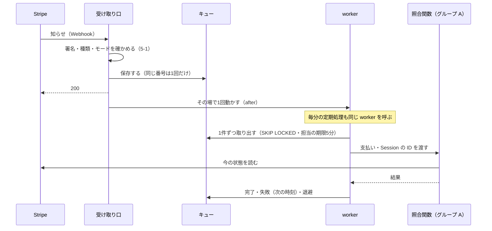
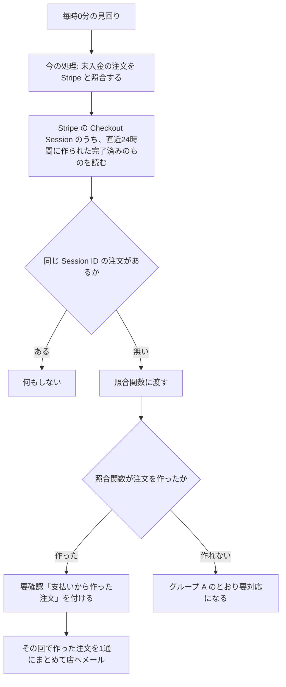
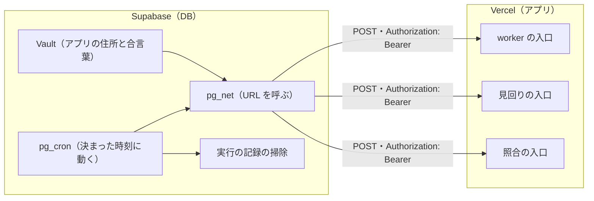
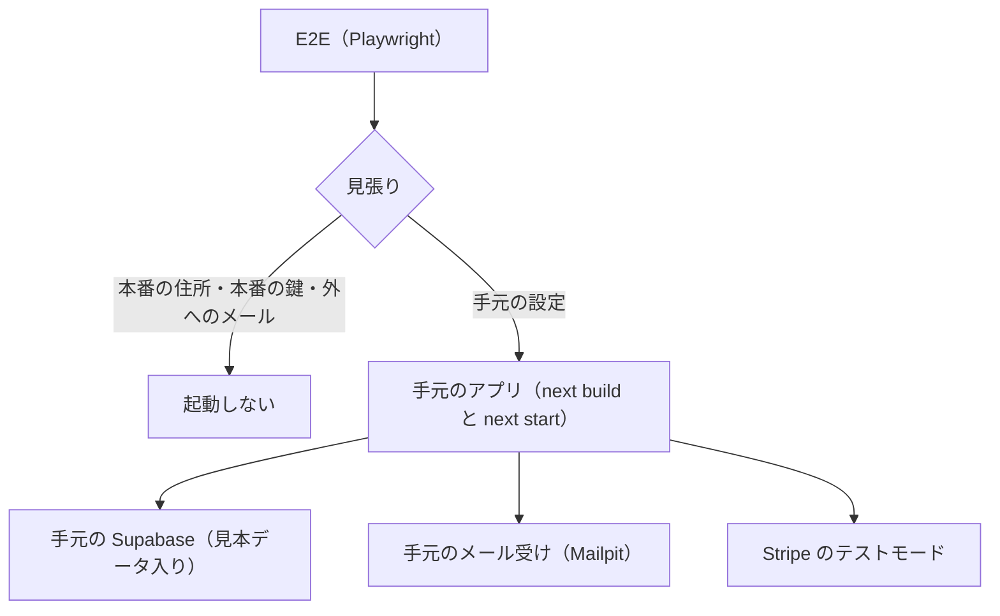

# Stripe の知らせのキューと定期処理の運用基盤 設計書（グループ B）

> 日付: 2026-10-05（第1〜5節の議論と節ごとの承認: 2026-10-05）
> 分類: architectural（キューの状態・定期処理の登録・受け取り口・E2E の接続先が変わるため）
> 対象の指摘: R-05, R-07, R-32, R-33, R-35, R-55, X-4（[レビュー台帳](../../05_Quality/reviews/code/2026-09-25-working-diff-security-review.md)）と、グループ A からの引き継ぎ（見回りと worker の本番登録、試行の上限と退避）
> 関連: [グループ A 設計書](2026-09-26-order-payment-reconciliation-design.md)、後続グループ C〜H（台帳の「対処計画」）

---

## 概要

Stripe から届く知らせ（Webhook）を、取りこぼさず、止まったら店が気づける形で処理する。失敗の扱いは Shopify と同じ（間隔を延ばして8回までやり直し、だめなら退避して知らせる）にし、取りこぼした支払いは毎時の見回りが拾って注文にする。あわせて、E2E を本番の DB から切り離す。

| 項目 | 決定 |
|---|---|
| 処理のきっかけ | 受け取った直後にその場で1回（`after()`）＋毎分の定期処理。1回の起動で約45秒まで続けて処理する |
| 失敗したとき | 1分から倍々に間隔を延ばし、やり直しは8回まで（最初の失敗から約4時間15分）。9回目の試行も失敗したら退避し、店へメール |
| 取りこぼしの安全網 | 毎時の見回りが、直近24時間の完了済みの決済のうち注文の無いものを注文にし、要確認「支払いから作った注文」を付ける |
| 定期処理 | pg_cron＋pg_net＋Vault。worker 毎分・見回り毎時・照合毎晩・実行の記録の掃除毎日（7日を残す） |
| 受け取り口 | 署名の確認だけ（送信元 IP の確認はしない）。署名不正は数えるだけ。13種以外の知らせとモードの違う知らせは保存しない |
| 店への知らせ | すべて `SHOP_ALERT_EMAIL` へのメール。種類ごとに1時間に1回まで |
| E2E | 手元の Supabase に切り替え、見張りで本番を拒む。見本データは架空。メールは外へ出さない |
| 普段の開発 | 開店まで今のまま（本番の DB）。開店のときに手元へ移す |
| 本番への入れ方 | DB の変更は push の後に MCP で当てる。定期処理の登録は開店のとき、手順書の順番どおり |

---

## 1. 目的

### 1-1 直す指摘

| ID | 内容 | この設計での直し方 |
|---|---|---|
| R-05 | 署名が正しくない知らせのたびに、DB に監査を書き、外へ通知する | 1件ずつは書かず、数えるだけにする。多いときだけ店へメール（5-2） |
| R-07 | 受け取り口を公開する前に、worker を定期で動かす仕組みが無い | その場の1回と毎分の定期処理（3-1）。開店のときは worker を動かしてから受け取り口を開ける（10-1） |
| R-32 | 10秒ごとの定期処理で実行の記録が溜まり、無料プランの容量を超える | 毎分にし、実行の記録は7日を残して毎日消す（4-4） |
| R-33 | 失敗し続ける知らせを、上限も退避も知らせも無くやり直し続ける | 9回目の試行で退避し、店へメール（3-2・3-4） |
| R-35 | worker が1回の起動で1件しか処理しない | 1回の起動で約45秒まで続けて処理する（3-1） |
| R-55 | E2E が本番の DB に注文を作るおそれがある | 受け取り口でモードを確かめる（5-1）。E2E は手元の DB（第7章） |
| X-4 | 照合の定期処理の合言葉を、時間が一定でない比べ方で確かめている | 全部の定期処理の入口で、同じ安全な確かめ方を使う（4-3） |

### 1-2 設計中に決まった要望

- 失敗した知らせの扱いは Shopify と同じにする。管理画面の「やり直す」ボタンは作らない（2026-10-05）。
- 注文の無い支払いを拾って作った注文は、それとわかるようにする。目的は、その注文について注文者に確認すること（2026-10-05）。
- 店への知らせはメールだけにする。外からの見張り（生存の合図を送るサービス）は入れない。
- 受け取り口は署名の確認だけにする（Shopify と同じ。送信元 IP の確認はしない）。
- E2E は手元の Supabase で流す。見本データは架空のものにし、メールは外へ出さない。

### 1-3 成功の基準

- やり直しの間隔・回数・退避・知らせの回数の上限を、単体テストで確かめる。
- 1回の起動で複数の知らせを処理し、同時に動いても同じ知らせを二重に処理しない（DB の結合テスト）。
- 注文の無い完了済みの決済が、次の見回り（1時間以内）で要確認つきの注文になる。
- 署名が正しくない要求で、DB の行が増えない。
- E2E を流しても本番の DB の行が増えず、本物のメールが出ない。本番の住所を指定すると E2E が起動しない。
- 切り替えの前に通っていた E2E が、切り替えの後も通る。

---

## 2. 今の状態（2026-10-05）

| 部品 | 今 | 問題 |
|---|---|---|
| キュー（`stripe_webhook_events`） | 状態は queued・processing・completed・failed。取り出しで試行回数を増やし、担当の期限は5分。失敗の後は「試行回数×30秒（上限30分）」で、期限なくやり直す | 上限・退避・知らせが無い（R-33） |
| 受け取り口（`/api/webhook/stripe`） | 署名を確かめて全種類を保存し、200 を返す。署名不正は毎回 `logAudit`（DB への書き込みと `ALERT_AUDIT_URL` への送信） | 署名不正で DB が増える（R-05）。使わない種類も保存する。モードを確かめない |
| worker（`/api/cron/process-stripe-webhooks`） | 1回の起動で1件。失敗はキューに記録するだけ | 集中時に遅れる（R-35）。知らせが無い |
| 定期処理の登録 | 本番は保持期間の掃除2件だけ。worker（10秒ごと）と見回り（毎時）の登録 SQL は保留中の置き場にある | worker が本番で動かない（R-07）。10秒ごとだと記録が溜まる（R-32） |
| 照合（`/api/cron/stripe-reconcile`） | GET。合言葉を `!==` で比べる。返金の同期の1件の失敗で、その回の残りが止まる | X-4。1件の失敗で全体が止まる |
| E2E | アプリが `.env.local` の本番の Supabase につながる。お問い合わせのテスト4件が Resend で本物のメールを送る | 本番の DB にテストのデータが溜まる。example.com 宛てのメールが戻る（R-55） |

---

## 3. キューと worker

### 3-1 処理の流れ

- 受け取り口は保存した後すぐ 200 を返し、同じ関数の続き（Next.js の `after()`）で worker を1回動かす。ふだんは数秒で注文に反映される。
- 毎分の定期処理も worker を呼び、取りこぼしを拾う。
- worker は、取り出せる知らせが無くなるか、約45秒たつまで1件ずつ処理を続ける。残りは次の起動で処理する。
- 同時に複数の worker が動いても、`FOR UPDATE SKIP LOCKED` と担当の印（claim token）で、同じ知らせを二重に取らない（今の仕組みのまま）。
- 処理の終わりに点検（4-6）を行う。

### 3-2 失敗とやり直し

| 試行 | 前の失敗からの間隔 | 最初の失敗からの目安 |
|---|---|---|
| 1回目 | ―（受け取った直後） | ― |
| 2回目 | 1分 | 1分 |
| 3回目 | 2分 | 3分 |
| 4回目 | 4分 | 7分 |
| 5回目 | 8分 | 15分 |
| 6回目 | 16分 | 31分 |
| 7回目 | 32分 | 63分 |
| 8回目 | 64分 | 2時間7分 |
| 9回目 | 128分 | 4時間15分 |

- やり直しは8回まで（Shopify の「4時間で8回」に合わせた）。最初の試行と合わせて9回試し、9回目も失敗したら退避する（3-4）。
- 失敗した試行の回数を n とすると、次の試行は 2^(n-1) 分後。
- 定期処理は毎分なので、実際の時刻は最大1分ほど遅れる。
- 処理の途中で担当の期限（5分）が切れた試行も、1回の失敗として数える（原因 `lease_expired`）。

### 3-3 原因の記号

失敗には原因の記号だけを残す。例外の文やスタック、個人情報は残さない（今の方針のまま）。

| 記号 | 意味 |
|---|---|
| `stripe_unavailable` | Stripe の通信の失敗・5xx・回数制限（グループ A） |
| `db_unavailable` | DB の接続・タイムアウト・デッドロック（グループ A） |
| `not_converged` | 書いた後の読み直しが3回で収まらない（グループ A） |
| `lease_expired` | 処理の途中で担当の期限が切れた |
| `invalid_payload` | 保存した知らせの中身が壊れている |
| `unexpected_error` | 上のどれにも当たらない |

### 3-4 退避

- 9回目の試行も失敗したら、状態を「退避」（`dead`）にし、退避した時刻を残す。以後は取り出さない。行は記録として残す。
- 店へのメールは、退避した知らせごとに1回だけ知らせる。点検（4-6）がまだ知らせていない退避をまとめて1通にする（1時間に1回まで）。
- 退避した知らせのやり直しボタンは作らない。注文の状態は毎時の見回り、返金と会計は毎日の照合が、Stripe の今の状態に合わせる（Shopify が求める照合の仕事と同じ考え方）。
- Stripe の管理画面から同じ知らせを送り直しても、同じ番号は保存済みとして扱い、処理し直さない（今のまま）。

### 3-5 注文の無い支払いの拾い上げ（毎時の見回り）

- 毎時の見回り（`/api/cron/expire-pending-orders`）の、今の処理の後に足す。時間の予算は今の45秒の中で使い、読み切れない分は次の回に回す。
- 読む範囲は毎回「直近24時間」で重なるので、1回失敗しても次の回で拾える。同じ Session を何度渡しても、照合関数は同じ結果に収まる（グループ A）。
- 当店の決済の下書きを持たない Session は、照合関数が「対象外」として扱う（グループ A）。
- 照合関数が注文を作ると、お客様にはグループ A のとおり注文確定（または、お支払い待ち）のメールが届く。

### 3-6 要確認「支払いから作った注文」

- `orders.review_reason` に `recovered_from_payment` を足す。管理画面の表示は「支払いから作った注文：お客様へ確認してください」。
- 付けるのは、見回り（3-5）が注文を作ったときだけ。Webhook の経路で作った注文には付けない（F の前は、通常の注文も Webhook が先に作ることがあるため）。
- ORDER タブの「要対応・要確認」の欄、注文一覧の要確認の印、サイドメニューの件数に出る（今の要確認と同じ場所）。
- 「確認済みにする」で消える（今の操作。確認した日時と人を残す）。
- 「在庫を確保できなかった」（`stock_not_reserved`）にも当たるときは、在庫の理由を残す。出荷できないことへの対応が先に要るため。店へのメールには両方を書く。

---

## 4. 定期処理

### 4-1 一覧

| 定期処理 | 時刻（日本時間・UTC） | 入口 | 何をする | 遅れの知らせ |
|---|---|---|---|---|
| worker | 毎分 | POST `/api/cron/process-stripe-webhooks` | キューを約45秒まで処理し、点検する | 溜まり（15分）を点検で見る |
| 見回り | 毎時0分 | POST `/api/cron/expire-pending-orders` | 未入金の注文の照合、注文の無い支払いの拾い上げ（3-5）、未送信の要対応メールの再送、点検 | 最後の成功から2時間 |
| 照合 | 毎日 3:00（18:00 UTC） | POST `/api/cron/stripe-reconcile` | 入金・返金・会計・Stripe からの入金（payout）を照合する | 最後の成功から25時間 |
| 実行の記録の掃除 | 毎日 4:00（19:00 UTC） | DB の中だけ | `cron.job_run_details` の7日より古い行を消す | ― |

- 照合の「25時間」は、承認した「1日以上」に、時刻のずれの余裕として1時間を足した値。

### 4-2 呼び出しの仕組み

- Supabase の公式の手順（pg_cron＋pg_net で URL を呼び、合言葉は Vault に置く）と同じ形にする。Vercel の無料プランの Cron（1日1回まで）には頼らない。
- 定期処理はアプリの公開 URL を呼ぶので、登録は Vercel に公開した後になる（10-1）。登録の SQL は保留中の置き場（`supabase/pending/`）に置く（8-3）。
- 実行の記録の掃除は URL を呼ばないので、通常の移行に入れて今すぐ当てる。

### 4-3 合言葉

- 全部の定期処理の入口で、同じ1つの確かめ方を使う。合言葉を SHA-256 にしてから `timingSafeEqual` で比べる（今の `authorizeCronBearer`）。共通の場所に置き直し、`stripe-reconcile`・`meta-kpi-sync`・`expire-pending-orders` の個別の比べ方を置き換える。
- `CRON_SECRET` が32文字より短いときは設定の誤りとして全部断り、ログに1行出す。
- 照合の入口は GET から POST に変える（`net.http_post` で呼ぶため）。`meta-kpi-sync` は確かめ方をそろえるだけで、登録はしない。
- 合言葉は Vercel の環境変数と Vault にだけ置く。入れ替えの手順を手順書に入れる（10-3）。

### 4-4 実行の記録の掃除

- pg_cron は実行の記録（`cron.job_run_details`）を自動では消さない。Supabase の公式の例どおり、7日を残して毎日消す。
- worker を10秒ごとから毎分にするので、記録は1日8,640行から1,440行に減る。

### 4-5 照合の1件ずつの受け止め

- 今の照合は、返金の同期（`syncRefunds`）の1件の失敗で、その回の残りがすべて止まる。
- 支払いごとに失敗を受け止め、監査に ID と原因の記号を残して次へ進む。その回の終わりに、失敗の件数を結果に含める。

### 4-6 点検（遅れと溜まりの見張り）

worker と見回りは、処理の終わりに同じ点検をする。

| 点検 | 条件 | 知らせ |
|---|---|---|
| 溜まり | 受け取ってから15分以上たって完了していない知らせ（待ち・処理中・やり直し待ち）がある | 店へメール（1時間に1回まで） |
| 退避 | まだ知らせていない退避がある | まとめて1通（1時間に1回まで） |
| 見回りの遅れ | 見回りの最後の成功から2時間以上 | 店へメール（1時間に1回まで） |
| 照合の遅れ | 照合の最後の成功から25時間以上 | 店へメール（1時間に1回まで） |

- 定期処理は、成功するたびに最後の成功の時刻を記録する（`ops_job_heartbeats`）。
- 一度も成功していない定期処理は、遅れの点検の対象にしない。登録した後に動いたかどうかは、手順書で確かめる（10-1）。
- アプリや DB ごと止まったときは、知らせが出ない。外からの見張りは入れないと決めた（1-2）。

---

## 5. 受け取り口

### 5-1 確かめる順番

| 順 | 確かめること | 当たらないとき | DB への書き込み |
|---|---|---|---|
| 1 | `STRIPE_WEBHOOK_SECRET` がある | 500 | なし |
| 2 | 署名がある・正しい（時刻の差は5分まで。ライブラリの既定のまま） | 400。数えるだけ（5-2） | 数の1行を更新 |
| 3 | 種類が下の13種のどれか | 200（保存しない）。ログに1行 | なし |
| 4 | モードが合う（本番の鍵なら本番の知らせ、テストの鍵ならテストの知らせ） | 200（保存しない）。店へメール（1時間に1回まで）。鍵の頭が分からないときだけ 500（下の注記。2026-10-07） | 数の1行を更新 |
| 5 | キューに保存する（同じ番号は1回だけ） | 500（Stripe が送り直す） | キューに1行 |
| 6 | 200 を返し、その場で worker を1回動かす | ― | ― |

- 13種: `checkout.session.completed`・`checkout.session.async_payment_succeeded`・`checkout.session.async_payment_failed`・`checkout.session.expired`・`payment_intent.succeeded`・`payment_intent.payment_failed`・`refund.created`・`refund.updated`・`refund.failed`・`charge.refunded`・`payout.paid`・`payout.failed`・`payout.reconciliation_completed`。一覧は1か所の定数に置き、Stripe 側の購読も同じ13種にする（10-3）。
- モードは `STRIPE_SECRET_KEY` の頭（`sk_live_`・`rk_live_` なら本番、`sk_test_`・`rk_test_` ならテスト）で決め、知らせの `livemode` と比べる。違うのは設定の誤りなので、店へ知らせる。
- 2026-10-07（最終レビューの直し）: 鍵の頭が `sk_live_`・`rk_live_`・`sk_test_`・`rk_test_` のどれでもないとき（引用符つきで貼った・`pk_` の鍵など。鍵は設定されている）は、200 で捨てずに 500 を返し、Stripe に最大3日送り直させる。200 だと、鍵を直した後に取り戻せない知らせが失われるため。保存しないこと、ログに1行出すこと、モード違いとして数えて店へ知らせること（メールの「このアプリの鍵」は「不明」）は、これまでと同じ。鍵が分かっていてモードだけ違うときは、これまでどおり 200。
- 処理する側（worker と照合関数）は、知らせの中身では支払いの状態を決めず、毎回 Stripe に読みに行く（グループ A）。偽の知らせが仮に署名を通っても、注文は支払い済みにならない。

### 5-2 署名不正の数え方

- 署名の欠落・不一致は、どちらも400で断る。監査ログ（`audit_logs`）に1件ずつ書かず、`ALERT_AUDIT_URL` へも送らない。
- サーバーのログには、秘密も中身も含まない1行だけを出す。
- 10分ごとの件数を `ops_alert_state` の1行で数える。10分に5件以上で店へメールを送る（1時間に1回まで）。行は増えない。
- メールには件数と、次の案内を入れる。「Stripe の署名の合言葉の設定を確かめる。設定が正しければ、外からの偽の知らせを断っているだけ」。
- 10分・5件・1時間は定数にまとめ、後で変えられるようにする。

### 5-3 採らなかった案：送信元 IP の確認

Stripe は、署名に加えて送信元 IP（今は15個）を確かめることも勧めている。採らなかった理由は次のとおり。

- 処理する側が毎回 Stripe に読みに行くので、偽の知らせではお金の被害が出ない。効くのは、署名の合言葉だけが漏れた場合に、ゴミが箱に入るのを止めることに限られる。
- 合言葉は Stripe の秘密鍵や DB の鍵と同じ場所に置く。そこが漏れたら、ほかの鍵も漏れていて、IP の確認では守れない。
- IP の一覧を持ち続ける手間がかかる。変更の知らせは7日前に英語のメーリングリストで届く。見落とすと本物の知らせを断ってしまう。
- Shopify は署名（HMAC）の確認だけを求めている。
- 店が大きくなったら、受け取り口の先頭に足せる。

---

## 6. 店への知らせ（まとめ）

宛先はすべて `SHOP_ALERT_EMAIL`（今の要対応のメールと同じ）。お客様の名前・住所・メールアドレスは入れず、番号と管理画面への案内を入れる。

| 知らせ | 条件 | 回数の上限 | 中身 | 送るところ |
|---|---|---|---|---|
| 退避 | 9回目の試行も失敗した | まとめて1通、1時間に1回 | 知らせの番号・種類・原因の記号・受け取った時刻・試行の回数。注文は見回りと照合が Stripe に合わせること | 点検（4-6） |
| 溜まり | 受け取ってから15分以上たって完了していない知らせがある | 1時間に1回 | 状態ごとの件数、いちばん古い受け取りの時刻、原因の記号の内訳 | 点検 |
| 見回りの遅れ | 最後の成功から2時間以上 | 1時間に1回 | 最後の成功の時刻 | 点検 |
| 照合の遅れ | 最後の成功から25時間以上 | 1時間に1回 | 最後の成功の時刻 | 点検 |
| 署名不正 | 10分に5件以上 | 1時間に1回 | 件数と確かめること（5-2） | 受け取り口 |
| モード違い | 1件でも | 1時間に1回 | 届いたモードと鍵のモード、確かめること | 受け取り口 |
| 支払いから作った注文 | 見回りが注文を作った | 見回り1回につき1通 | 注文番号・金額・お客様へ確認すること | 見回り（3-5） |
| 照合で見つかったこと（2026-10-07 に追加。最終レビュー） | 毎晩の照合が、直近7日の注文の無い成功の支払い（全額返金済みを除く）か、支払い・入金ごとの失敗を見つけた | 照合1回につき1通（見つかった夜だけ）。権利（claim）も間隔も無い。送れなくても送り直さない（支払いは翌夜も載り、失敗は翌夜の照合でやり直す） | 支払いの ID・金額・支払いの時刻と、失敗の ID・原因の記号（どちらも20件まで）、確かめること。お客様の名前・住所・メールアドレスは入れない | 照合（4-1） |

- 種類ごとの「最後に送った時刻」を `ops_alert_state` に記録し、送れたときだけ進める。送れなかったら、次の点検でもう一度試す（グループ A の要対応のメールと同じ考え方）。ただし、受け取り口の2つの知らせ（署名不正・モード違い）は、2026-10-07 に決めた例外（裁定 T7-R1）で、送れなくても権利（最後に送った時刻）を返さず、1時間たってから試し直す。外からの不正な要求で、メールの送り直しを起こさせないため。

---

## 7. E2E と開発環境

### 7-1 範囲

| 対象 | つなぎ先 | 時期 |
|---|---|---|
| E2E と push の前の検査（pre-push） | 手元の Supabase | 今すぐ |
| 普段の開発（`npm run dev`） | 本番の DB のまま。手元の画面から本番の商品を登録できる | 開店のときに手元へ移す（10-1） |
| DB の結合テスト | 手元の Supabase | 今のまま |

### 7-2 つなぎ先

| 相手 | 今 | 切り替えの後 |
|---|---|---|
| Supabase | 本番（`.env.local`） | 手元（`127.0.0.1:54321`） |
| メール | Resend で本物を送る | 手元のメール受けに溜める。外へは出さない |
| Stripe | テストモード | テストモード（今と同じ） |
| Turnstile | Cloudflare のテスト用の鍵 | 今と同じ |
| 3000番のアプリ | 動いていれば、設定を確かめずに使い回す | 見張りが確かめたものだけ使い回す |

### 7-3 見張り

E2E の起動（`scripts/e2e-server.mjs`）と Playwright の設定（`playwright.config.ts`）の両方で、始める前に次を確かめる。当たらなければ理由を出して止める。

- Supabase の住所が `localhost`・`127.0.0.1`・`::1` のどれか。
- Stripe の秘密鍵がテスト用（`sk_test_`・`rk_test_`）。
- メールの送り先が手元のメール受け。
- 3000番で動いているアプリは、この仕組みが手元の設定で起動したものだと印で確かめられるときだけ使い回す。それ以外は止める。

あわせて次のようにする。

- 手元の Supabase の住所と鍵は、起動のたびに `npx supabase status` から読む（ファイルに書かない）。手元の Supabase が動いていなければ止める。
- `.env.local` の本番の Supabase の鍵と Resend の鍵は、E2E のアプリにもテストにも渡さない。E2E 用の値で上書きする。

### 7-4 見本データ

- `supabase/seed.sql` に架空のデータを書く。`supabase db reset` のたびに、移行の後に入る（Supabase の仕様）。
- 中身は、公開中の商品（色・サイズ・在庫を含む）、ルック（商品とのつながり）、ニュース、取扱店。画像は、E2E の前に手元の Storage に置く仮の画像（架空の小さな PNG）を使う。検索のテスト（`FR-SEARCH-007`）が、画像が Storage の署名つき URL で表示されることを確かめるため（2026-10-05、計画づくりの中で決定）。
- Next.js 16 は手元の住所の画像の最適化を既定で止めるので、手元の Supabase につないだビルドのときだけ、手元の Storage の画像を許す（本番のビルドは変わらない）。
- お客様・管理者のアカウント、注文、個人情報は入れない。E2E のログインは今どおり、偽の応答で行う。
- 既存のテストが前提にする番号（例: 商品 101）があれば、見本データでそろえる。
- DB の結合テストも同じ手元の DB を使う。見本データが入っても結合テストが通ることを確かめる。

### 7-5 メール

| 動かし方 | メールの送り先 |
|---|---|
| E2E（本番の作り方で起動） | 起動の仕組みが「手元のメール受け」に固定する |
| 普段の開発（`next dev`） | 設定にかかわらず、手元のメール受け |
| 本番（Vercel） | 今どおり Resend |

- 手元のメール受けは、手元の Supabase に付いている Mailpit（画面は54324番）。テストはここでメールの中身を確かめられる。
- 手元の Supabase が動いていないときは、メールの送信の失敗として扱う（今のメールの失敗と同じ扱い）。

### 7-6 Stripe

- テストモードのまま。11件のテストが、Stripe のテスト用の API と決済画面を使う（お金は動かない）。
- E2E は Stripe の知らせ（Webhook）を手元へつながない。決済から知らせ、注文までの流れは、DB の結合テストと単体テストで確かめる。
- 受け取り口がモードを確かめる（5-1 の4）ので、仮にテストの知らせが本番に届いても処理しない。

### 7-7 手元の Supabase の設定（`supabase/config.toml`）

- Auth の `site_url` と追加の戻り先に、`http://localhost:3000` と `http://127.0.0.1:3000` を入れる（今は `https://127.0.0.1:3000` で、Playwright の `http://localhost:3000` と合わない）。
- アプリのメールは、手元のメール受け（Mailpit）の送信 API（`POST /api/v1/send`、画面と同じ54324番）で渡す。SMTP の口は開けない（2026-10-05、計画づくりの中で確認）。

---

## 8. DB の変更と権限

### 8-1 変更

| 対象 | 変更 |
|---|---|
| `stripe_webhook_events` | 状態に `dead`（退避）を足す。受け取った時刻・退避した時刻・店へ知らせた時刻の列を足す。失敗の関数を、倍々の間隔と9回目の失敗での退避に変える。担当の期限切れを `lease_expired` として数える。溜まりを数えるための索引を足す |
| `ops_job_heartbeats`（新規） | 定期処理ごとの最後の成功・最後の失敗の時刻と、原因の記号 |
| `ops_alert_state`（新規） | 知らせの種類ごとの最後に送った時刻と、10分ごとの件数 |
| `orders.review_reason` | `recovered_from_payment` を足す |
| pg_cron | 実行の記録の掃除（毎日、7日を残す）を登録する |

- 受け取った時刻は、新しい列 `received_at`（既定値 `now()`）に残す。今の列 `processed_at` は取り出すたびに今の時刻へ書き換わるので、受け取ってからの時間を測るのに使えない（2026-10-05、計画づくりの中で確認）。今ある行の `received_at` は `processed_at` の値で埋める。
- 店へのメールの回数の上限と、署名不正の数え方は、`ops_alert_state` を1回で読み書きする関数で行う（同時に動いても、1時間に2通にならない）。

### 8-2 権限

- 新しい表は RLS を有効にし、許可の方針を置かない（`anon`・`authenticated` は読めない）。
- 新しい関数と変える関数は `service_role` だけが実行できる。`search_path=''` と完全修飾名を使い、`PUBLIC`・`anon`・`authenticated` の実行権限を剥がす（グループ A と同じ）。

### 8-3 保留中の SQL（開店のときに当てる）

| ファイル | 中身 |
|---|---|
| `schedule_stripe_webhook_worker.sql` | worker を10秒ごとから毎分に変える |
| `schedule_expire_pending_orders.sql` | 見回りを毎時0分に呼ぶ（今のまま） |
| `schedule_stripe_reconcile.sql`（新規） | 照合を毎日 18:00 UTC（日本時間 3:00）に POST で呼ぶ |

- どれも pg_net を有効にし、Vault の `app_base_url` と `cron_secret` を読む（今の形）。適用のときに無ければ警告し、実行のときに無ければ失敗として記録に残す。

---

## 9. テスト

### 9-1 自動テスト

テストを先に書いてから作る。作るのは Codex、レビューは Opus。

| 種類 | 確かめること |
|---|---|
| 単体（Jest） | やり直しの間隔の表と9回目での退避。退避のまとめのメール（1通・1時間に1回・送れなかったら次の点検で）。溜まりと遅れの点検（一度も成功していない処理は対象外）。署名不正（1件ずつ書かない・10分に5件で1通・1時間に1回）。13種の絞り込み。モード違い。受け取った後に worker を動かすこと。定期処理の確かめ方（全部の入口・32文字未満を断る・照合は POST）。照合の1件ずつの受け止め。見回りの拾い上げ（注文の有無で分ける・作ったときだけ要確認・1通にまとめる・在庫の理由が先） |
| DB の結合（手元の Supabase） | 取り出しの並行（同じ知らせを二重に取らない）。失敗の関数の間隔と退避。担当の期限切れ。点検と知らせの関数（回数の上限・10分の数え方）。`review_reason` の新しい値。権限（`anon`・`authenticated` から読めない・実行できない）。掃除の定期処理の登録 |
| E2E（手元の DB・本番ビルド） | 要確認「支払いから作った注文」の表示（スマホ・タブレット・パソコンの3つの画面幅）。署名が正しくない要求を5回送ると400が返り、手元のメール受けに店への知らせが1通届くこと（1時間に1回の上限があるので、画面幅ごとに手元の DB の知らせの状態を消してから送る） |
| 見張り（Jest） | 本番の住所・本番の鍵・外へのメールのどれかで止まること。確かめられない3000番のアプリを使い回さないこと |

- 要求管理のルールに従い、画面に出るもの（要確認の文言）と署名不正の知らせは、要件定義書に FREQ を足し、`e2e/FR-*` のテストを作る。

### 9-2 E2E の切り替えの比べ方

- 「前」は、2026-10-05 1:04 に本番の DB で流した全件の結果（`test-results/.last-run.json`。248件が失敗）。上書きされる前に作業用のフォルダへ写した。
- 切り替えの後に全件を流し、この248件以外で落ちたテストは、見本データかコードを直して通す。
- 本番の DB でもう一度流す必要はない。

### 9-3 完了の条件

- 型の検査・lint・単体テスト・DB の結合テスト・E2E（手元の DB・本番ビルド）が全部通る。E2E は 9-2 の比べ方で判断する。
- E2E を流す前と後で本番の DB の行が増えていない。本物のメールが出ていない。本番の住所を指定すると E2E が止まる。

---

## 10. 本番への入れ方

### 10-1 順番

| 順 | いつ | やること | 誰が |
|---|---|---|---|
| 1 | 今 | 作る → レビュー → 9-3 の確認 | Claude と Codex |
| 2 | 今 | push | ユーザー |
| 3 | 今 | B の DB の変更（移行）を本番 DB に当てる。CI は鍵の権限の問題で止まっているので、グループ A と同じく MCP で当てて、移行の記録を残す | Claude（その都度ユーザーの許可） |
| 4 | 開店のとき | Vercel に公開し、環境変数を入れる（`CRON_SECRET` は32文字以上のランダム） | ユーザー |
| 5 | 開店のとき | 本番 DB で pg_net を有効にし、Vault に `app_base_url` と `cron_secret` を入れる | ユーザー（合言葉）、Claude（許可を得て残り） |
| 6 | 開店のとき | 保留中の SQL（8-3）を当て、定期処理を登録する | Claude（許可を得て） |
| 7 | 開店のとき | 4つの定期処理が成功しているのを、実行の記録と `ops_job_heartbeats` で確かめる | Claude |
| 8 | 開店のとき | 最後に、Stripe の知らせの宛先を登録する（13種）。最初の知らせが処理されたのを確かめる | ユーザー |
| 9 | 開店のとき | 普段の開発を手元の DB に切り替える（第7章） | Claude とユーザー |

- 1 の中では、第7章（E2E の切り離し）を先に作る。後の作業で E2E を流しても、本番の DB に書かず、本物のメールも出さないため。
- 6・7 を 8 より先にする。worker が動いているのを確かめてから、受け取り口を開ける（R-07）。
- 3 を今やる理由: 開店までは普段の開発が本番の DB を使う。DB が古いままだと、新しいコードが手元で動かない。

### 10-2 B の外で、開店までに要るもの

- CI の鍵（`SUPABASE_ACCESS_TOKEN`）の権限を直す（後で対処すると決めたもの）。
- 店への知らせの宛先（`SHOP_ALERT_EMAIL`）を入れる。
- Vercel のプランを決める。無料プラン（Hobby）は規約で個人の非商用に限られ、支払いを受け付けるサイトは Pro 以上が要る。

### 10-3 手順書に入れるもの

`docs/06_Operations/` に手順書を足す。

- 開店のときの順番（10-1 の4〜9）と、各段の確かめ方（`cron.job_run_details`・`net._http_response`・`ops_job_heartbeats`・キューの状態）。
- `CRON_SECRET` の入れ替え: 新しい値を作る → Vercel を更新して出し直す → Vault を更新する → 次の実行の成功を確かめる。入れ替えの間の数分は定期処理が断られるので、見回りの直後に行う。
- Stripe の署名の合言葉の入れ替え: Stripe の画面で入れ替える（古い合言葉も最大24時間通る）→ その間に Vercel の `STRIPE_WEBHOOK_SECRET` を更新して出し直す。
- Stripe の購読を13種にする手順。
- 知らせのメールが届いたときの調べ方（退避・溜まり・遅れ・署名不正・モード違い・支払いから作った注文・照合で見つかったこと）。

---

## 11. 範囲外と後続への引き継ぎ

| 項目 | 扱い |
|---|---|
| 送信元 IP の確認 | 採らない（5-3） |
| 外からの見張り（生存の合図） | 入れない（1-2） |
| 退避した知らせのやり直しボタン | 作らない（3-4） |
| 普段の開発の手元への切り替え | 開店のとき（10-1 の9） |
| 処理済みの知らせの古い行の掃除 | 量が小さいので入れない。必要になったら別に決める |
| `ALERT_AUDIT_URL` と `functions/alert-audit` | 使わない（設定しない）。コードは触らない |
| `meta-kpi-sync` の定期処理の登録 | 入れない。確かめ方をそろえるだけ（4-3） |
| F への引き継ぎ | F の後は、受付を通らない支払いを Webhook の経路で注文にした場合にも、要確認「支払いから作った注文」を付けるかを F で決める |

---

## 12. 参考資料

| 分野 | 資料 |
|---|---|
| Stripe | [Webhook でイベントを受け取る](https://docs.stripe.com/webhooks)、[届かなかったイベントの処理](https://docs.stripe.com/webhooks/process-undelivered-events)、[ドメインと IP アドレス](https://docs.stripe.com/ips) |
| Shopify | [Webhook のやり直しの変更](https://shopify.dev/changelog/updates-to-webhook-retry-mechanism)、[Webhook のベストプラクティス](https://shopify.dev/docs/apps/build/webhooks/best-practices)、[HTTPS で Webhook を受け取る](https://shopify.dev/docs/apps/build/webhooks/subscribe/https)、[開発用の店](https://shopify.dev/docs/api/development-stores)、[開発用の店の見本データ](https://shopify.dev/docs/api/development-stores/generated-test-data) |
| Supabase | [Edge Functions の定期実行（pg_cron＋pg_net＋Vault）](https://supabase.com/docs/guides/functions/schedule-functions)、[pg_cron の調べ方（記録の掃除）](https://supabase.com/docs/guides/troubleshooting/pgcron-debugging-guide-n1KTaz)、[環境の分け方](https://supabase.com/docs/guides/deployment/managing-environments)、[見本データ（seed.sql）](https://supabase.com/docs/guides/local-development/seeding-your-database)、[DB の容量](https://supabase.com/docs/guides/platform/database-size) |
| OWASP | [Logging Cheat Sheet](https://cheatsheetseries.owasp.org/cheatsheets/Logging_Cheat_Sheet.html)、[Secrets Management Cheat Sheet](https://cheatsheetseries.owasp.org/cheatsheets/Secrets_Management_Cheat_Sheet.html)、[Top 10 A05 Security Misconfiguration](https://owasp.org/Top10/A05_2021-Security_Misconfiguration/) |
| Vercel | [Cron の管理](https://vercel.com/docs/cron-jobs/manage-cron-jobs)、[公平利用の指針（商用の利用）](https://vercel.com/docs/limits/fair-use-guidelines) |
| Resend | [テストのメールの送り方](https://resend.com/docs/dashboard/emails/send-test-emails) |
