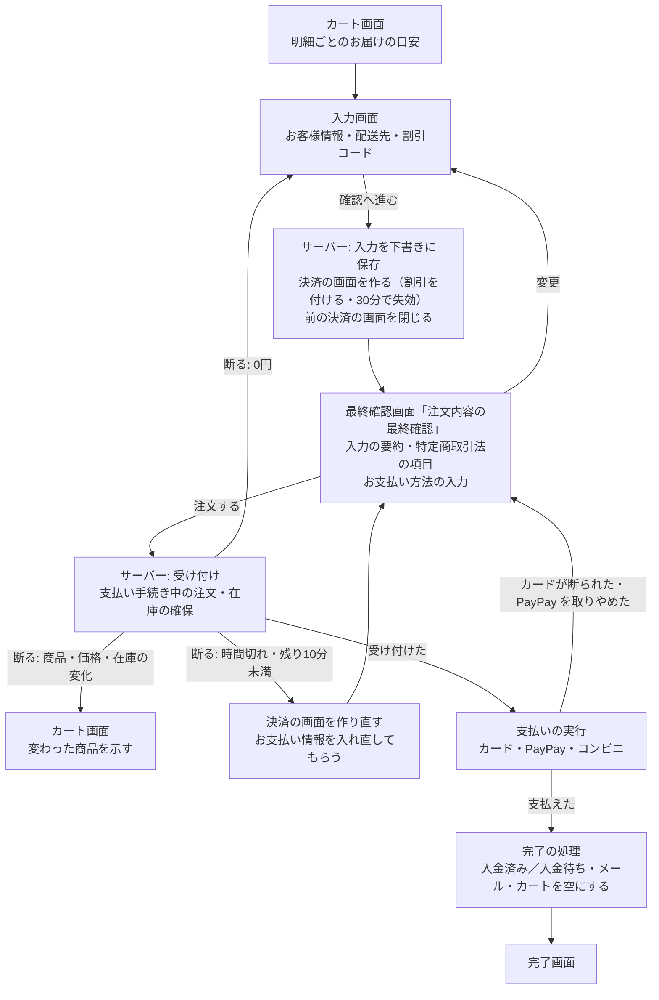

# 支払いを「注文する」で行う 設計書（グループ F）

> 日付: 2026-10-07（第1〜5節の議論と節ごとの承認: 2026-10-07）
> 分類: architectural（決済の画面を作る時点、お支払い方法の入力欄の位置、受け付けの窓口、受け付けの DB の関数が変わるため）
> 対象の指摘: R-56, X-3、在庫を注文の確定時に確保する要望、R-28 の画面側（[レビュー台帳](../../05_Quality/reviews/code/2026-09-25-working-diff-security-review.md)）と、[グループ A 設計書](2026-09-26-order-payment-reconciliation-design.md) 第8章の F への引き継ぎ
> 関連: [グループ B 設計書](2026-10-05-webhook-queue-operations-design.md)、[1画面化の設計書](2026-09-11-checkout-single-step-design.md)、[決済手段の動的化の設計書](2026-09-12-checkout-dynamic-payment-methods-design.md)、[ブランド](../../01_Planning/brand.md)

---

## 概要

今は「確認へ進む」で支払いが確定し、確認画面で戻る・読み込み直すと先へ進めず、二重に払えてしまう（R-56）。最終確認の前に支払いが確定するので、特定商取引法 12条の6 の最終確認画面の趣旨にも合わない（X-3）。この設計では、支払いを最終確認画面の「注文する」に移す。「注文する」でサーバーが注文を受け付けて在庫を確保し、その場で支払いを実行する。

| 項目 | 決定 |
|---|---|
| 画面の流れ | 入力画面（お客様情報・配送先・割引コード）→「確認へ進む」→ 最終確認画面（入力の要約・特定商取引法の項目・お支払い方法の入力）→「注文する」。Shopify の3ページの形の最後のページに近い |
| 支払いの実行 | 「注文する」で、受け付け（「支払い手続き中」の注文を作り在庫を確保）→ 支払い → 完了の処理を一度に行う |
| 決済の画面（Stripe の Checkout Session） | 「確認へ進む」でサーバーが下書きから作る。30分で失効する。同じ下書きの前の決済の画面は閉じる |
| 割引コード | 入力画面でサーバーが確かめ、決済の画面を作るときにサーバーが付ける。お客様のブラウザからは変えられない |
| 在庫 | カートでは確保しない。確認画面で「在庫あり」と見せた明細が受注生産に変わったら受け付けず、カート画面で変わった商品を示す |
| 最終確認画面 | 表題「注文内容の最終確認」。特定商取引法 12条の6 の項目を出す |
| 入り直し（R-56） | 支払いの前は何も確定しない。受け付けの後は同じ決済の画面・同じ注文で続ける。支払いの後に入り直すと注文の状態を示す |
| 支払い方法 | カード・PayPay・コンビニ（今のまま） |
| DB | 受け付けの関数を作り直す移行を1本。見回りからの呼び出しは今までどおり動く |
| 公開 | DB の移行は push の後に許可を得て本番へ。アプリは開店のとき |

---

## 1. 目的

### 1-1 直す指摘と要望

| ID | 内容 | この設計での直し方 |
|---|---|---|
| R-56 | 「確認へ進む」で支払いが確定し、戻る・読み込み直しの後は決済フォームが出ず先へ進めない。カートを変えると二重に払える | 支払いを「注文する」に移す（第2章）。支払いの後に入り直すと注文の状態を示す（2-5） |
| X-3 | 最終確認の前に課金が確定し、特定商取引法 12条の6 の最終確認画面の趣旨に合わない | 最終確認画面で申し込み（「注文する」）と同時に支払う。必要な項目を出す（第4章） |
| 要望（2026-09-25） | 在庫は「確認へ進む」ではなく、次の画面で注文が確定しメールが送られる時点で確保する | 「注文する」の受け付けで確保する（第5章） |
| R-28（画面側） | 0円の注文を支払いの前に止める案内 | 割引コードを適用する時点と受け付けで断る（第3章・6-3） |
| A からの引き継ぎ | 受け付けの窓口、割引コードのサーバーでの付与、受け付けの後の割引の変更の停止、決済の画面の作り直し、「商品の内容が変わりました」の案内 | 第2・3・6章 |

### 1-2 できたと言える状態

- 確認画面で戻る・読み込み直す・カートから入り直すをしても、二重に払えない。
- 支払ったお客様は、注文の状態を必ず見られる。
- 在庫は「注文する」の時点で確保される。
- お届けの時期が確認画面で見せたものより遅くなるときは、お金が動く前にお客様に示される。
- お客様のブラウザから、受け付けた後の金額を変えられない。

### 1-3 範囲外

| 範囲外のもの | 扱う場所 |
|---|---|
| 割引コードの管理画面（作る・止める）、初回限定・1人あたりの回数の上限、注文に使ったコードの記録 | H |
| 在庫・注文・受注生産の管理画面 | G |
| ログイン客の注文の `user_id`（R-24 の Webhook 単独の経路） | C |
| メールの送信待ちの記録（outbox） | D |
| 返金の反映 | E |
| 銀行振込（今の決済の画面では使えない） | 使えるようにするとき |
| 特定商取引法の表示が要件を満たすかの最終判断 | 開店の前に専門家に確かめる（X-3 は台帳で「法務判断」のまま） |

---

## 2. 画面の流れ

### 2-1 入力画面

- お客様情報・配送先・割引コードを入れる。カードやコンビニの入力欄は、この画面から外して最終確認画面へ移す。
- この画面にはまだ決済の画面が無い。注文の要約の金額（小計・送料・割引・合計）は当店のサーバーが計算する。
- 割引コードの扱いは第3章。

### 2-2 「確認へ進む」

サーバーが次を行う。お金は動かない。

1. 入力を下書きに保存する（今の「確定の直前に必ず下書きへ書き込む」の決まりを引き継ぐ。FREQ-365）。
2. 下書きから Stripe の決済の画面を作る。商品・送料・確かめた割引をサーバーが付け、30分で失効させる。お客様のブラウザから割引コードを付ける設定（`allow_promotion_codes`）は使わない。
3. 同じ下書きで前に作った決済の画面が開いていれば閉じる。その決済の画面で受け付け済みの注文があれば、放棄の扱いになって在庫が戻る（グループ A の仕組み）。
4. 明細ごとの在庫の有無をその時点で読み直し、最終確認画面のお届けの時期に出す（第5章）。

### 2-3 最終確認画面

- 表題は「注文内容の最終確認」。
- 上部に入力した内容（お客様情報・配送先）を「変更」の案内つきで並べる。「変更」で入力画面へ戻る。戻ると、この画面で入れたお支払い情報は消える。
- 商品・数量・金額・送料・割引・合計は、決済の画面の金額をそのまま出す。
- 特定商取引法の項目（第4章）を出す。
- その下にお支払い方法の入力（Stripe の入力部品。カードの入力、PayPay・コンビニの選択）を置き、「注文する」を置く。
- この画面では割引コードを変えられない。

### 2-4 「注文する」

この順で一度に行う。

1. **受け付け**：サーバーが第6章の確かめをし、通れば「支払い手続き中」の注文を作り、在庫を確保する。同じ決済の画面なら同じ注文を返す。
2. **支払いの実行**：Stripe の支払いの命令（`confirm`）を、画面にある入力部品から行う。支払い方法ごとの動きは第7章。
3. **完了の処理**：照合関数が注文を入金済み（カード・PayPay）または入金待ち（コンビニ）にし、確定メールまたはお支払い待ちのメールを送る（グループ A）。カートを空にし、完了画面を出す。

「注文する」は処理中は押せない。

### 2-5 完了画面と入り直し（R-56）

| 離れた時点 | 開き直したとき |
|---|---|
| 「注文する」の前 | 入力画面から。何も確定していない |
| 受け付けの後、支払いの前 | 同じ決済の画面が開いていれば、同じ注文で支払いを続けられる。失効していれば在庫は戻っていて、最初から |
| 支払いの後 | エラーで止めず、「ご注文は確定しています」と注文番号と状態を示す画面へ案内する。カートを空にする。ログイン客には注文の詳細への案内を付ける |

今の入口が完了済みの決済の画面に返す「やり直せない」応答（409）は、この案内に置き換える。

---

## 3. 割引コード

開いている Stripe の決済の画面に、後からサーバーが割引を付ける手段は無い（決済の画面の更新で変えられるのは、明細・配送料・メタデータなど）。付け方を3つ比べ、A に決めた。

| 付け方 | 良い点 | 弱い点 | 決定 |
|---|---|---|---|
| A「確認へ進む」で割引を付けて決済の画面を作る | 第2章の流れにそのまま乗る。お客様のブラウザから割引を変えられない。Stripe の明細と領収書に割引として正しく出る | 確認画面ではコードを変えられない | 採る |
| B 今のまま（ブラウザから付ける） | 変更が少ない | 受け付けの後に割引を変えられ、受け付けた金額と払った金額が食い違う。サーバーが金額を決める方針（2026-09-27 承認）に反する | 採らない |
| C 商品の単価を下げて作る | 決済の画面の作り直しが要らない | 割引として記録されず、領収書と会計で見えない | 採らない |

決まり:

- 割引コードを入れる欄は入力画面に置く。「適用」でサーバーが Stripe に問い合わせ、有効か・期限内か・使える回数が残っているか・最低購入額を満たすかを確かめる。
- 合計が0円になるコードは「このコードでは合計が0円になるため使えません」と断る（R-28 の画面側。0円の注文は FREQ-389 どおり受けない）。
- 入力画面の要約には、サーバーが計算した割引後の金額を出す。最終確認画面は決済の画面の金額を出し、こちらが最終になる。
- 「確認へ進む」で、サーバーが決済の画面にコードを付ける。
- 受け付けでは、下書きの金額（割引を含む）と決済の画面の合計が一致するかを確かめる（グループ A の受け付けの決まり）。

---

## 4. 最終確認画面の表示（特定商取引法 12条の6）

消費者庁の[通信販売の申込み段階における表示についてのガイドライン](https://www.no-trouble.caa.go.jp/pdf/20241119la02_09.pdf)が最終確認画面に求める項目を、次のように出す。文言は[特定商取引法に基づく表記](../../../src/app/legal/page.tsx)と商品詳細の表記に合わせる。

| ガイドラインの項目 | 最終確認画面に出すもの |
|---|---|
| 分量 | 商品ごとの色・サイズ・数量 |
| 販売価格（送料を含む） | 商品ごとの価格、小計・送料・割引・合計（税込）。決済の画面の金額をそのまま出す |
| 支払の時期・方法 | カード：ご注文時にお支払いが確定します／PayPay：ご注文時に PayPay の画面でお支払いが確定します／コンビニ：ご注文から7日以内に、発行される払込番号でお支払いください。期限までにお支払いが確認できないときは、ご注文をキャンセルします |
| 引渡しの時期 | 明細ごとに、在庫あり：ご注文（コンビニはご入金）の確認後、3〜7営業日で発送／受注生産：発送まで数週間〜2か月以上（目安） |
| 申込みの期間 | 期間の定めが無いので出さない |
| 撤回・解除（返品） | ご注文後のお客様都合による返品・交換・キャンセルはお受けできません。初期不良・誤送は、商品到着後7日以内にご連絡ください。詳しくは特定商取引法の表記をご覧ください（表記のページへの案内つき） |

- 表題は「注文内容の最終確認」とし、ガイドラインが望ましいとする「最終確認の画面だと分かる表題」に合わせる。
- 申し込みのボタンは「注文する」。

---

## 5. 在庫の扱い

### 5-1 決まり

- カートでは在庫を確保しない（2026-09-25 の決定を 2026-10-07 に改めて確認。Shopify と同じく、注文の確定の時点で引く）。
- 在庫の有無は明細ごとに決める。数量の分の在庫が足りれば「在庫あり」、足りなければその明細は「受注生産」（グループ A の受け付けの決まり）。
- 在庫が無くても受注生産で買える。在庫が変わるとお届けの時期が変わるので、お金が動く前にお届けの時期を示す。

### 5-2 確かめる時点

| 時点 | 確かめること |
|---|---|
| カートから決済へ進むとき | カート画面に、その時点の明細ごとのお届けの目安（在庫あり・3〜7営業日で発送／受注生産・数週間〜2か月以上）を出す |
| 「確認へ進む」 | サーバーがその時点の在庫を読み直し、最終確認画面のお届けの時期に出す。入力画面で長く放置しても、最終確認画面は必ずその時点の状況になる |
| 「注文する」 | 最終確認画面で「在庫あり」と見せた明細と、受け付けの時点の在庫を比べる（5-3） |

### 5-3 在庫が変わったとき

- 最終確認画面で「在庫あり」と見せた明細のどれかが、受け付けの時点で受注生産になる（在庫が数量に足りない）なら、注文を作らない。在庫も確保しない。お金は動かない。
- カート画面へ移し、変わった商品を見て分かるようにする。
  - 画面の上に「在庫の状況が変わりました。次の商品は受注生産になります（発送まで数週間〜2か月以上）」と、商品名・色・サイズを並べる。
  - その商品の行に「在庫あり → 受注生産」の印を付ける。
  - お客様はその内容で良ければ、もう一度決済へ進む。
- 受注生産の予定だった明細に在庫が入った場合は、お届けが早まるだけなので止めずに受け付ける。早まったことは確定メールで伝える。

---

## 6. 受け付けの窓口と DB

### 6-1 受け付けの窓口

「注文する」で呼ぶサーバーの入口を新しく置く。

| 守ること | 中身 |
|---|---|
| 誰の注文か | ログインのお客様、またはゲストのセッションの持ち主の下書きだけを受け付ける |
| 金額 | お客様から送られた金額は使わない。サーバーが Stripe から決済の画面を読み直し、その合計と下書きを比べる |
| 在庫の見せ方 | お客様から受け取るのは、最終確認画面で「在庫あり」と見せた明細だけ。偽って送られても、在庫の確保はサーバーが決めるので害は無い（遅くなる変化を見つけるためだけに使う） |
| 決済の画面の状態 | 開いている・未払い・残り10分以上・この下書きと結び付いている・モード（本番／テスト）が鍵と合う |
| 二重の申し込み | 同じ決済の画面なら同じ注文を返す（受け付けの関数の一意の制約。在庫を二重に確保しない） |
| ほかのサイトからの送信 | 今の決済の入口と同じ、送信元の確かめと回数の制限 |
| 記録 | 断った理由の記号だけを残し、お客様の個人情報やカードの情報は残さない |

### 6-2 受け付けの関数の作り直し

グループ A の受け付けの関数 `place_order_from_checkout_draft` に、最終確認画面で「在庫あり」と見せた明細を受け取る引数を足す（既定は空）。

- 引数があるとき：その明細のどれかで在庫が数量に足りなければ、注文を作らず在庫も確保せずに、理由の記号 `stock_changed` を返す。
- 引数が無いとき（照合の見回りの予備処理からの呼び出し）：今までどおり、在庫が足りない明細を受注生産にして注文を作る。
- 関数の引数が変わるので、移行で古い定義を消して新しい定義を作る。名前付きの引数で呼んでいる今の呼び出しは、そのまま動く。
- 関数の安全の決まり（`SECURITY DEFINER`・`SET search_path = ''`・完全修飾名・実行は `service_role` だけ）はグループ A のまま。

### 6-3 断る理由と案内

どれもお金は動いていない。

| 理由 | 案内 | 移る先 |
|---|---|---|
| 商品が非公開・削除になった | ご注文いただけない商品が含まれています | カート |
| 価格が変わった | 商品の価格が変わりました。内容をご確認ください | カート |
| 在庫あり → 受注生産に変わった | 5-3 のとおり | カート |
| 合計が0円になる | このご注文は合計が0円になるため、お受けできません | 入力画面 |
| 決済の画面が時間切れ・残り10分未満 | 時間がたったため、お支払い情報をもう一度入力してください | 最終確認画面（決済の画面を作り直す） |
| 別のタブで進んでいる（決済の画面が閉じられている） | 別の画面で手続きが進んでいます。画面を読み込み直してください | そのまま |

---

## 7. 支払い方法ごとの動き

| 支払い方法 | 「注文する」の後 | うまくいかないとき |
|---|---|---|
| カード | 本人確認（3Dセキュア）は Stripe の画面が出す。支払えたら完了の処理 | 断られたら同じ最終確認画面に理由を出す。カードを直してもう一度「注文する」。受け付け済みの注文と確保した在庫はそのまま使う |
| PayPay | PayPay の画面に移って支払い、当店に戻る。戻ったら決済の画面の状態を読み、支払い済みなら完了画面 | PayPay で取りやめた場合は、最終確認画面に「PayPay でのお支払いが完了しませんでした」と出し、もう一度選べるようにする |
| コンビニ | 払込票が出る。注文は「入金待ち」になり、お支払い待ちのメールを送る | 期限（7日）までに支払われなければ、グループ A の仕組みで期限切れにし在庫を戻す |

受け付けの後にお客様が離れた場合は、30分で決済の画面が失効し、照合の見回りが注文を放棄の扱いにして在庫を戻す（グループ A。Stripe の知らせが届かなくても最長90分で戻る）。

---

## 8. 途中で止まったとき・戻ったとき

- 完了の処理（入金済みにする・メールを送る）は、画面の通信が切れても止まらない。Stripe の知らせ（グループ B のキュー）と毎時の見回りが、同じ結果に仕上げる。
- 受け付けの後に「変更」で入力画面へ戻り、もう一度「確認へ進む」を押した場合：前の決済の画面はサーバーが閉じ、受け付け済みだった注文は放棄の扱いになって在庫が戻る。新しい決済の画面で改めて受け付ける。
- 別のタブで同時に進めた場合：後から「確認へ進む」を押したタブが優先。前のタブで「注文する」を押すと、6-3 の「別のタブで進んでいる」の案内で止める。

---

## 9. テスト

| 種類 | 確かめること |
|---|---|
| 単体テスト | 受け付けの窓口が、6-3 の理由とモード違いで正しく断ること。同じ決済の画面なら同じ注文を返すこと。割引コードの確かめ（有効・期限・回数・最低購入額・0円）。「確認へ進む」で作る決済の画面の中身（割引がサーバーで付く、ブラウザから付ける設定を使わない、30分で失効、前の決済の画面を閉じる）。PayPay から戻ったときの振り分け |
| DB の結合テスト（手元の Supabase） | 作り直した受け付けの関数で、「在庫あり → 受注生産」の変化があると、注文も在庫の確保も作らずに `stock_changed` を返すこと。引数が無い呼び出し（見回り）は今までどおり動くこと |
| E2E（本番ビルド・手元の Supabase・3つの画面幅） | 最終確認画面に表題と第4章の項目が出ること。Stripe のテストのカードで「注文する」まで通り、注文ができて完了画面が出ること。支払いの後に戻る・読み込み直す・入り直すと注文の状態の画面へ案内されること。在庫が変わるとカート画面に変わった商品が示されること。割引コードの案内（使えない・0円） |

- 今の Stripe のテスト用の設定ではコンビニが使えない。コンビニと PayPay の流れは、単体テストと、Stripe の応答を差し替えた E2E で確かめる。
- 今の決済の E2E のうち、古い流れ（入力画面に決済の部品がある、ページを開いた時に決済の画面を作る）を前提にしたものは、新しい流れに書き直す。

---

## 10. 要件と文書・公開

### 10-1 要件と文書

- 要件定義書に FREQ の行を足す（番号は FREQ-417 から。実装計画で確かめる）。
  - 「注文する」で支払う（受け付け → 支払い → 完了）
  - 最終確認画面の表示（第4章）
  - 在庫の変化の案内とカートのお届けの目安（第5章）
  - 割引コードをサーバーで付ける・0円を断る（第3章）
  - 支払いの後の入り直しで注文の状態を示す（2-5）
- 古い流れを書いた今の FREQ には、置き換えたことを書く。
- 決済の詳細設計（`docs/04_DetailDesign/pages/13_checkout.md`）、決済の流れの図、API の一覧、レビュー台帳（R-56・X-3・F の行）を新しい動きに合わせる。

### 10-2 公開の順番

1. DB：受け付けの関数を作り直す移行を1本出す。今の呼び出し方（見回り）もそのまま動く。本番へは push の後に、ユーザーの許可を得て Supabase MCP で当てる。
2. アプリ：「確認へ進む」で決済の画面を作る、受け付けの窓口、最終確認画面、カートの案内。本番のアプリは開店のときに公開する。

### 10-3 開店の前に残ること

- 特定商取引法の表示が要件を満たすかを、できれば専門家に確かめてもらう。

---

## 11. 後続グループへの引き継ぎ

| グループ | 引き継ぐこと |
|---|---|
| H | 割引コードの管理画面。初回限定・1人あたりの回数の上限は自前で確かめ、第3章の「適用」の確かめに加える。注文に使ったコードを記録し、受け付けの確かめに加える |
| G | 在庫の管理画面。第5章の「在庫あり／受注生産」の決め方（明細ごと・数量の分）をそのまま使う |
| C・D・E | この設計で変わる前提は無い。完了の処理の後の流れ（照合関数・メール）はグループ A のまま |
