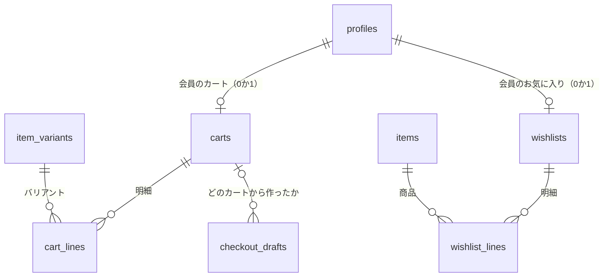
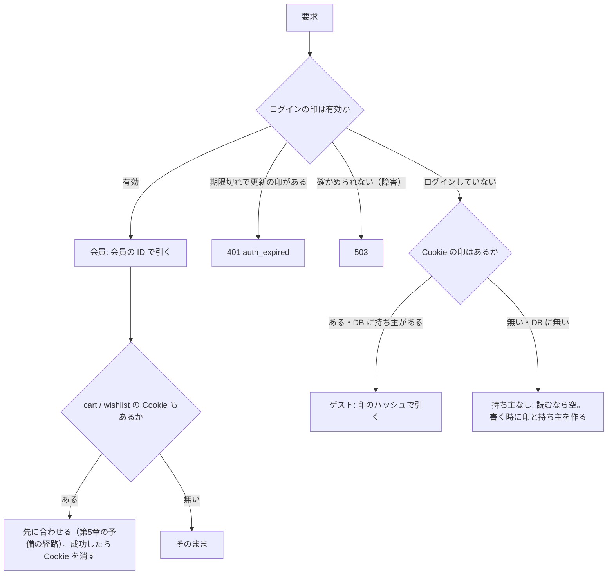
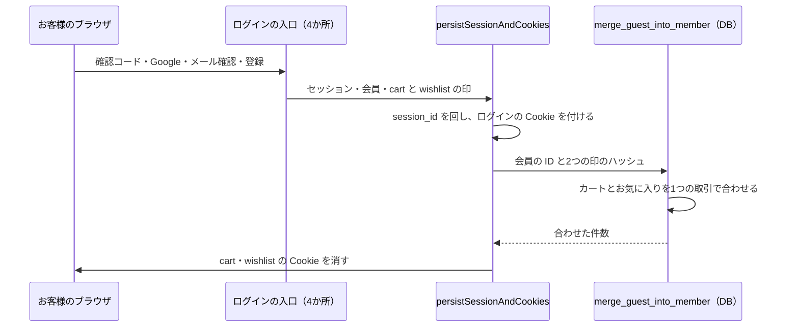

# カートとお気に入りの引き継ぎ 設計書

> 日付: 2026-10-08（設計 1〜8 の承認: 2026-10-08）
> 分類: architectural（カートとお気に入りの表・窓口、ログインの処理、決済のカートの読み方が変わるため）
> きっかけ: グループ C の M9（ゲストで「確認へ進む」の後にログインするとカートが空になる）。ユーザーの判断「カートの引き継ぎを先に作る」（グループ D の前に入れる）
> 方針: **Shopify と同じ構造に近づける。Shopify に無い部分は世界の業界標準（commercetools・Magento（Adobe Commerce）・WooCommerce など）に従う**（ユーザーの指示）
> 関連: [2026-09-06 バリアント在庫・カート所有権・ウィッシュリスト設計](2026-09-06-variant-inventory-and-cart-ownership-design.md)（2 章・3 章・4 章のカートとお気に入りの部分をこの設計で置き換える）、[グループ C 設計書](2026-10-08-order-owner-binding-design.md)、[グループ F 設計書](2026-10-07-checkout-place-order-payment-design.md)

---

## 概要

ゲストで入れたカートとお気に入りを、ログインしても失わないようにする。会員のカートとお気に入りはサーバーに保存し、ログアウトしても次のログインで戻る。別の端末でログインしても同じものが見える。

今はカートもお気に入りも `session_id` Cookie を鍵にしている。`session_id` はログインのたびに回る（なりすましの守り）ので、ログインの瞬間に中身が見えなくなる。この設計は、カートとお気に入りの鍵を `session_id` から切り離し、Shopify と同じ「カートは独自の印で識別し、ログインの印とは別に持つ」形にする。

| 項目 | 決定 | 根拠 |
|---|---|---|
| 中身の置き場所 | カートもお気に入りもサーバー。ゲストのブラウザには印（Cookie）だけを置く | Shopify のカート、Swym（Shopify 最大手のお気に入りアプリ）、commercetools、Magento、WooCommerce、YITH |
| 表の形 | 持ち主の表＋明細の表。持ち主は「会員」か「ゲストの印」のどちらか1つ | Shopify の Cart と CartLine、commercetools の匿名のカートと会員のカート |
| 明細が指すもの | 色・サイズの組み合わせ（バリアント）の番号と数量 | Shopify の CartLine の merchandise（ProductVariant） |
| ゲストの印 | `cart`・`wishlist` の2つの Cookie。256 ビットの乱数、DB には SHA-256 だけ。寿命2週間で、書き換えるたびに延びる | Shopify の `cart` Cookie（2週間）、OWASP |
| 会員の分の引き方 | 会員の ID で引く（Cookie は使わない） | commercetools・Magento・Shopify の Persistent Cart アプリ |
| ログインした時 | ログインの処理の中で、ゲストの分を会員の分へ合わせる。違う商品は両方残し、同じバリアントは大きい方の数量。会員に分が無ければゲストの分を付け替える | commercetools の既定の合わせ方 |
| ログアウトした時 | `cart`・`wishlist` の Cookie を消す。会員の分はサーバーに残り、次のログインで戻る | Adobe Commerce の「ログアウトで消す」 |
| 窓口 | Shopify の Ajax Cart API の形（`GET /api/cart`・`POST /api/cart/add`・`POST /api/cart/change`、断りは 422・404） | Shopify の Ajax Cart API |
| 上限 | 1明細20個、1カート50種類 | 20個は今の決まり。50種類は Stripe の明細の上限（100）に送料の行を足しても収まる数 |
| ゲストの分の期限 | 最後に使ってから30日で、毎日の処理が消す | Shopify は作成から30日、commercetools は最後の変更から数える |
| 決済 | 「確認へ進む」はカートを持ち主で読み、下書きにどのカートかを記録する。支払いの後は注文した明細だけ消す | Shopify は注文で丸ごと消す。この店は「確認へ進む」で中身を固定するので、ふつうは同じく空になる |
| 本番への入れ方 | DB の変更は移行1本。push の後に許可をもらい MCP で当てる | グループ F・C と同じ |

### 章構成

| 章 | 内容 |
|---|---|
| [1](#1-背景と範囲) | 背景と範囲 |
| [2](#2-調査の結論) | Shopify と業界の標準の調査の結論 |
| [3](#3-データ) | 表・決まり・期限・片付け |
| [4](#4-印と持ち主の決め方) | Cookie と持ち主の決め方、ログアウト |
| [5](#5-ログイン時に合わせる処理) | ログイン時に合わせる処理 |
| [6](#6-窓口) | カート・お気に入りの窓口と守り |
| [7](#7-決済とのつなぎ) | 決済とのつなぎ |
| [8](#8-画面) | 画面 |
| [9](#9-移行と本番への入れ方) | 移行と本番への入れ方 |
| [10](#10-要求と試験) | 要求・試験・文書 |
| [11](#11-範囲外と残すこと) | 範囲外と残すこと |

---

## 1. 背景と範囲

### 1-1 今の問題

| 問題 | 中身 |
|---|---|
| ログインでカートが消える | カートの行は `carts.session_id` で読み書きする。ログインの入口4か所（確認コード・Google・メール確認・登録）は共通の `persistSessionAndCookies` で `session_id` を回すので、ゲストで入れた行が見えなくなる（行は孤児として残る） |
| ログアウトでも消える | ログアウトは `session_id` の Cookie を消す。会員のカートも session_id に付いているので、次のログインで戻らない |
| お気に入りも同じ | `wishlist` の行も `session_id` で読み書きする |
| 決済の途中のログイン（M9） | ゲストで「確認へ進む」→ ログイン → 「注文する」は 403 で断られ、「もう一度『確認へ進む』を押してください」と案内するが、押してもカートが空 |
| 数量の上限が効かない | `POST /api/cart` は同じ物を足す時に20個で止めていない |
| 色・サイズを文字で持つ | 管理画面で色の名前を変えるとカートの行が実在しない組み合わせを指す。実在しない色・サイズの文字も入れられる |

### 1-2 範囲

| 範囲に入れる | 範囲に入れない |
|---|---|
| カートとお気に入りの表・窓口・画面のつなぎ方、ログイン時に合わせる処理、ログアウト、ゲストの分の期限、決済のカートの読み方、古い表と関数の片付け | 決済の流れそのもの（下書き・注文・入り直しの `session_id` はそのまま）、見た目の変更、カートの「メモ」「属性」「割引コード」（Shopify のカートにはあるが、この店は決済の画面で扱う） |

---

## 2. 調査の結論

ユーザーの指示どおり、まず Shopify を見て、無い部分は業界の主要な仕組みを比べた。

| 論点 | Shopify | 業界の主要な仕組み | この設計 |
|---|---|---|---|
| カート×ゲスト | 中身はサーバー。ブラウザには `cart` Cookie（2週間）だけ | commercetools・Magento・WooCommerce も中身はサーバー、ブラウザは印だけ | サーバー＋`cart` Cookie |
| カート×会員 | 標準は端末ごと（会員を結び付けるだけ）。端末をまたぐのはアプリ（会員に保存し、ログインで合わせる） | commercetools（会員の有効なカート）・Magento（会員のカート）・WooCommerce（会員のセッション、ログインで合わせる） | サーバーに会員で保存、ログインで合わせる |
| お気に入り×ゲスト | 標準なし。最大手の Swym は印（RegID）を Cookie に置き、中身はアプリのサーバー | commercetools（匿名の買い物リスト）・YITH（3.0 で Cookie 保存から DB 保存へ）・Magento（標準はログイン必須、拡張はサーバー） | サーバー＋`wishlist` Cookie |
| お気に入り×会員 | Swym は会員で保存し、端末をまたいで同じ | Magento・commercetools・YITH はサーバーに会員で保存 | サーバーに会員で保存、ログインで合わせる |
| 明細 | CartLine は ProductVariant と数量。1カート最大500明細 | commercetools・Magento も SKU（バリアント） | バリアントと数量。50種類まで |
| 同じバリアントが両方にある時 | 標準なし（アプリは非公開） | commercetools は大きい方、Magento は足す、WooCommerce は今のカートで上書き | 大きい方（同じ物を2台で入れても倍にならない） |
| 窓口 | Ajax Cart API：`/cart.js`・`/cart/add.js`（`id`＝バリアント）・`/cart/change.js`（数量0で削除）。在庫を超えると 422、バリアントが無いと 404 | — | 同じ形 |
| ログアウト | 標準は端末にカートが残る（共用の端末で次の人に見えると苦情があり、Cookie を消す手直しが勧められている） | Adobe Commerce の「ログアウトで消す」：この端末では消え、同じ会員がログインすると戻る | Cookie を消す。会員の分はサーバーに残る |
| 注文の後 | 注文ができるとカートを丸ごと消す | — | 注文した明細だけ消す（第7章） |

出典:

- [Cart - Storefront API (Shopify)](https://shopify.dev/docs/api/storefront/latest/objects/Cart)、[Cart - Shopify headless docs](https://shopify.dev/docs/storefronts/headless/building-with-the-storefront-api/cart)、[Cart API reference (Shopify Ajax API)](https://shopify.dev/docs/api/ajax/reference/cart)、[Shopify Cookies Policy](https://www.shopify.com/legal/cookies)
- [Persistent Cart: How Shopify Carts Work by Default](https://persistentcartapp.com/shopify-persistent-cart)、[How Persistent Cart Works on Shopify](https://persistentcartapp.com/how-it-works)
- [Cart Persists Across Users Even After Logout (Shopify Developer Community)](https://community.shopify.dev/t/cart-persists-across-users-even-after-logout-how-to-fix/3794)、[Storefront API Cart returns cart after completed order (Shopify Community)](https://community.shopify.com/t/storefront-api-cart-returns-cart-after-completed-order/125908)
- [SDK-Only Mode — Swym Wishlist Plus](https://developers.getswym.com/docs/custom-wishlist-experience-using-js-sdk)
- [Cart merge strategies (commercetools)](https://docs.commercetools.com/learning-implement-carts-and-shopping-lists/manage-signups-and-signins/cart-merge-strategies)
- [mergeCarts mutation (Magento)](https://r-martins.github.io/m1docs/guides/v2.4/graphql/mutations/merge-carts.html)、[Cart persistence (Adobe Commerce)](https://experienceleague.adobe.com/docs/commerce-admin/stores-sales/point-of-purchase/cart/cart-persistent.html)
- [WooCommerce Cart Merge & Sessions: June 2025 Changes](https://www.businessbloomer.com/woocommerce-cart-merge-sessions-changes/)、[YITH WooCommerce Wishlist](https://en-gb.wordpress.org/plugins/yith-woocommerce-wishlist/)
- [Cross-Site Request Forgery Prevention Cheat Sheet (OWASP)](https://cheatsheetseries.owasp.org/cheatsheets/Cross-Site_Request_Forgery_Prevention_Cheat_Sheet.html)

---

## 3. データ

### 3-1 表



```sql
-- カートの持ち主（Shopify の Cart）。会員かゲストの印のどちらか1つ
CREATE TABLE public.carts (
  id               uuid PRIMARY KEY DEFAULT gen_random_uuid(),
  user_id          uuid UNIQUE REFERENCES public.profiles(user_id) ON DELETE CASCADE,
  guest_token_hash text UNIQUE CHECK (guest_token_hash ~ '^[0-9a-f]{64}$'),
  created_at       timestamptz NOT NULL DEFAULT now(),
  updated_at       timestamptz NOT NULL DEFAULT now(),
  CONSTRAINT carts_single_owner CHECK (num_nonnulls(user_id, guest_token_hash) = 1)
);

-- カートの明細（Shopify の CartLine）
CREATE TABLE public.cart_lines (
  id         uuid    PRIMARY KEY DEFAULT gen_random_uuid(),
  cart_id    uuid    NOT NULL REFERENCES public.carts(id) ON DELETE CASCADE,
  variant_id bigint  NOT NULL REFERENCES public.item_variants(id) ON DELETE CASCADE,
  quantity   integer NOT NULL CHECK (quantity BETWEEN 1 AND 20),
  added_at   timestamptz NOT NULL DEFAULT now(),
  updated_at timestamptz NOT NULL DEFAULT now(),
  UNIQUE (cart_id, variant_id)
);
CREATE INDEX cart_lines_variant_id_idx ON public.cart_lines (variant_id);

-- お気に入りの持ち主。カートと同じ形
CREATE TABLE public.wishlists (
  id               uuid PRIMARY KEY DEFAULT gen_random_uuid(),
  user_id          uuid UNIQUE REFERENCES public.profiles(user_id) ON DELETE CASCADE,
  guest_token_hash text UNIQUE CHECK (guest_token_hash ~ '^[0-9a-f]{64}$'),
  created_at       timestamptz NOT NULL DEFAULT now(),
  updated_at       timestamptz NOT NULL DEFAULT now(),
  CONSTRAINT wishlists_single_owner CHECK (num_nonnulls(user_id, guest_token_hash) = 1)
);

-- お気に入りの明細。色・サイズを決める前の商品単位（2026-09-06 設計書 3 章と同じ）
CREATE TABLE public.wishlist_lines (
  id          uuid   PRIMARY KEY DEFAULT gen_random_uuid(),
  wishlist_id uuid   NOT NULL REFERENCES public.wishlists(id) ON DELETE CASCADE,
  item_id     bigint NOT NULL REFERENCES public.items(id) ON DELETE CASCADE,
  added_at    timestamptz NOT NULL DEFAULT now(),
  UNIQUE (wishlist_id, item_id)
);
CREATE INDEX wishlist_lines_item_id_idx ON public.wishlist_lines (item_id);

-- 注文の下書きに、どのカートから作ったかを記録する（第7章）
ALTER TABLE public.checkout_drafts
  ADD COLUMN cart_id uuid REFERENCES public.carts(id) ON DELETE SET NULL;
CREATE INDEX checkout_drafts_cart_id_idx ON public.checkout_drafts (cart_id);
```

| 決まり | 中身 |
|---|---|
| 持ち主は1つ | `num_nonnulls(user_id, guest_token_hash) = 1`。会員1人・印1つにつき1つ（`UNIQUE`） |
| 印のハッシュの形 | `tokenHashSha256`（`src/lib/hash.ts`）と同じ 64 桁の16進。ログインの更新の印（refresh token）と同じ規律 |
| 数量 | 1〜20。同じカートに同じバリアントは1行 |
| 50種類 | 明細を足す DB の関数と合わせる関数が、カートの行をロックしてから数えて守る（第5章・第6章） |
| 最後に使った日時 | `cart_lines`・`wishlist_lines` の追加・変更・削除で、持ち主の `updated_at` をトリガーが更新する |
| 状態の列 | 作らない（2026-09-06 設計書の `status` は不要）。持ち主ごとに常に1つで、合わせた後のゲストの持ち主は消す |

### 3-2 直接アクセスの拒否

4つの表は、ブラウザ（`anon`・`authenticated`）から一切読めず書けない。読み書きはサーバーの API（service role）だけ。

```sql
ALTER TABLE public.carts ENABLE ROW LEVEL SECURITY;
CREATE POLICY "deny direct client access" ON public.carts
  AS RESTRICTIVE FOR ALL TO anon, authenticated USING (false) WITH CHECK (false);
REVOKE ALL ON public.carts FROM anon, authenticated;
-- cart_lines・wishlists・wishlist_lines も同じ
```

`checkout_drafts` と同じ形。2026-09-06 設計書 4 章の「`current_setting('app.session_id')` の分岐を消す」は、古い表ごと消えるので満たす。

### 3-3 ゲストの分の期限

最後に使ってから30日を過ぎたゲストの持ち主を、毎日消す（明細も一緒に消える）。会員の分は退会まで残す（`profiles` を消すと一緒に消える）。今の保持の処理（`checkout-drafts-retention`）と同じ書き方。

```sql
select cron.schedule(
  'guest-shopping-retention',
  '45 3 * * *',
  $$
    delete from public.carts
    where guest_token_hash is not null and updated_at < now() - interval '30 days';
    delete from public.wishlists
    where guest_token_hash is not null and updated_at < now() - interval '30 days';
  $$
);
```

### 3-4 片付け

| 消す物 | 理由 |
|---|---|
| 表 `public.carts`（1行＝1商品・`session_id` 付き）と `public.wishlist`、その許可（RLS）・索引 | 新しい表に置き換える。今の行は捨てる（本番は未公開。2026-09-06 設計書 5 章と同じ） |
| 関数 `add_guest_cart_item`・`update_guest_cart_item_quantity`・`delete_guest_cart_item`・`list_guest_cart`・`add_guest_wishlist_item`・`delete_guest_wishlist_item`・`list_guest_wishlist`・`update_cart_item_quantity_secure`・`delete_cart_item_secure` | 古い表を使う。アプリから呼んでいるのは最後の2本だけで、窓口の作り直しで要らなくなる |

---

## 4. 印と持ち主の決め方

### 4-1 Cookie

| 項目 | `cart` | `wishlist` |
|---|---|---|
| 中身 | 256 ビットの乱数（暗号用の乱数、base64url） | 同じ |
| DB | `carts.guest_token_hash` に SHA-256 だけ | `wishlists.guest_token_hash` に SHA-256 だけ |
| 属性 | HttpOnly、SameSite=Lax、Path=/、本番は Secure（`getBaseCookieOptions` と同じ） | 同じ |
| 寿命 | 2週間（Max-Age 1,209,600 秒）。カートを書き換えるたびに2週間に延ばす | お気に入りを書き換えるたびに延ばす |
| 作る時 | ゲストが初めてカートに入れた時。見るだけでは作らない | 初めてお気に入りに入れた時 |
| 消す時 | ログインで合わせ終えた時、ログアウトの時 | 同じ |

カートとお気に入りで印を分けるのは、Shopify の `cart` Cookie がカート専用だからであり、片方が漏れてももう片方には触れない。印そのものは DB にも監査の記録にも残さない。

### 4-2 持ち主の決め方

カート・お気に入り・決済の全部が、サーバーの1つの関数で持ち主を決める。ログインの確かめはグループ C の `resolveCheckoutBuyer` と同じ規則（`authenticateRequest` の検証済みの `sub` だけを使う）。



| 状態 | 動き |
|---|---|
| 会員 | 会員の ID で会員のカート・お気に入りを引く（無ければ書く時に作る） |
| 期限切れ | 401 `auth_expired`（更新の印 `sb-refresh-token` がある時だけ）。画面が印を更新して1回だけ送り直す。会員に空のゲストのカートを見せない |
| 障害 | 503。ゲスト扱いにしない |
| ゲスト | 印のハッシュでゲストの持ち主を引く |
| 持ち主なし | 読む窓口は空を返す。書く窓口は新しい印を作り、持ち主の行を作り、Cookie を付ける。DB に無い印（期限で消えた等）も同じ扱い |

画面からカート・お気に入りの番号は受け取らない。明細の番号（`key`）を受け取る時は、その明細が今の持ち主のものかを DB の関数の中で照合し、違えば「無い」と同じ 404 を返す（OWASP A01）。

### 4-3 ログアウト

ログアウトの応答で、今消している Cookie に `cart`・`wishlist` を足す。会員のカートとお気に入りはサーバーに残り、次のログインで戻る。`session_id` は今のまま消す。

---

## 5. ログイン時に合わせる処理

### 5-1 呼ぶ場所

ログインの入口4か所が共通で通る `persistSessionAndCookies` の中で、ログインの Cookie を全部付け終えた後に1回だけ呼ぶ。入口から `cart`・`wishlist` の Cookie の値を渡す。



失敗してもログインは止めない。その時は `cart`・`wishlist` の Cookie を残し、監査の記録に失敗を残す。次にカート・お気に入り・決済の窓口を呼んだ時、持ち主の決め方（4-2）が同じ関数でもう一度合わせる。

### 5-2 DB の関数 `merge_guest_into_member`

`merge_guest_into_member(_user_id uuid, _cart_token_hash text, _wishlist_token_hash text)`。SECURITY DEFINER、`search_path = ''`、実行は service_role だけ。カートとお気に入りを1つの取引で処理する。

| 場面 | カート | お気に入り |
|---|---|---|
| ゲストの分が無い（印が無い・期限で消えた） | 何もしない | 何もしない |
| ゲストの分だけある | ゲストの持ち主を会員に付け替える（`user_id` を入れ、`guest_token_hash` を空に）。明細はそのまま | 同じく付け替える |
| 両方ある | ゲストの明細を入れた順（`added_at`、同じなら `id`）に会員のカートへ移す。同じバリアントは**大きい方の数量**にし、ゲストの明細は消す。最後にゲストの持ち主を消す | ゲストの商品を会員のお気に入りへ足す（同じ商品は1つ）。ゲストの持ち主を消す |
| 合わせて50種類を超える | 会員の明細を先に残し、ゲストの明細は50種類に達するまで移す。超えた分は移さず、件数を監査の記録に残す | 上限なし（同じ商品は1つなので、商品の数が上限） |

- 2つの持ち主の行を、番号の小さい順に `FOR UPDATE` でロックしてから処理する（明細を足す関数とロックの順をそろえ、行き詰まりを防ぐ）
- 2つのタブで同時にログインしても、先に合わせた方だけが効き、後の方は「ゲストの分が無い」で何もしない
- 返す値: 移した明細の数、移さなかった明細の数、移したお気に入りの数。監査の記録は件数だけで、印は残さない
- お知らせは出さない（Shopify の Persistent Cart アプリの既定と同じ）

---

## 6. 窓口

### 6-1 カート（Shopify の Ajax Cart API の形）

`PATCH`・`DELETE /api/cart/[id]` はやめ、次の3つにする。

| 窓口 | Shopify | 中身 |
|---|---|---|
| `GET /api/cart` | `GET /cart.js` | カート全体を返す |
| `POST /api/cart/add` | `POST /cart/add.js` | バリアントの番号と数量で足す |
| `POST /api/cart/change` | `POST /cart/change.js` | 明細の `key` と数量。数量0で削除。カート全体を返す |

`GET /api/cart` の返す中身（Shopify の `/cart.js` から、この店で使う項目だけ。印 `token` は返さない）:

```json
{
  "item_count": 3,
  "currency": "JPY",
  "items_subtotal_price": 36000,
  "total_price": 36000,
  "items": [
    {
      "key": "6f1c2d3e-…（明細の番号）",
      "id": 1201,
      "variant_id": 1201,
      "product_id": 45,
      "quantity": 2,
      "title": "リネンシャツ - ブラック / M",
      "product_title": "リネンシャツ",
      "variant_title": "ブラック / M",
      "options_with_values": [
        { "name": "カラー", "value": "ブラック" },
        { "name": "サイズ", "value": "M" }
      ],
      "price": 12000,
      "line_price": 24000,
      "image": "https://…（署名付きの画像の URL）",
      "url": "/item/45",
      "fulfillment": "stock"
    }
  ]
}
```

| 項目 | 決め方 |
|---|---|
| `id`・`variant_id` | バリアントの番号（Shopify と同じく `id` はバリアント） |
| `price`・`line_price` | 円の整数（JPY は小数の単位が無い）。今の商品の値段で計算する |
| `title`・`variant_title`・`options_with_values` | `title` は「商品名 - 色 / サイズ」。色・サイズが無いバリアントは `title` が商品名だけ、`variant_title` が `null`、`options_with_values` が空の配列 |
| `items_subtotal_price`・`total_price` | 出す明細の `line_price` の合計。カートでは割引を扱わないので同じ値 |
| `fulfillment` | この店の追加の項目。在庫あり `stock`・受注生産 `backorder`・読めない時 `null`（グループ F 設計書 5-2 と同じ） |
| 出さない明細 | 非公開の商品の明細と、取り扱い終了（`is_active = false`）のバリアントの明細（今の非公開の商品の扱いをバリアントにも広げる）。`item_count` にも数えない |
| 並び | 入れた日時の新しい順（今と同じ） |
| 持ち主なし | `{"item_count": 0, "items": [], …}` |

`POST /api/cart/add` の送る中身と返す中身:

```json
{ "items": [ { "id": 1201, "quantity": 1 } ] }
```

- `items` は1〜10件。`id` はバリアントの番号、`quantity` は1〜20
- 同じバリアントが既にあれば、その明細の数量を足す（Shopify と同じ）
- 全部成功か全部断るか（1件でも断れば何も変えない）
- 返す中身: `{"items": [ 足した後の明細（GET の明細と同じ形） ]}`、200

`POST /api/cart/change` の送る中身:

```json
{ "id": "6f1c2d3e-…（明細の key）", "quantity": 0 }
```

- `quantity` は0〜20。0なら明細を消す
- 返す中身: カート全体（GET と同じ形）、200

断りの形は Shopify と同じ `{"status", "message", "description"}`（`message` は `"Cart Error"`）。`description` は画面にそのまま出す日本語。

| 場面 | 状態 | `description` |
|---|---|---|
| 足した後の数量が20を超える | 422 | 1つの商品は20個までです。 |
| 51種類目を足す | 422 | カートに入れられるのは50種類までです。 |
| バリアントが無い・取り扱い終了・商品が非公開 | 404 | 選んだ色・サイズは現在お求めいただけません。 |
| 変える明細が無い（他人の明細を含む） | 404 | カートの商品が見つかりません。ページを読み込み直してください。 |
| 送った中身の形が違う | 400 | 送った内容を確認できませんでした。 |

ログインの期限切れ（401）・CSRF（403）・回数の制限（429）・障害（503）は、今の各窓口と同じ形のまま（画面の共通の扱いがそのまま効く）。

### 6-2 お気に入り

Shopify に無いので、窓口の形は今のまま（一覧・追加・削除）。中身の読み書きを持ち主（第4章）に替える。

| 窓口 | 中身 |
|---|---|
| `GET /api/wishlist` | 今と同じ形（明細の番号・商品・追加日時）。公開中の商品だけ。カートに入れるために、商品ごとの販売中のバリアント（番号・色・サイズ）を足す |
| `POST /api/wishlist` | 商品の番号。公開中の商品だけ。同じ商品は1つ（何度押しても同じ） |
| `DELETE /api/wishlist/[id]` | 持ち主の明細だけ消せる。他人の明細は 404 |

### 6-3 守り

| 守り | 会員 | ゲスト |
|---|---|---|
| CSRF | 書き換え（カートの追加・変更、お気に入りの追加・削除）に合言葉が必須（決済の窓口と同じ） | 合言葉は無い。他のサイトからの送信は送信元（Origin）の確かめ（`src/proxy.ts`、POST・PUT・PATCH・DELETE）と SameSite=Lax で止める（今と同じ） |
| 回数の制限 | IP ごと＋会員ごと | IP ごと＋印ごと（印がまだ無い時は IP ごとだけ） |
| 回数 | 今の値を使う（`cart:add` は IP 60回・持ち主 30回／分など）。`cart:change` は今の `cart:update` の値 | 同じ |
| 監査の記録 | 会員の ID | 「ゲスト」と印のハッシュの先頭12桁。印そのものは残さない |
| 明細の照合 | DB の関数の中で、明細のカートが今の持ち主のカートかを確かめる | 同じ |

### 6-4 窓口が使う DB の関数

すべて SECURITY DEFINER、`search_path = ''`、実行は service_role だけ。

| 関数 | 中身 | 断り |
|---|---|---|
| `cart_add_lines(_cart_id uuid, _lines jsonb)` | カートの行を `FOR UPDATE` でロックし、各行のバリアントが販売中（`is_active` で商品が公開中）かを確かめ、同じバリアントは数量を足し、無ければ明細を作る。全部成功か全部断る | `CART_VARIANT_UNAVAILABLE`・`CART_LINE_QUANTITY_LIMIT`・`CART_LINE_LIMIT` |
| `cart_change_line(_cart_id uuid, _line_id uuid, _quantity integer)` | 明細がそのカートのものか確かめ、0なら消し、1〜20なら変える | `CART_LINE_NOT_FOUND`・`CART_LINE_QUANTITY_LIMIT` |

持ち主の行を作る処理（会員の ID や印のハッシュで1行を作る）と、お気に入りの追加・削除は、表の一意の決まりで足りるので service role の通常の読み書きで行う。

---

## 7. 決済とのつなぎ

| 場面 | 直した後 |
|---|---|
| 「確認へ進む」（create-session） | カートを持ち主で読む（第4章。ゲストの印が残っていれば先に合わせる）。明細から下書きの中身を作る形は今と同じ（商品・名前・値段・画像・色・サイズ・数量・金額）。明細の参照は `source_cart_line_id`（`cart_lines.id`）。下書きを取る関数 `claim_checkout_draft` に `_cart_id` を足し、`checkout_drafts.cart_id` に記録する |
| 最終確認画面のカートの読み直し | 同じく持ち主で読む（`loadCheckoutCart` の引数を session_id からカートに替える） |
| 「注文する」（`place_order_from_checkout_draft`） | 「カートが変わった」（`cart_changed`）の判定を、下書きの全部の `source_cart_line_id` が `cart_id = 下書きの cart_id` の明細として残っているかで行う。`cart_id` が無い下書き（移行の前に作った物）は `cart_changed` で断る |
| 支払いが済んだ後（`private.clear_cart_for_order`） | 下書きの `source_cart_line_id` の明細を、下書きのカートから消す（今と同じ範囲）。ふつうはカートが空になり、Shopify の「注文でカートを消す」と同じ結果になる。「確認へ進む」の後に別のタブで足した明細は、買っていないので残す |
| 決済の途中でログイン（M9） | 今の案内のまま。ゲストの下書きは `session_id` が回るので「注文する」が 403 で断られ、「もう一度『確認へ進む』を押してください」を出す。押すと合わせた後の会員のカートで下書きを作り直す |
| 同じ会員が2台で同時に決済 | 2台とも同じ会員のカートから下書きを作る。先に払った方が明細を消すので、後の方の「注文する」は `cart_changed` で止まる（今の守りがそのまま効く） |
| `session_id` | 決済の流れ（下書き・注文・入り直し・回数の制限・新しい下書きの判定）の印として今のまま使う |

---

## 8. 画面

見た目は変えない（新しい画面も無い）。

| 画面 | 直した後 |
|---|---|
| ヘッダーのカートの数 | `GET /api/cart` の `item_count`。入れた・変えた時に加え、ログイン・ログアウトの直後にも読み直す（今は最初に1回だけ）。Shopify のテーマが `/cart.js` の `item_count` を読み直すのと同じ |
| 商品詳細の「カートに入れる」 | 選んだ色・サイズのバリアントの番号を `/api/cart/add` に送る。商品の窓口（`/api/items/[id]`）の `variantAvailability` にバリアントの番号（`variantId`）を足す（Shopify も公開している番号） |
| カートの画面 | 新しい返す中身を読む。数量の変更と削除は `/api/cart/change`（削除は数量0） |
| お気に入りの画面 | 見た目と使い方は今のまま（ゲストも使える）。「カートに追加」は今と同じ色・サイズの選び方で、お気に入りの窓口が返すバリアントの番号を送る |
| 注文履歴の「再注文」 | 注文の明細のバリアントの番号で入れる。番号が無い古い注文の明細、取り扱いが終わった色・サイズは「この商品は現在お求めいただけません。」 |
| 決済の画面 | カートの読み方を新しい返す中身に合わせる。流れは今のまま |
| 期限切れの時 | カート・お気に入りの読み書きが 401 `auth_expired` なら、画面が印を更新して1回だけ送り直す（グループ C の `refreshSessionOnce`）。会員の書き換えには CSRF の合言葉を付ける |

断った時の案内は第6章の `description` を、今の通知の部品（トースト・LiveMessage）でそのまま出す。ログインの直後に合わせた時のお知らせは出さない。

---

## 9. 移行と本番への入れ方

移行は1本（`BEGIN;`〜`COMMIT;`）。

| 順 | 中身 |
|---|---|
| 1 | 古い表 `carts`・`wishlist` と関数9本を消す（3-4） |
| 2 | 新しい4つの表・決まり・索引・`updated_at` のトリガー・直接アクセスの拒否（3-1・3-2） |
| 3 | `checkout_drafts.cart_id` と索引 |
| 4 | DB の関数 `cart_add_lines`・`cart_change_line`・`merge_guest_into_member` |
| 5 | `claim_checkout_draft`（`_cart_id` を足して15引数）、`place_order_from_checkout_draft`、`private.clear_cart_for_order` を作り直す |
| 6 | ゲストの分の期限の毎日の処理（3-3） |
| 7 | `NOTIFY pgrst, 'reload schema'` |

本番への入れ方はグループ F・C と同じ。push の後にユーザーの許可をもらい、Supabase MCP の `apply_migration` で本番の DB に当て、当てた版に手元のファイル名と文書の版を直す。アプリは本番に未公開なのでお客様への影響は無い。普段の開発は本番の DB に向いているので、当てた後は新しいコードで動かす。

---

## 10. 要求と試験

### 10-1 要求（requirements.md に足す行）

| ID | 要求 | 受け付け基準 |
|---|---|---|
| FREQ-428 | ログインしてもカートが残ること | AC-01: mobile（390px）/ tablet（768px）/ desktop（1280px）で、ゲストでカートに入れた商品が、ログインの後もカートの画面に同じ色・サイズ・数量で表示されること<br>AC-02: 会員のカートとゲストのカートに同じバリアントがある時、ログインの後の数量が大きい方になり、違うバリアントは両方残ること（DB 結合）<br>AC-03: 会員にカートが無い時、ゲストのカートの明細がそのまま会員のカートになること（DB 結合）<br>AC-04: 合わせて50種類を超える時、会員の明細とゲストの明細を入れた順に50種類までが残ること（DB 結合）<br>AC-05: 同3画面幅で、ゲストで「確認へ進む」の後にログインして「注文する」を押すと「ログインの状態が変わりました。」を含む案内が表示され、「確認へ進む」を押すと最終確認画面にゲストで入れた商品が表示されること |
| FREQ-429 | ゲストもお気に入りを使え、ログインで会員のお気に入りへ合わさること | AC-01: 同3画面幅で、ゲストでお気に入りに入れた商品が、ログインの後もお気に入りの画面に表示されること<br>AC-02: 両方に同じ商品がある時、ログインの後に1件になること（DB 結合） |
| FREQ-430 | カートの窓口を Shopify の Ajax Cart API の形にし、上限と取り扱いの無い色・サイズを断ること | AC-01: `GET /api/cart` が `item_count` と `items`（`key`・`id`・`variant_id`・`product_id`・`quantity`・`price`・`line_price`）を返し、`token` を返さないこと<br>AC-02: 同じバリアントを2回入れると明細が1行で数量が足されること<br>AC-03: 同3画面幅で、20個を超えて入れようとすると「1つの商品は20個までです。」が表示され、数量が変わらないこと<br>AC-04: 51種類目を入れると 422 で `description` が「カートに入れられるのは50種類までです。」であること<br>AC-05: 無い・取り扱い終了のバリアントを入れると 404 で `description` が「選んだ色・サイズは現在お求めいただけません。」であること<br>AC-06: `/api/cart/change` で数量0にすると明細が消え、他人の明細の `key` は 404 であること<br>AC-07: 会員がカートを書き換える時、CSRF の合言葉が無いと 403 であること |
| FREQ-431 | ログアウトでこの端末のカートとお気に入りを消し、会員の分は次のログインで戻ること | AC-01: 同3画面幅で、会員でログアウトするとヘッダーのカートの数が表示されず（0）、カートの画面が空になり、もう一度ログインすると元の商品が表示されること<br>AC-02: ログアウトの応答が `cart`・`wishlist` の Cookie を消すこと |
| FREQ-432 | カートとお気に入りのデータを守ること | AC-01: `anon`・`authenticated` から4つの表を読めず書けないこと（DB 結合）<br>AC-02: DB に印そのものが無く、`guest_token_hash` が印の SHA-256 であること<br>AC-03: 最後に使ってから30日を過ぎたゲストのカート・お気に入りが毎日の処理で消え、会員の分と30日以内の分は消えないこと（DB 結合）<br>AC-04: `cart`・`wishlist` の Cookie が HttpOnly・SameSite=Lax・Path=/・Max-Age 2週間であること |

### 10-2 E2E（本番の作り・手元の Supabase・3つの画面幅）

| ファイル | 確かめる受け付け基準 |
|---|---|
| `e2e/FR-CART-023-guest-cart-carryover-on-login.spec.ts` | FREQ-428-AC-01、FREQ-431-AC-01 |
| `e2e/FR-CART-024-cart-api-shopify-format.spec.ts` | FREQ-430-AC-01〜07（窓口は `page.request`、上限の案内は画面） |
| `e2e/FR-CHECKOUT-047-login-mid-checkout-merged-cart.spec.ts` | FREQ-428-AC-05 |
| `e2e/FR-WISHLIST-016-guest-wishlist-carryover-on-login.spec.ts` | FREQ-429-AC-01 |

会員のログインはグループ C の `e2e/member-session-helpers.ts`（`createTestMember`・`loginAsMember`）を使う。回数の制限（`auth:refresh`・`cart:add`）で全件の中だけ落ちることがあるので、落ちたら単体で流し直して切り分ける。

### 10-3 DB 結合・単体

| 種類 | 確かめること |
|---|---|
| DB 結合 | 持ち主は1つ・数量1〜20・同じバリアント1行・50種類、直接アクセスの拒否、`updated_at` のトリガー、合わせる処理の全部の場面（付け替え・大きい方・お気に入りは1つ・50種類・2つ同時）、30日の処理、`cart_add_lines`・`cart_change_line` の断り、`place_order` の `cart_changed`（`cart_id` が無い下書きを含む）、支払い後に明細を消す範囲、古い関数9本と古い表が無いこと |
| 単体 | 持ち主の決め方（会員・期限切れ・障害・ゲスト・印なし・DB に無い印）、Cookie の属性と延長、窓口の形（Shopify と同じ中身、`token` を返さない、断りの形）、会員の CSRF、ログインで合わせる呼び出しと失敗してもログインが通ること、ログアウトで Cookie を消すこと、ヘッダーの数がログイン・ログアウトで読み直されること |

### 10-4 既存の試験の直し

カートの窓口を真似る・呼ぶ E2E（`/api/cart`・`/api/wishlist` を使う約20本）、カートの単体試験、DB 結合の試験の部品（`tests/integration/db/helpers/order-fixtures.ts` など、古い `carts` に行を入れる4本）を新しい形に直す。

### 10-5 文書

`docs/02_Requirements/requirements.md`（FREQ-428〜432）、`docs/03_BasicDesign/data/er.md`、API の説明（api-spec.md）、`docs/04_DetailDesign/sequence/checkout-payment.md`、`docs/04_DetailDesign/states/checkout-draft.md`、カート・お気に入りの画面の文書を直す。2026-09-06 設計書の 2 章・3 章・4 章の頭に「カートの所有権とお気に入りは 2026-10-08 のカートとお気に入りの引き継ぎ設計で置き換えた」と書き足す。

---

## 11. 範囲外と残すこと

| 項目 | 扱い |
|---|---|
| 端末をまたいだ画面の即時の更新 | しない。2台とも同じ会員のカートを読むので、開き直せばそろう |
| カートのメモ・属性・割引コード（Shopify のカートにある） | 作らない。割引コードは決済の画面で扱う（今と同じ） |
| 合わせた時のお知らせ・選ばせる画面 | 出さない（Shopify の Persistent Cart アプリの既定） |
| 決済の流れの `session_id` の平文の保存（下書き・注文） | この設計では変えない |
| 2026-09-06 設計書のバリアント在庫（1 章） | 実装済みのまま。この設計はカートの明細をその `item_variants` に結ぶ |
