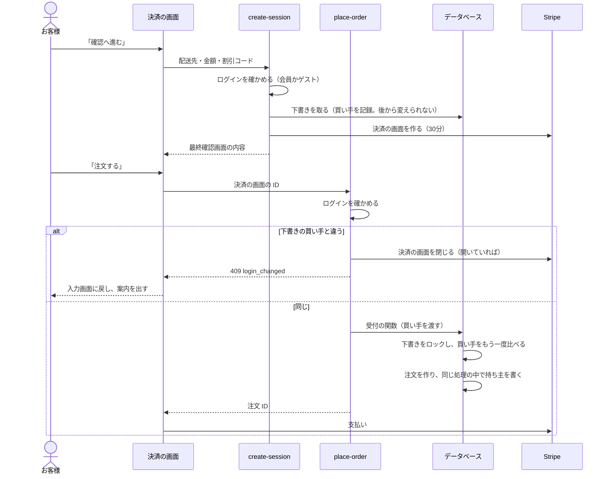
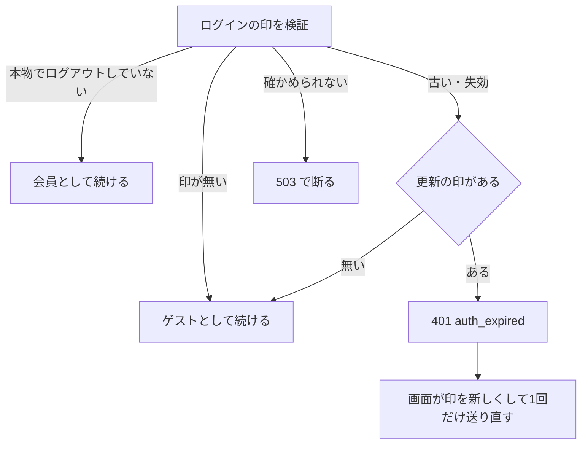

# ログイン客の注文の持ち主を確かめて保存する 設計書（グループ C）

> 日付: 2026-10-08（案1〜4 の比較と案4 の承認: 2026-10-08。ユーザーの指示「DB の作りを変えてよいので一番安全にしたい」）
> 分類: architectural（下書きと注文の DB の決まり、下書きを取る関数・受付の関数の引数、決済の4つの入口が変わるため）
> 対象の指摘: R-24（[レビュー台帳](../../05_Quality/reviews/code/2026-09-25-working-diff-security-review.md)）。同じグループの R-26 はグループ A で解消済み
> 関連: [グループ A 設計書](2026-09-26-order-payment-reconciliation-design.md)、[グループ F 設計書](2026-10-07-checkout-place-order-payment-design.md)

---

## 概要

ログインして買った注文を、完了画面に戻らなくても、本人の注文履歴に必ず出す。同時に、別の人の注文が履歴に出ることを、サーバーと DB の両方で防ぐ。

持ち主は、サーバーが「確認へ進む」と「注文する」の両方でログインを確かめて決める。同じ人の時だけ、注文を作るのと同じ処理の中で書く。確かめられない経路では持ち主を付けない。その注文は、メール確認済みのログインの時にまとめる（今の仕組み）。

| 項目 | 決定 |
|---|---|
| 持ち主を決める人 | サーバー。ログインの印（アクセストークン）を検証し、ログアウト済みでないことも確かめる（`authenticateRequest`）。画面から送られた値は使わない |
| 買い手を記録する時点 | 「確認へ進む」で下書きに記録する（会員ならその ID、ゲストなら空）。下書きの買い手は後から変えられない |
| 持ち主を注文に書く時点 | 「注文する」でもう一度確かめる。下書きの買い手と同じ時だけ、注文を作るのと同じ処理の中で書く |
| ログインの状態が変わった時 | 「注文する」を断る（`login_changed`）。決済の画面が開いていれば閉じる。お金は動かない。「確認へ進む」からやり直す |
| 確かめられない時 | 印が古い・失効 → 401。画面が印を新しくして1回だけ送り直す（更新の印が無ければゲスト）。DB の不調 → 503 で断る（ゲスト扱いにしない） |
| 「注文する」を通らない支払い | 持ち主を付けない。メール確認済みのログインの時に、同じメールの注文としてまとめる（今の仕組み） |
| 完了画面での紐付け | やめる（`linkOrderToUserIfUnowned` を消す） |
| 入り直し | ログインの状態が下書きと違えば、前の確認画面も、支払い済みの知らせも出さない |
| 注文の持ち主の DB の決まり | 空から値へだけ書ける。別の会員への付け替えは DB が断る。空に戻るのは会員を消した時だけ |
| 本番への入れ方 | DB の変更は移行1本。push の後に許可をもらい、MCP で当てる |

---

## 1. 目的

### 1-1 直す指摘

| ID | 内容 | この設計での直し方 |
|---|---|---|
| R-24 | ログイン客の注文が持ち主（`orders.user_id`）に紐付かず、注文履歴に出ない | 「注文する」で注文を作る時に、確かめた会員を持ち主として書く（第4章・第5章） |

今の状態（グループ F の後）:

- 注文は「注文する」（place-order）で作る。この時、持ち主は空のまま。
- 完了画面の処理（complete）が、その時ログインしている人を持ち主にする。
- 完了画面に戻らないと（ブラウザを閉じた・通信が切れた・PayPay から別のブラウザに戻った）、持ち主は空のまま。次にログインし直すまで、注文履歴に出ない（ログインし直すと、メールが同じ注文をまとめる）。
- 注文の持ち主を書く場所は2つ。完了画面の処理と、メール確認済みのログインでまとめる処理（`linkGuestOrdersByEmail`）。このうち、注文した人とログインした人が同じかを確かめずに書くのは、完了画面の処理だけ。

### 1-2 設計中に決まった要望

- DB の作りを変えてよいので、一番安全な形にする（2026-10-08）。
- 案1〜4 を比べ、案4（第2章）を採る（2026-10-08）。
- 完了画面で「その時ログインしている人」に付ける今の仕組みはやめる（2026-10-08。案4 に含めて承認）。

### 1-3 成功の基準

- 会員がログイン中に注文すると、完了の処理がログインなしで行われても、支払いの後に注文履歴に出る（E2E）。
- 「確認へ進む」の後にログインの状態が変わると、「注文する」が断られる。注文は作られず、在庫も確保されない（単体・DB 結合・E2E）。
- 持ち主のある注文の持ち主を、別の会員へ変える更新を DB が断る（DB 結合）。
- 「注文する」を通らない支払いの注文には、持ち主が付かない（DB 結合）。
- ゲストの購入は今と同じ動き（既存の E2E が通る）。

### 1-4 やらないこと

| 項目 | 理由 |
|---|---|
| 管理画面から注文の持ち主を付け替える機能 | 作らない。DB が付け替えを断る |
| ログインでゲストのカートを引き継ぐこと | カートの持ち主の設計書（2026-09-06）の範囲。今はログインでカートの印が新しくなり、引き継がれない（4-3） |
| 「注文する」を通らない支払い（画面を改ざんした場合）への持ち主付け | 払った時に誰がログインしていたかを確かめられない。付けない方が安全 |
| 完了画面の注文番号の表示の守りを強める | 今の守り（同じブラウザ＝カートの印が合う時だけ）のまま。完了の応答は注文 ID・状態・支払い方法だけで、住所などは返さない |

---

## 2. 比べた案

| 観点 | 案1 | 案2 | 案3 | 案4（採用） |
|---|---|---|---|---|
| 中身 | 「注文する」の直後に、別の書き込みで持ち主を書く | 受付の関数に持ち主を渡し、注文と同時に書く | 「確認へ進む」で下書きに覚え、どの経路でも注文に写す | 案2＋案3 に、比べる・付け替え禁止・完了画面の紐付けの廃止を足す |
| 払う直前（注文する）にログインを確かめる | ○ | ○ | × | ○ |
| 「確認へ進む」と「注文する」で同じ人か比べる | × | × | × | ○ |
| 注文と持ち主を同時に書く | × | ○ | ○ | ○ |
| 確かめていない経路では持ち主を付けない | ○ | ○ | × | ○ |
| 一度付いた持ち主を別の人へ付け替えさせない（DB） | × | × | × | ○ |
| 完了画面で「その時ログインしている人」に付ける仕組みをやめる | × | × | × | ○ |
| DB の作りの変更 | なし | あり | あり | あり |

案3 は「確認へ進む」の時の人を持ち主にする。だから、その後に別のアカウントへ入り直されると、前の人の注文になる。また、払った時のログインを確かめない経路にも持ち主を付ける。案3 で増えるのは自動で持ち主が付く注文の数で、安全さではない。

Shopify も、ログイン中のチェックアウトの注文は、作った時点でアカウントに付く。ゲストの注文は、同じメールのアカウントにまとめる。案4 はこれと同じ形で、さらに途中でのログインの切り替えを断る。

---

## 3. 全体の流れ

完了の処理（complete）と、Stripe の知らせ・見回りの照合は、支払いの状態を注文に写すだけになる。持ち主には触れない。

---

## 4. サーバー

### 4-1 買い手の確かめ（新しい関数）

`src/features/checkout/services/checkout-buyer.ts` に `resolveCheckoutBuyer(request)` を置く。決済の入口（create-session・place-order・resume）は、`guardCheckoutPost`（カートの印・回数の制限・CSRF）の直後、DB への書き込みや Stripe の呼び出しより前に、これを呼ぶ。

| `authenticateRequest` の結果 | 扱い | 入口の応答 |
|---|---|---|
| `ok` | 会員。ID は検証済みの `claims.sub` | 続ける |
| `missing`（印が無い） | ゲスト | 続ける |
| `invalid`（古い・偽物）・`revoked`（失効）で、更新の印（`sb-refresh-token`）がある | 確かめ直しが要る | 401 `{ error: 'auth_expired' }`。何も変えずに返す |
| `invalid`・`revoked` で、更新の印が無い | 新しくできないのでゲスト（残った古い印は使わない） | 続ける |
| `unavailable`（DB の不調） | 確かめられない | 503＋Retry-After（`authFailureResponse` と同じ） |

401・503 は何も変える前に返す。だから、画面が送り直しても二重にならない。

### 4-2 確認へ進む（create-session）

- 買い手を確かめる（4-1）。
- 下書きの見分けの値（fingerprint）に買い手（会員の ID、ゲストは空）を含める。買い手が違えば、別の下書きになる。
- 見分けの値の作りが変わるので、`CHECKOUT_REQUEST_VERSION` を 2 から 3 に上げる（古い版の下書きは使い回さない）。
- 下書きを取る関数に買い手を渡し、新しい下書きに書く（5-2）。
- 会員の時は、注文のメールアドレス（下書きの配送先の写しの `email`）を、検証済みのログインのメール（`claims.email`）にする。画面から送られたメールは使わない（C7）。ログインのメールは、ゲストの入力と同じ整え（NFKC・前後の空白・小文字・形の確かめ）を通してから使う。`claims.email` が無い会員の印は、画面のメールのまま扱う。`claims.email` があるのに形として使えない会員は、画面のメールに落とさず 400 で断る（実際の登録は同じ形の確かめを通すので起きない想定。2026-10-08 のレビューで足した）。
- 同じ下書きの決済の画面を使い回す今の動き（残り15分以上）は変えない。使い回す下書きは、作りからして買い手が同じ。
- このカートで支払い済みの決済の画面が見つかった時（`order_already_placed`）も、その下書きの買い手が今の買い手と同じ時だけ返す。違う・下書きが無い時は 409 `login_changed` で断り、決済の画面の ID を返さない（C5 と同じ理由。実装中のレビューで見つかった抜けを 2026-10-08 に足した）。

### 4-3 注文する（place-order）

- 買い手を確かめる（4-1）。
- Stripe の決済の画面がこのカートのものか確かめた直後（今の 403 の確かめの後）に、下書きを読み、買い手を比べる。この比べは、ほかの判断（支払い済み・時間切れ・別のタブの支払い）より前に行う。違う人に、別のタブの支払い済みの知らせを返さないため。
- 下書きが無い時は比べず、今の流れ（`superseded`）に任せる。
- 別のタブの支払い済みの決済の画面（`payment_done`）を返す時も、その下書きの買い手が今の買い手と同じ時だけ返す。違えば下と同じく `login_changed` で断る。
- 違えば:
  - 決済の画面が開いていれば閉じる（`expireRejectedCheckoutSession`）。
  - 監査ログを残す（第7章）。
  - 409 `{ error: 'login_changed', message: 'ログインの状態が変わりました。もう一度「確認へ進む」を押してください。' }` を返す。
- 同じなら、受付の関数に買い手を渡す（`_buyer_user_id`。ゲストは空）。関数の断り `login_changed`（同時の操作で起きうる。5-3）も、上と同じに扱う。

ログインとカートの印（2026-10-08 に E2E で分かったことを足した）:

- ログイン（確認コードの確かめ・登録・メールの確認）は、セッション固定（他人が仕込んだ印を使わせる攻撃）を防ぐため、カートの印（`session_id` の Cookie）を新しい値に替える（今の仕組み。`persistSessionAndCookies`）。
- そのため、「確認へ進む」の後にログインする（ゲスト→会員、会員→別の会員）と、place-order は買い手を比べる前の確かめで「決済の画面がこのカートのものでない」（403 `forbidden`）と断る。注文は作られず、お金も動かない。
- この 403 では決済の画面を閉じない（印の合わない要求で他人の決済の画面を閉じさせないため。30分の時間切れで閉じる）。画面はこの 403 も `login_changed` と同じ案内と扱いにする（第6章）。
- 買い手の比べ（409 `login_changed`）が直接効くのは、カートの印が残ったまま、ログインの Cookie が無くなった時（更新の失敗で消された後など）。ログインの Cookie が残ったまま失効した時（別の端末からのログアウトなど）は、まず 401 `auth_expired` になり、印を新しくできなければ画面が同じ案内を出す（第6章）。どちらもお客様に見える案内は同じ。
- 今の仕組みでは、ゲストのカートはログインで引き継がれない（カートの持ち主の設計書 2026-09-06 の範囲。未実装）。

### 4-4 入り直し（resume）

- 買い手を確かめる（4-1）。401 のときは、画面が送り直す。
- 開いている決済の画面の下書きの買い手が違えば、`{ state: 'none' }` を返す。前の確認画面（品物・配送先）は返さない。
- 支払い済みの決済の画面を見つけた時も、その下書きの買い手が違えば `{ state: 'none' }` を返す。支払い済みの知らせ（決済の画面の ID）は返さない。

### 4-5 完了（complete）

- その時ログインしている人を持ち主にする処理を消す（`resolveAuthenticatedUserId`・`linkOrderToUser`・`linkOrderToUserIfUnowned`）。完了の処理は照合だけを行う。
- 監査ログ `checkout.link_order_to_user` は出なくなる。

### 4-6 照合（Stripe の知らせ・見回り・完了）

- 受付の関数の呼び方は変えない（8つの値。買い手を渡さない）。この経路で作る注文（「注文する」を通らない支払い）には持ち主を付けない。
- その注文は、メール確認済みのログインの時に `linkGuestOrdersByEmail` がまとめる（今の仕組み）。

---

## 5. データベース（移行1本）

### 5-1 変更の一覧

| 対象 | 変更 |
|---|---|
| `checkout_drafts.buyer_user_id` | `uuid NULL` を足す。空はゲスト。外部キーは付けない（5-4） |
| 下書きの買い手の変更禁止 | トリガーで、`buyer_user_id` の更新を断る（`CHECKOUT_DRAFT_BUYER_IMMUTABLE`） |
| `claim_checkout_draft` | 引数 `_buyer_user_id uuid` を足して作り直す（5-2） |
| `place_order_from_checkout_draft` | 引数 `_buyer_user_id uuid DEFAULT NULL` を足して10個にし、作り直す（5-3） |
| 注文の持ち主の決まり | トリガーで、持ち主の付け替えを断る（5-5） |
| 権限 | 作り直す2つの関数は、PUBLIC・anon・authenticated から外し、service_role だけに許す（今と同じ）。最後に PostgREST へ作りの変更を知らせる |

### 5-2 下書きを取る関数

- 古い引数の形（13個）を消して、14個で作り直す。
- 新しい下書きを作る時に `buyer_user_id` を書く。
- 見分けの値で見つけた既存の下書きの買い手が `_buyer_user_id` と違えば、例外を投げる（見分けの値に買い手を含めるので起きない想定。二重の守り）。

### 5-3 受付の関数

- 古い引数の形（9個）を消して、10個で作り直す。
- 「注文する」の経路（`_shown_in_stock_variant_ids` が空でない）:
  - 下書きをロックした直後、既にある注文を返すより前に、`draft_row.buyer_user_id` と `_buyer_user_id` を比べる。違えば `login_changed` を返し、何も変えない。
  - 下書きの行が無い時（ロックの前に消された時）や、下書きの Session・カートの印が要求と違う時は、既にある注文の持ち主と比べる。違えば `login_changed`。持ち主は、返す注文の ID と同じ文で読む（比べた後に別の受付が注文を確定しても、比べていない ID を返さない）。
  - 注文の `user_id` に下書きの買い手を書く（ゲストなら空）。注文を作るのと同じ処理の中で書く。
- 照合の経路（`_shown_in_stock_variant_ids` が空）: 注文の `user_id` は空。既にある注文を返す今の動きは変えない。
- 照合の経路に買い手（`_buyer_user_id`）だけを渡す呼び間違いは、黙って照合として扱わず、`PLACE_ORDER_ARGUMENT_REQUIRED`（22023）で断る。

（5-3 の下書きと要求が合わない時の比べと、呼び間違いの断りは、実装中のレビューで見つかった守りの穴を 2026-10-08 に足した。）

### 5-4 下書きの買い手に外部キーを付けない理由

- 会員を消した後も、下書きには ID が残る。その会員として誰もログインできないので、「注文する」は必ず `login_changed` で断られる（安全な方に倒れる）。
- 外部キーで空にすると、消した会員の下書きがゲストの下書きに変わり、ゲストとして注文できてしまう。
- 下書きは30日で消えるので、残った ID は溜まらない。

### 5-5 注文の持ち主の決まり（トリガー）

`orders.user_id` を更新する時に、次の決まりを当てる。

| 前 | 後 | 扱い |
|---|---|---|
| 空 | 会員 | 通す（メール確認済みのログインでまとめる今の仕組み） |
| 会員A | 会員B | 断る（`ORDER_OWNER_IMMUTABLE`） |
| 会員A | 空 | その会員の `profiles` の行が無い時（会員を消して、外部キーが空にする時）だけ通す。それ以外は断る |

- トリガーの関数は、RLS に左右されずに `profiles` を見るため、SECURITY DEFINER にし、search_path を空にする。
- `orders.user_id` は `profiles(user_id)` への外部キー（ON DELETE SET NULL）なので、会員を消した時の空への更新はこの決まりで通る。DB 結合テストで確かめる。

---

## 6. 画面

| 場面 | ふるまい |
|---|---|
| 「注文する」が `login_changed` で断られた | 入力画面に戻し、ボタンの上に「ログインの状態が変わりました。もう一度「確認へ進む」を押してください。」を出す（押し直せる）。ログインの状態とカートを読み直し、入力画面を今のログインに合わせる（会員はメールを読み取り専用、ゲストは入力できる） |
| 「注文する」が 403 `forbidden`（決済の画面がこのカートのものでない。ログインでカートの印が新しくなった時など。4-3） | `login_changed` と同じ扱い（同じ案内・入力画面へ戻す・読み直し） |
| ログインの状態が変わった（ゲスト→会員、会員→別の会員） | 入力画面を、その会員のプロフィールと保存済みの配送先で読み直し、入力欄を置き換える（前の人が入れた名前・住所・メールを残さない。C7） |
| 401 `auth_expired`（3つの入口とも） | 印を新しくして（refresh）、同じ要求を1回だけ送り直す |
| 印を新しくできなかった（更新の入口が 401。ログアウト済み） | 確認へ進む: 「ログインの有効期限が切れました。ログインし直すか、そのままもう一度「確認へ進む」を押してください。」を出す（自動でゲストとして進めない）。注文する: `login_changed` と同じ扱い。入り直し: 入力画面（`none`） |
| 印の更新が一時的に失敗した（回数の制限・通信の失敗・待ち時間中） | ゲストの形に落とさず、今の「時間をおいて、もう一度」の案内を出す（押し直せる。ログインの状態は読み直さない） |
| 503 | 今の「時間をおいて、もう一度」の案内（押し直せる） |

- 印を新しくする処理は `src/lib/client-fetch.ts` にある（同時に走る更新を1つにまとめる）。これを外から1回呼べるようにする。`clientFetch` は POST を自動で送り直さないので、決済の画面の通信（`checkout-api.ts`）が送り直しを受け持つ。
- 印を新しくできなかった時、更新の入口がログインの Cookie を消す（今の動き）。更新の印がそもそも無い時は消さないが、4-1 のとおりゲストとして扱う。どちらでも、次の要求はゲストとして進み、同じ断りを繰り返さない。

---

## 7. 監査ログ

| 場面 | action | outcome | metadata |
|---|---|---|---|
| 「注文する」の `login_changed`（下書きの買い手が違う・受付の関数が断った） | `checkout.place_order` | failure | `reason: 'login_changed'`、`checkout_session_id`、`draft_id`、`draft_buyer_user_id`、`buyer_user_id`（ゲストは空） |
| 「注文する」で、別のタブの支払い済みの画面の買い手が違う・下書きが無い | `checkout.place_order` | failure | 上の項目（`draft_id`・`draft_buyer_user_id` は今の下書きの値）に加えて、`paid_checkout_session_id`、`paid_draft_found`、`paid_draft_buyer_user_id`（下書きがある時だけ） |
| 「確認へ進む」で、支払い済みの画面の買い手が違う・下書きが無い（4-2） | `checkout.session.create` | failure | `reason: 'login_changed'`、`draft_id: null`（下書きを取る前）、`buyer_user_id`、`paid_checkout_session_id`、`paid_draft_found`、`paid_draft_buyer_user_id`（下書きがある時だけ） |
| 下書きを取る関数の失敗（5-2 の買い手の食い違いを含む） | `checkout.session.create` | error | `error_code`・`error_message`（PostgREST の code と message。本文や details は残さない） |
| 入り直しの買い手の食い違い | 残さない（`none` を返すだけ。回数の制限で守る） | - | - |

action の名前は今の入口の名前に合わせた（create-session は `checkout.session.create`。計画の決め事 P3）。どの行も、名前・住所・メールアドレス・カードの情報は残さない。

401・503 は、今の入口と同じく監査ログに残さない（503 はサーバーのログに出す）。

---

## 8. テスト

### 8-1 DB 結合（手元の Supabase）

- 下書きを取る関数: 買い手を書く。同じ見分けの値と同じ買い手なら同じ下書きを返す。既存の下書きの買い手が違えば例外。
- 下書きの買い手の更新は断られる。
- 受付の関数（「注文する」の経路）: 買い手が違えば `login_changed`。注文は作られず、在庫も変わらない。同じなら、注文の `user_id` が買い手になる。ゲストなら空。
- 受付の関数: 既に注文がある時も、買い手が違えば `login_changed` を返し、注文の ID を返さない。下書きの行が無い時や、下書きの Session・カートの印が要求と違う時は、既にある注文の持ち主と比べる。
- 受付の関数（照合の経路）: 下書きに買い手があっても、注文の `user_id` は空。買い手だけを渡す呼び間違いは 22023 で断られる。
- 下書きを取る関数（14個の引数）と受付の関数（10個の引数）は、anon・authenticated が実行できず、service_role だけが実行できる。
- 注文の持ち主: 空→会員は通る。会員A→会員B は断る。会員→空は、`profiles` がある間は断る。会員を消すと空になる（外部キーの ON DELETE SET NULL が通る）。
- `linkGuestOrdersByEmail` の更新（空→会員）が通る。

### 8-2 単体

- `resolveCheckoutBuyer`: 5つの場合（会員・ゲスト・更新の印がある古い印は 401・更新の印が無い古い印はゲスト・503）。
- create-session: 買い手が見分けの値と下書きを取る関数に渡る。401・503 は Stripe と DB に触れる前に返る。
- place-order: 買い手の比べが、支払い済み・時間切れ・別のタブの支払いの判断より前。違えば決済の画面を閉じ（開いている時だけ）、監査ログを残して 409。別のタブの支払い済みの画面も、その下書きの買い手が違えば返さない。同じなら受付の関数に買い手が渡る。関数の `login_changed` も 409。401・503 は何も変える前に返る。
- resume: 買い手が違えば、開いている画面でも支払い済みでも `none`。
- complete: 持ち主を書く処理と、ログインの確かめを呼ばない。
- 決済の画面の通信（`checkout-api.ts`）: 401 で印を新しくして1回だけ送り直す。新しくできなかった時の3つの入口の扱い。`login_changed` を断りとして返す。
- 決済の画面（`page.tsx`）: `login_changed` で入力画面に戻り、案内を出し、ログインの状態を読み直す。有効期限切れの案内。

### 8-3 E2E（本番ビルド・手元の Supabase・3つの画面幅）

`e2e/FR-CHECKOUT-046-order-owner-binding.spec.ts`

| 受け付け基準 | 流れ |
|---|---|
| FREQ-426-AC-01 | 会員でログインする → カードで注文する → 完了の要求からログインの Cookie を外す（別のブラウザに戻った形） → アカウントの注文履歴に、その注文が出る |
| FREQ-427-AC-01 | ゲストで「確認へ進む」→ 同じブラウザの別のタブでログイン → 「注文する」→ 案内が出て入力画面に戻る。注文が作られていないことを、手元の DB で確かめる（ログインでカートの印が新しくなるので、サーバーは 403 で断る。4-3） |
| FREQ-427-AC-02 | 会員で「確認へ進む」→ ログインの Cookie（`sb-access-token`・`sb-refresh-token`・`sb-csrf-token`）を消す（カートの印は残す。ログインの Cookie が更新の失敗などで消された後の形）→ 「注文する」→ 案内が出て入力画面に戻る。注文が作られていないことを確かめる（サーバーは買い手を比べて 409 `login_changed` で断る） |

- E2E 用に、手元の Supabase に試験ごとの会員を作り、アプリのログインを通ってログインする助けを足す。アプリが出す本物の Cookie（ログイン・CSRF）を使う。
- 本番の住所では動かない（今の見張り `scripts/e2e/environment.ts` の中で動く）。
- 既存のゲスト購入の E2E が通ることも確かめる。

---

## 9. 要求と文書

### 9-1 要求（`docs/02_Requirements/requirements.md`）

| 要求ID | 要求 | 要件 | 受け付け基準 |
|---|---|---|---|
| FREQ-426 | ログインして注文した注文は、完了画面に戻らなくても本人の注文履歴に出ること（グループ C） | REQ-01: 「確認へ進む」と「注文する」でサーバーがログインを確かめ、同じ会員の時だけ、注文を作る処理の中で持ち主を書くこと REQ-02: 注文の持ち主は空から値へだけ書け、別の会員へは付け替えられないこと | AC-01: 会員がログイン中に注文し、完了の処理がログインなしで行われても、注文履歴にその注文が表示されること AC-02: 持ち主のある注文を別の会員へ付け替える更新が失敗すること（DB 結合テストで確かめる） |
| FREQ-427 | 「確認へ進む」の後にログインの状態が変わったら、「注文する」を断ること（グループ C） | REQ-01: 下書きに記録した買い手と「注文する」の時の買い手が違えば、注文を作らず、決済の画面を閉じ、案内を出すこと（ログインでカートの印が新しくなった時は、決済の画面がこのカートのものでないとして断り、同じ案内を出す） | AC-01: ゲストで「確認へ進む」の後にログインして「注文する」を押すと「ログインの状態が変わりました。もう一度「確認へ進む」を押してください。」が表示され、注文が作られないこと AC-02: 会員で「確認へ進む」の後にログインの印が無くなり（更新の失敗などでログインの Cookie が消された時）、「注文する」を押すと同じ案内が表示され、注文が作られないこと |

### 9-2 直す文書

| 文書 | 直すこと |
|---|---|
| [レビュー台帳](../../05_Quality/reviews/code/2026-09-25-working-diff-security-review.md) | R-24 を解消（グループ C）にする。対処計画のグループ C の行を更新する |
| `docs/03_BasicDesign/api/api-spec.md` | create-session・place-order・resume の 401・503 と買い手。place-order の `login_changed`。resume の `none`。complete の紐付けの廃止 |
| `docs/04_DetailDesign/sequence/checkout-payment.md` | 買い手の確かめと比べの段 |
| `docs/04_DetailDesign/pages/13_checkout.md` | `login_changed` と有効期限切れの案内 |
| `docs/04_DetailDesign/states/checkout-draft.md` | 下書きの買い手（変えられない） |
| `docs/03_BasicDesign/data/er.md` | `checkout_drafts.buyer_user_id` と注文の持ち主の決まり |

---

## 10. 本番への入れ方

- 移行は1本（`supabase/migrations/<時刻>_checkout_order_owner_binding.sql`）。
- push の後、ユーザーの許可をもらい、Supabase MCP で本番に当てる。当てた時刻の版にファイル名を合わせる（[db-migrations.md](../../06_Operations/db-migrations.md)）。
- 本番のアプリはまだデプロイしていない。だから、関数の引数の形が変わっても、本番で古いアプリが呼ぶことはない。デプロイの時は、DB とアプリを同じ版にする。

---

## 11. 決め事

| ID | 決め事 | 理由 |
|---|---|---|
| C1 | ゲストで「確認へ進む」の後にログインした場合も断り、「確認へ進む」からやり直してもらう | 入力した人とログインした人が同じとは限らない。やり直しは1回押すだけ |
| C2 | 401 で印を新しくできなかった時、「確認へ進む」は自動でゲストとして進めず、案内を出す | ログインしているつもりの人の注文が、知らないうちにゲストの注文になるのを避ける |
| C3 | ログインを確かめられない時（DB の不調）は 503 で断り、ゲスト扱いにしない | 確かめられないまま受け付けると、C1 の比べが意味を失う |
| C4 | 下書きの買い手に外部キーを付けない | 5-4 のとおり。会員を消した後は必ず断られる方に倒れる |
| C5 | 「注文する」での買い手の比べを、支払い済み・時間切れ・別のタブの支払いの判断より前に置く | 違う人に、別のタブの支払い済みの知らせ（決済の画面の ID）を返さない |
| C6 | 持ち主の付け替えは、管理者にもさせない | 付け替えの経路が無ければ、間違いや乗っ取りで付け替わることもない |
| C7 | 会員の注文のメールアドレスは、検証済みのログインのメール（`claims.email`）にする（画面から送られた値は使わない）。ログインの状態が変わったら、入力画面をその会員の内容で読み直す | 同じブラウザで前の人が入れたメール・住所が、別の会員の注文に混ざらないようにする。実装中のレビューで見つかり、2026-10-08 に「やらないこと」から外した |

---

## 12. 残る心配

| 心配 | 手当て |
|---|---|
| E2E で本物のログインを作る助けが無い。ログインには、パスワード・確認コード（手元のメール受け）・ボット対策（Turnstile）が要る | 計画の最初の作業で、手元の環境でログインを通せるか確かめる。通せない時は、手元の Supabase で作ったセッションから、アプリが出す Cookie を得る形を検討する |
| 途中でログインしたお客様は、「確認へ進む」をもう一度押す手間が増える | 案内の文で、何をすればよいかを示す（C1） |
| 会員を消した時の、トリガーと外部キーの組み合わせ | DB 結合テストで確かめる（8-1） |
