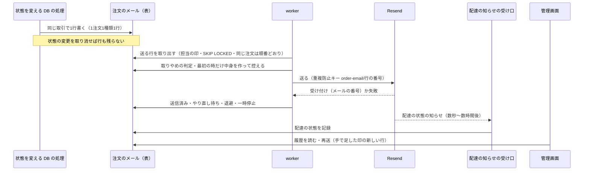

# 注文メールを確実に送る（グループ D）設計書

> 日付: 2026-10-09（設計 1〜5 の承認: 2026-10-09）
> 分類: architectural（新しい表・worker・外から呼ばれる受け口・注文の状態を変える DB の処理の変更を含むため）
> 直す指摘: [レビュー台帳](../../05_Quality/reviews/code/2026-09-25-working-diff-security-review.md) の R-34（送信に失敗した確認メールを再送する経路が無い）と R-14（送信権の取得に失敗すると重複送信を許す）。要求 FREQ-386「0通や2通にならない」を満たす
> 方針: **Shopify と同じ形に近づける。Shopify の仕組みが見つからない所は、世界の業界の定番（ベストプラクティス・デファクトスタンダード）に従う**（ユーザーの指示）。各設計の節の終わりに、根拠の資料を添えて突き合わせた結果を書く
> 関連: [グループ A 設計書](2026-09-26-order-payment-reconciliation-design.md)（照合と注文の状態）、[グループ B 設計書](2026-10-05-webhook-queue-operations-design.md)（キュー・worker・定期処理・店への知らせ）、[グループ F 設計書](2026-10-07-checkout-place-order-payment-design.md)

---

## 概要

お客様への注文のメール（注文確認・入金待ち・支払い期限切れ・取消・発送）を、0通にも2通にもならないように送る。

実装前は、メールを送る前に DB で「送信権」を取り、送れなかったら権利を戻すだけで、誰も送り直さない（R-34）。権利の確認そのものに失敗すると「届かないよりまし」と送ってしまい、同時に動く経路があると2通になる（R-14）。発送のメールは送信権も再送も無い。

この設計は、業界の定番の **transactional outbox**（状態の変更と同じ取引で「送る予定」を1行書き、別の処理が送る）に置き換える。送る処理はグループ B の worker と同じ作りにし、管理画面には Shopify と同じ「注文の履歴」と「メールの再送」を付ける。

| 項目 | 決定 | 根拠 |
|---|---|---|
| 対象のメール | お客様への注文のメール5種類（注文確認・入金待ち・支払い期限切れ・取消・発送） | ユーザーの決定。Shopify も注文の通知を同じ仕組みで送る |
| 作り方 | 状態を変える DB の処理が、同じ取引で「注文のメール」の表に1行書き、worker が送る | transactional outbox（microservices.io・AWS） |
| 2通にしない | 自動の行は1注文1種類1行。送る時は Resend の重複防止キー（行の番号から作る） | outbox は「少なくとも1回」なので受け手側で重複を防ぐ。Resend の idempotency key（24時間） |
| 0通にしない | 失敗したら間隔を倍に広げて9回（約4時間）までやり直す。駄目なら退避して店へ知らせ、管理画面から再送できる | Shopify の Webhook の送り直し（約4時間で8回）、Amazon Builders' Library |
| 順番 | 同じ注文のメールは書いた順に送る。意味がなくなったメールは「取りやめ」 | outbox の順番の決まり、Firebase の collapsible messages |
| 設定の問題 | 全体を一時停止し（回数を数えない）、15分ごとに1件だけ試す | サーキットブレーカー（Azure） |
| 管理画面 | 注文の「履歴」（状態の変化とメール）・送ったメールの中身（45日）・再送・発送のメールを送るかのチェック | Shopify の注文の Timeline・メールの再送・「発送の詳細を今すぐ送る」 |
| 配達の状態 | Resend の知らせ（Webhook）の受け口と、1時間ごとの見回りで「配達済み・届かなかった」を記録する | Shopify の「配達の状態」と注意の印、Shopify の Webhook の見回り（reconciliation） |
| 目標 | 注文のメールはふだん1分以内に送る。15分を超えたら店へ知らせる | Google SRE（知らせを目標に結び付け、手順を付ける） |

---

## 1. 目的と範囲

### 1-1 直す指摘

| 指摘 | 内容 | この設計での直し |
|---|---|---|
| R-34 | 確認メールの送信に失敗すると権利を戻すだけで、Webhook・決済の完了・見回りのどれも送り直さない。Resend の一時的な失敗だけで0通になる | 送る予定の表と worker がやり直す。駄目なら退避して店へ知らせ、管理画面から再送できる |
| R-14 | `claim_order_email` が失敗すると送ってしまう。決済の完了・Webhook・見回りが同時に動き、DB が一時的に失敗すると2通以上になる | 送信権の仕組みをやめ、状態の変更と同じ取引で書く1行（1注文1種類1行）と Resend の重複防止キーで防ぐ |

### 1-2 ユーザーが決めたこと（2026-10-09）

| 質問 | 決定 |
|---|---|
| 確実に送る仕組みに乗せるメールの範囲 | お客様への注文のメール全部（注文確認・入金待ち・支払い期限切れ・取消・発送） |
| 管理画面の記録と再送 | 送ったメールの記録と再送を付ける。自分への写しは作らない |
| 作り方 | 案1（DB の送る予定の表＋worker）。案2（失敗した時だけ再送の表）と案3（外のキューのサービス）は採らない |
| 設計 1〜5 | Shopify と業界の定番に照らして直した版を承認 |
| 配達の状態の受け口 | 外から呼ばれる受け口と秘密の鍵が1つ増えることも含めて入れる。お問い合わせの受け口とは分ける |

### 1-3 成功の基準

- 注文の状態が変われば、必ずその種類のメールが1行できる（状態の変更を取り消せば行も残らない）。
- 同じ注文・同じ種類の自動のメールは、どの経路が何回動いても1通だけ送る。
- 送信に失敗したメールは自動でやり直し、送れなければ店に知らせ、管理画面から送り直せる。
- 注文のメールはふだん1分以内に送る。15分を超えて送れていないメールがあれば店へ知らせる。
- 管理画面で、注文ごとに状態の変化とメールの記録（配達済み・届かなかったを含む）を見られ、送ったメールの中身を送ってから45日見られる。

### 1-4 範囲の外

| 項目 | 理由 |
|---|---|
| 店への知らせ（要対応・ops の知らせ） | お客様へのメールではない。グループ A・B の仕組みのまま |
| 返金のメール | 返金はグループ E で扱う。種類を足せば同じ表に乗る形にしておく |
| 注文にならなかった支払いの案内（要対応の `order_not_creatable` の時に、お客様へ「確認が必要になりました。担当者からご連絡します」と送るメール） | 注文が無いので、注文ごとの表に乗らない。店には要対応の知らせが届き、案内も「担当者からご連絡します」なので、送れなくても店からの連絡で補える。送り方は今のまま（要対応の記録 `payment_exceptions.customer_notified_at` で送信権を取り、失敗したら戻す） |
| 注文の連絡先のメールアドレスを管理画面で直すこと | Shopify は注文の画面で直せるが、今の管理画面に無い。宛先の誤りで届かない時に要るので、別の作業として後で扱う |
| 社内のコメント（Shopify の Timeline のコメント） | 要望に無い |
| 文面を管理画面で直す・プレビュー・テスト送信 | Shopify の通知の設定画面にあるが、今は文面がプログラムの中にある。文面を管理画面で直せるようにする時に一緒に作る |
| 支払い待ちの失敗のメールに「今すぐ支払う」のリンク | Shopify にあるが、グループ A で「期限切れで注文を失効し、買い直し」と決めた流れなので変えない |

---

## 2. 実装前の状態（2026-10-09）

| メール | きっかけ | 送り方 | 失敗した時 |
|---|---|---|---|
| 注文確認（入金済み） | 照合の `mark_order_paid` の後（金額が合い、全額返金済みでない時） | アプリが送信権 `claim_order_email` を取ってから送る | 権利を戻すだけ（R-34）。権利の確認の失敗では送ってしまう（R-14） |
| 入金待ち | 照合の `mark_order_awaiting_payment` の後 | 同上 | 同上 |
| 支払い期限切れ | 照合の在庫を戻す処理（`release_stock_for_unpaid_order`、次の状態が失敗）の後 | 同上 | 同上 |
| 取消 | 管理画面の取消（「お客様に知らせる」の時）・要対応の解決の取消（同） | 同上 | 同上 |
| 発送 | 管理画面の `admin_ship_paid_order` の後 | 送信権なしで送る | 監査に残すだけ |

- 送信権の表は `private.order_emails`、関数は `claim_order_email`・`release_order_email`（移行 `20260920064241_add_order_email_claims.sql`）。
- 送り手は `src/lib/mail.ts` の `resolveMailProvider()` で決まる。本番は `MAIL_PROVIDER` に従い、**設定が無いと SES になる**。本番で使う予定は Resend（送信元のドメインは確認済み）。
- 失敗→取消（`admin_cancel_failed_order`）はお客様に送らない（期限切れで知らせ済み）。この設計でも変えない。
- お客様へのメールにはもう1つ、注文にならなかった支払いの案内（`sendUnplacedPaymentNotice`）がある。1-4 のとおり範囲の外にする。

---

## 3. 流れと「注文のメール」の表（設計1）

### 3-1 行を書く場所

| DB の処理 | 書くメール | 書く条件 |
|---|---|---|
| `mark_order_paid` | 注文確認（入金済み） | 状態を変えられ、DB が金額が合うと判断し（合わない時は要対応になり、書かない）、アプリが「全額返金済みでない」を渡した時。書き分け（`order_confirmed`・`payment_received`・`payment_received_after_expiry`）は今のアプリの決め方を引数で渡す |
| `mark_order_awaiting_payment` | 入金待ち | 状態を変えられた時 |
| `release_stock_for_unpaid_order` | 支払い期限切れ／取消 | 次の状態が失敗なら期限切れ。取消で `_notify_customer` が真なら取消 |
| `resolve_payment_exception`（要対応の解決） | 取消 | 注文を取り消し、「お客様に知らせる」の時 |
| `admin_ship_paid_order` | 発送 | 発送の画面の「お客様に発送のメールを送る」が入っている時（新しい引数。最初から入った状態） |

- 「書くか」の条件のうち、Stripe の状態など DB の外で分かること（全額返金済みか・知らせるか）は引数で渡し、DB の処理の中で決める。
- アプリはメールを直接送らない。行を書いた後に、その場で worker を1回動かす（4-7）。

### 3-2 行の決まり

- 自動の行は「1つの注文・1つの種類につき1行」に DB の一意の決まりで縛る。2通目の行はそもそも作れない。
- 管理画面の再送は「手で足した」印の行として別に作る。同じ注文・同じ種類の手の再送は、送信待ち・送信中・やり直し待ちの間は1行だけ（5-3）。
- 状態は6つ：送信待ち（`pending`）・送信中（`sending`）・やり直し待ち（`retry_wait`）・送信済み（`sent`）・取りやめ（`skipped`）・送れなかった（`dead`、退避）。送信中の担当が期限切れになった行は、やり直し待ちと同じ扱いで取り出す。取りやめを `canceled` にしないのは、取消のメールの種類（`canceled`）と見分けるため。
- Resend の重複防止キーは行の番号から作る（`order-email/<行の番号>`）。手の再送は新しい行なので新しいキーになる。

### 3-3 突き合わせ

| 点 | 根拠 | 判定 |
|---|---|---|
| メールのきっかけが注文の出来事ごと | [Shopify のお客様への通知](https://help.shopify.com/en/manual/fulfillment/setup/notifications/customer-notifications)、[支払い待ちの注文](https://help.shopify.com/en/manual/fulfillment/managing-orders/payments/pending-payments) | 合う |
| 注文確認は止められない／取消は知らせるかを選べる | 同上 | 合う |
| 発送は「発送の詳細を今すぐ送る」を外せる | 同上 | 合わせた（発送の画面にチェックを足す） |
| 状態の変更と同じ取引で書く・取り消しなら送らない | [microservices.io](https://microservices.io/patterns/data/transactional-outbox.html)、[AWS の outbox の指針](https://docs.aws.amazon.com/prescriptive-guidance/latest/cloud-design-patterns/transactional-outbox.html) | 合う |
| 送り手は「少なくとも1回」なので受け手側で重複を防ぐ | 同上 | 合う（1注文1種類1行・担当の印・[Resend の重複防止キー](https://resend.com/docs/dashboard/emails/idempotency-keys)） |

---

## 4. 送る時の決まり（設計2）

### 4-1 順番と取りやめ

- 同じ注文のメールは、書いた順に送る。前のメールが片付く（送信済み・取りやめ・退避）まで、後のメールは取り出さない。
- 送る時の注文の状態を見て、意味がなくなったメールは送らずに「取りやめ」にし、理由の記号を残す。

| メール | 取りやめにする時 | 理由の記号 |
|---|---|---|
| 入金待ち | もう入金待ちでない（入金済み・期限切れ・取消になった） | `superseded` |
| 支払い期限切れ | その後に入金を確認した（入金済みのメールを送る） | `superseded` |
| 入金済み・取消・発送 | 取りやめない（その時の事実を伝える。Shopify も確認と取消を別々に送る） | ― |
| どれも | お客様のメールアドレスが無い | `no_recipient` |

- 入金済みのメールの書き分けが `payment_received_after_expiry`（期限切れの案内の後の入金）でも、期限切れのメールを実際には送っていない時（取りやめ・行が無い）は、普通の文面（`payment_received`）で作る。

- `public.skip_order_email` も `superseded` を `awaiting_payment`・`payment_expired` に限る。ほかの種類は SQLSTATE `22023`・`SUPERSEDE_NOT_ALLOWED` で断る。

### 4-2 中身を作る時

- 最初に送る時、その時点の注文の情報で件名と本文を作り、**送る前に**行に控える。やり直しは控えた中身と同じ重複防止キーで送る（Resend は同じキーで中身が違うと 409 で断る）。送れた後に記録の前に落ちても、やり直しは同じ中身と同じキーになるので、Resend は2通目を送らずに最初の受け付けを返す。
- 文面は実装前の注文確認・入金待ち・期限切れ・取消・発送のメールと同じにし、現在は `src/lib/orders/email/order-email-compose.ts` の `composeOrderEmail` が組み立てる。件名は固定の文と注文番号だけで組み、氏名や商品名は本文にだけ入れる（メールの見出しへの差し込みを防ぐ。今と同じ）。
- 控えた本文の保存期間は 7-5。

### 4-3 やり直し

| 試行 | 前の失敗からの間隔 | 最初の失敗からの目安 |
|---|---|---|
| 1回目 | ―（書いた直後） | ― |
| 2回目 | 1分 | 1分 |
| 3回目 | 2分 | 3分 |
| 4回目 | 4分 | 7分 |
| 5回目 | 8分 | 15分 |
| 6回目 | 16分 | 31分 |
| 7回目 | 32分 | 63分 |
| 8回目 | 64分 | 2時間7分 |
| 9回目 | 128分 | 4時間15分 |

- グループ B の Webhook のキューと同じ表。Shopify の Webhook の「約4時間で8回の送り直し」とも同じ。9回目も失敗したら退避する。
- 間隔には前後2割までの揺らぎを足す。
- 回数の制限（429）やサーバーの一時停止（503）の応答が待つ時間（`Retry-After`）を示したら、決めた間隔と比べて長い方を使う。
- 担当の期限は5分。期限切れも1回の失敗（`lease_expired`）として数える。
- 通常のやり直しは約4時間で、Resend の重複防止キーの有効期間（24時間）に収まる。`Retry-After` は最大1日で、一時停止や長い待機で24時間を越えると、前の試行が届いていた場合に2通目になりうる（[手順書](../../06_Operations/order-email-operations.md)の3）。

### 4-4 失敗の分け方

| 種類 | Resend の例 | 扱い | 原因の記号 |
|---|---|---|---|
| 一時的 | 回数の制限 `rate_limit_exceeded`（429）・`application_error`（500）・`service_unavailable`（503）・同じキーの送信が処理中 `concurrent_idempotent_requests`（409）・通信の失敗・時間切れ | 4-3 のとおりやり直す | `provider_unavailable`・`rate_limited`・`network_error` |
| 設定の問題（全部のメールに効く） | API キーが無い `missing_api_key`（401）・止まっている `restricted_api_key`・`suspended_api_key`（403）・送信元のドメインが未確認 `validation_error`（403）・`daily_quota_exceeded`・`monthly_quota_exceeded`（429） | 4-5 の一時停止 | `config_api_key`・`config_sender_domain`・`quota_daily`・`quota_monthly` |
| このメールだけの問題 | 宛先などの形が不正 `validation_error`（400）・`missing_required_field`（422）・同じキーで中身が違う `invalid_idempotent_request`（409） | やり直さずにすぐ退避して店へ知らせる | `invalid_message`・`idempotency_conflict` |
| どれにも当たらない | ― | 一時的と同じくやり直す | `unexpected_error` |

- 失敗には原因の記号だけを残す。例外の文・宛先・本文は残さない（グループ B と同じ）。
- 送り手が Resend でも手元のメール受け（`local`）でもない時（設定が無く SES になる時を含む）は、送らずに 4-5 の一時停止（`config_provider`）にする。`local` は手元の Supabase とだけ使い、ほかの DB との組み合わせも `checkOrderEmailSendConfig` が `config_provider` で一時停止する。
- 1回の送信の待機は `ORDER_EMAIL_SEND_TIMEOUT_MS`（8秒）で打ち切り、一時的な失敗（`network_error`）でやり直す。通信自体は中断せず、遅れて返った結果は使わない。やり直しは同じ重複防止キーで送る（24時間の限りは4-3）。

### 4-5 送信の一時停止（サーキットブレーカー）

- 設定の問題が起きたら、注文のメールの送信全体を止める。止めている間はやり直しの回数を数えない（メールは送信待ち・やり直し待ちのまま残る）。
- 店へすぐ知らせる（1時間に1回まで）。
- 15分ごとに1件だけ試し（half-open）、通ったら全体を再開する。1日の上限（`quota_daily`）の時は、上限が戻る時刻（UTC 0時＝日本時間 9時）まで待ってから試す。
- 一時停止を書き直しても、`quota_daily` 以外は `next_probe_at` を延ばさない。`quota_daily` だけは次の UTC 0時に決め直す。
- 止めている間も、4-8 の「溜まり」の知らせは続く。

### 4-6 店への知らせ

宛先は `SHOP_ALERT_EMAIL`（今の要対応・ops の知らせと同じ）。お客様の名前・メールアドレス・住所は入れず、注文番号・種類・原因の記号・件数と、管理画面への案内・手順書の節の名前を入れる。

| 知らせ | 条件 | 回数の上限 | 送るところ |
|---|---|---|---|
| 送れなかった | 退避した（9回失敗・このメールだけの問題） | まとめて1通、1時間に1回 | 点検（4-8） |
| 届かなかった | 配達の状態が「届かなかった」「迷惑メールにされた」「送信先が止められている」「送信サービスで送れなかった」になった（6-3） | まとめて1通、1時間に1回 | 点検 |
| 送信の一時停止 | 4-5 で止めた | 1時間に1回 | 点検 |
| 溜まり | 書いてから15分以上送れていないメール（送信待ち・送信中・やり直し待ち）がある | 1時間に1回 | 点検 |
| worker の停止 | 注文のメールの worker の最後の成功から15分以上 | 1時間に1回 | 点検 |

- 種類ごとの「最後に送った時刻」は `ops_alert_state` に記録し、送れた時だけ進める（グループ B と同じ）。
- 一時停止の知らせも、止まった原因と同じ送信の道（同じ鍵・送信元・上限）を通るため届かない。店主が気づく道として、管理画面の ORDER タブの上に「お客様への注文のメールの送信を止めています」の帯を、止めている時だけ出す。`GET /api/admin/order-attention` の `data.emailSending: { paused, reasonLabel } | null` を使い、原因と再開の案内を出す（E2E `FR-ADMIN-067`）。状態の取得だけが失敗した場合は `null` とし、要対応の一覧と200応答を保つ。

### 4-7 動かすきっかけ

- **毎分の定期処理**：今の Webhook の worker の定期処理（`/api/cron/process-stripe-webhooks`、pg_cron＋pg_net）の続きで、注文のメールの表も処理する。新しい定期処理と合言葉は増やさない。1回の起動の時間の中で、Webhook の知らせを先に、メールを後に処理する。
- Stripe の知らせは35秒、注文のメールは10秒の処理予算とし、その後に店への知らせの点検と配達の見回りが続く。入口の実行上限は60秒で、点検・見回り（最大約13秒）や開始済みの処理を含む厳密な45秒の上限ではない。
- **行を書いた直後**：決済の完了（complete）・Webhook の知らせの処理・管理画面の発送・取消・再送・要対応の解決・期限切れの定期処理（`/api/cron/expire-pending-orders`）のあとで、その場（Next.js の `after()`）で1回動かす。ふだんは数秒で届く。
- 最後に成功した時刻を `ops_job_heartbeats` に記録する（`order_email_worker`）。
- `orderEmailWorkerDisabledReason` は `VERCEL_ENV` が設定されて production 以外の公開と、手元でない DB につないだ `next dev` を止める。worker・点検・配達の見回りは DB に触れず、心拍も書かない。Resend の受け口にはこの門を置かない。
- 手元で本番の DB に向けた `next build && next start` はこの門では止まらない。Vercel の `VERCEL_ENV` が実行時に見える設定と、手元の接続先を公開前に確かめる（[手順書](../../06_Operations/order-email-operations.md)の1）。

### 4-8 点検

グループ B の点検（`runOpsChecks`）に続けて `runOrderEmailOpsChecks` を呼び、一時停止・送れなかった・届かなかったのまとめ・溜まり・worker の停止を点検する。毎分の worker と期限切れの見回り（`expire-pending-orders`）の両方から動く。4-7 の環境の門で止まる時は読み書きも店への送信もしない。

### 4-9 突き合わせ

| 点 | 根拠 | 判定 |
|---|---|---|
| 同じ注文は起きた順に送る | [microservices.io](https://microservices.io/patterns/data/transactional-outbox.html)、[AWS の outbox の指針](https://docs.aws.amazon.com/prescriptive-guidance/latest/cloud-design-patterns/transactional-outbox.html) | 合う |
| 古くなった知らせは新しい知らせが入れ替える | [Firebase の collapsible messages](https://firebase.google.com/docs/cloud-messaging/customize-messages/collapsible-message-types) | 合う（取りやめ） |
| 倍に広げる・上限・揺らぎ・やり直しは重複を防げる時だけ | [Amazon Builders' Library](https://builder.aws.com/content/3EumjoZascWd1oZiEgL8ORlv3qE/timeouts-retries-and-backoff-with-jitter) | 合う |
| 回数と期間 | [Shopify の Webhook の送り直し](https://shopify.dev/docs/apps/build/webhooks/troubleshoot) | 合う |
| 一時的な失敗だけやり直し、形の不正はやり直さない | [Resend の失敗の一覧](https://resend.com/docs/api-reference/errors)、[Postmark の 422 の説明](https://postmarkapp.com/support/article/troubleshooting-422-unprocessable-entity-errors) | 合う |
| 全体が止まる失敗は試すのを止め、時々1件試す | [サーキットブレーカー（Azure）](https://learn.microsoft.com/en-us/azure/architecture/patterns/circuit-breaker) | 合う |
| 待つ時間の指示に従う | 同上（429・503 は待つ時間を示せる）、Resend（回数の制限の応答の見出しを見て遅くする） | 合う |
| 支払い待ちの後に支払いが済んだら成功の知らせ | [Shopify の支払い待ち](https://help.shopify.com/en/manual/fulfillment/managing-orders/payments/pending-payments) | 合う |
| 重複を防げない送り手では送らない | [OWASP Fail Securely](https://owasp.org/www-community/Fail_securely) | 合う |

---

## 5. 管理画面（設計3）

### 5-1 履歴

- 注文の一覧のカードに「履歴」のボタンを足し、押すと「この注文の履歴」のダイアログを開く。今の管理画面には注文ごとの詳しい画面が無いので、返金・発送・取消と同じダイアログの形にする。
- この注文の出来事を新しい順に並べる。
  - 注文の状態の変化（`order_revisions` から）：受付・入金・発送（配送業者と伝票番号）・取消（理由）。管理者の操作なら、その管理者。
  - メール：種類・状態・時刻・試した回数・失敗の原因（記号を短い日本語にする。例「宛先の形が不正」「送信サービスの一時的な失敗」）・手で再送した物の印と操作した管理者。
- メールの状態は次のように出す。送信済みのメールは、配達の状態が分かればそれを出す（6-3）。

| 表の状態 | 配達の状態 | 履歴の表示 | 注意の印 |
|---|---|---|---|
| `pending`・`sending` | ― | 送信待ち | なし |
| `retry_wait` | ― | やり直し待ち | なし |
| `sent` | まだ無い | 送信済み | なし |
| `sent` | `delivered`・`delayed`・`bounced`・`complained`・`suppressed`・`failed` | 6-3 の表示 | 6-3 のとおり |
| `skipped` | ― | 取りやめ | なし |
| `dead` | ― | 送れなかった | あり |

- 上に宛先（注文のメールアドレス）を出す。送信を一時停止している時は「メールの送信を一時停止しています（理由）」と出す。
- 状態の変化の表示は、表に残っている前後の値をそのまま出さず、上の項目だけを決まった文で出す（住所などを余計に出さない）。
- 注文の状態の表示名は、[order-history.ts](../../../src/lib/orders/email/order-history.ts) の `ORDER_STATUS_LABELS` を正本とし、注文一覧と履歴の窓口で共有する。
- `public.list_order_status_history` は `'status' = ANY (changed_fields)` で絞り、`apply_order_refund_projection` の `refund_update` による状態変更も含める。`order-history.ts` は返金でキャンセルになった行に「理由: 全額返金」、キャンセルから戻った行に「返金の取り消し」を出す。

### 5-2 送ったメールの中身

- 送信済み（配達済み・届かなかったを含む）のメールを開くと、件名と本文を見られる。
- 送ってから45日を過ぎて本文を消した後は「本文の保存期間（45日）を過ぎました」と出す。種類・時刻・状態は残る。

### 5-3 再送

- 「送信済み」（配達済み・届かなかったを含む）と「送れなかった」の行に「お客様へ再送」のボタンを出す。「取りやめ」と「送信待ち」には出さない。
- 今の注文の状態で意味のある種類だけ再送できる。

| 種類 | 再送できる注文の状態 |
|---|---|
| 注文確認（入金済み） | 入金済み（`paid`）・発送済み（`shipped`） |
| 入金待ち | 入金待ち（`pending`） |
| 支払い期限切れ | 失敗（`failed`） |
| 取消 | 取消（`cancelled`） |
| 発送 | 発送済み（`shipped`） |

- 確認のダイアログで「〇〇のメールを、お客様（注文のメールアドレス）へもう一度送ります」と出す。ボタンは「再送する」「やめる」（「はい・いいえ」にしない）。
- 押すと「手で足した」印の新しい行を作り、同じ worker がすぐ送る。中身は今の注文の情報で作り直す。
- 同じ注文・同じ種類の手の再送が送信待ち・送信中・やり直し待ちの間は、次の再送を受け付けない（DB の一意の決まり）。ボタンも押せなくする。
- 権限：履歴と中身を見るのは「注文を見る」（`admin.orders.read`）、再送は発送・取消と同じ「注文の管理」（`admin.orders.manage`）。
- 再送は CSRF の合言葉を求め、回数の制限（管理者ごとと送信元ごとに10分に30回。今の管理画面の窓口と同じ `enforceRateLimit` の形）を付け、再送した管理者・注文・種類を監査の記録に残す（お客様の個人情報は入れない）。
- 再送の窓口は、注文ID・本文の不正を400で断る時も `admin.orders.email.resend` の監査に残す。検証の詳細や入力値を残さず、`Invalid order id`・`Invalid request body` の固定の文と `outcome = 'failure'` を使う。

### 5-4 発送の画面

- 発送のダイアログに「お客様に発送のメールを送る」のチェックを足す（最初から入った状態）。入っている時だけ発送のメールの行を書く。

### 5-5 使いやすさ

- 履歴・中身・再送のダイアログは今の Dialog 部品を使う。キーボードで閉じられ、開いている間はフォーカスが中に留まり、閉じたら押したボタンに戻る。
- 中身の「戻る」と再送の「やめる」は、開いたメールの行の「中身を見る」「お客様へ再送」へ焦点を戻す。そのボタンが無くなっていればパネルへ移す。再送の返事を待つ間の「やめる」は、返事の後の読み直しで行の「お客様へ再送」が消えるので、最初からパネルへ移す。再送の受付の知らせは、焦点を移した後の描画で `role="status"` に入れる。遅れて届いた前の行や前の要求の応答で、今の画面を上書きしない。前の再送の結果の知らせは、別の行の確かめの画面にいる間は取っておき、履歴へ戻った時に出す。

### 5-6 突き合わせ

| 点 | 根拠 | 判定 |
|---|---|---|
| 注文の履歴に支払い・メールなどが並び、メールの下に「再送」 | [Shopify の注文の詳細](https://help.shopify.com/en/manual/fulfillment/managing-orders/managing-order-details)、[Shopify の Timeline](https://help.shopify.com/en/manual/productivity-tools/timeline) | 合う（形は今の管理画面に合わせてダイアログ。社内のコメントは作らない） |
| 送れなかったメールに注意の印・送ったメールを見直せる・配達の状態は自動のメールだけ | [Shopify のお客様の管理（送ったメールを見直す）](https://help.shopify.com/en/manual/customers/manage-customers) | 合う |
| 再送の前の確かめ | Shopify の「注文確認を再送しますか？」、[NN/g の確認のダイアログ](https://www.nngroup.com/articles/confirmation-dialog/) | 合う |
| 自分への写し | Shopify にはある | 作らない（ユーザーの決定） |
| 管理者の操作を記録し、個人情報は入れない | [OWASP Logging Cheat Sheet](https://cheatsheetseries.owasp.org/cheatsheets/Logging_Cheat_Sheet.html) | 合う |
| 管理の窓口に回数の制限 | [OWASP API Security Top 10 の API4](https://owasp.org/API-Security/editions/2023/en/0xa4-unrestricted-resource-consumption/) | 合う |
| ダイアログの作法 | [WAI-ARIA のダイアログ](https://www.w3.org/WAI/ARIA/apg/patterns/dialog-modal/) | 合う |

---

## 6. 配達の状態（設計3・4）

### 6-1 何のやり取りか

サイトは Resend に「送って」と頼み、Resend は受け付けを返す。お客様のメールの会社に届いたか・断られたかは、数秒〜数時間後に Resend にだけ分かる。Resend はそれを、サイトの受け口（Webhook）を呼んで知らせる。受け口はインターネットに公開されるので、Resend が発行する署名の鍵で「本当に Resend からの知らせか」を確かめる。

### 6-2 受け口（`/api/webhook/resend-delivery`）

- 鍵は新しい環境変数 `RESEND_DELIVERY_WEBHOOK_SECRET`。お問い合わせの受け口（`/api/contact/inbound`、`RESEND_WEBHOOK_SECRET`）とは分ける（役目ごとに鍵を分け、片方の鍵の作り直しや不具合がもう片方に響かないため）。
- 署名（Svix の `svix-id`・`svix-timestamp`・`svix-signature`）を、届いたままの本文で確かめる。比べ方は時間差の出ない比べ方（`timingSafeEqual`）。今のお問い合わせの受け口の確かめを共通の関数にして使う。
- 署名が並んでいたら（鍵の作り直しの24時間）、どれか1つが合えば通す。
- 時刻が5分より古い・新しすぎる知らせは断る（使い回しを防ぐ）。
- 本文の大きさに上限（64KB）を付ける。
- 受ける種類は `email.delivered`・`email.delivery_delayed`・`email.bounced`・`email.complained`・`email.suppressed`・`email.failed` だけ。ほかの種類は「受けた」と返して何もしない。
- 同じ知らせの番号（`svix-id`）は1回だけ処理する。受付済みの番号の表に入れられた時だけ進め、2回目は 200 を返して何もしない。
- 知らないメールの番号（Resend のメールの番号が表に無い）は 200 を返して何もしない。
- 配達の状態は、知らせの時刻が今の記録より新しい時だけ書き換える（順番が前後しても戻らない）。
- 受け口は受付済みの番号を書き、配達の状態を1行直すだけにして、すぐ返す（目安2秒以内。Svix は15秒で打ち切る）。DB の失敗の時だけ 500 を返し、Svix に送り直してもらう。署名の誤りは 401。
- 受け口は `/api/webhook/` の下に置くので、外からの POST の送信元の確かめ（`src/proxy.ts`）から既に外れている（Stripe の受け口と同じ。除外の一覧の説明書きに Resend の配達の知らせを足す）。守りは署名・時刻・大きさの上限・種類の絞り込みで行う。
- ログと監査には宛先や本文を出さない。

### 6-3 配達の状態の対応

| Resend の知らせ | 配達の状態 | 履歴の表示 | 店への知らせ |
|---|---|---|---|
| `email.delivered` | `delivered` | 配達済み | なし |
| `email.delivery_delayed` | `delayed` | 配達の遅れ | なし |
| `email.bounced` | `bounced` | 届かなかった（注意の印） | あり（4-6） |
| `email.complained` | `complained` | 迷惑メールにされた（注意の印） | あり |
| `email.suppressed` | `suppressed` | 送信先が止められている（注意の印） | あり |
| `email.failed` | `failed` | 送信サービスで送れなかった（注意の印） | あり |

### 6-4 見回り

- 1時間ごとに、送ってから3日以内で配達の状態がまだ決まっていない（無い・配達の遅れ）メールについて、Resend の API でそのメールの最後の状態を読み、記録を直す（Shopify の Webhook の「取りこぼしを API で読み直す見回り」と同じ考え方。グループ B の Stripe の見回りと同じ形）。
- 受け口の登録前や、受け口が長く止まった時の取りこぼしを拾う。
- 1回に読む件数に上限（50件）を付け、Resend の回数の制限を守る。
- 毎分の worker の最後、店への知らせの点検の後に1時間に1回だけ動かす。心拍（`order_email_delivery_check`）を Resend の読み取り前に書き、途中で止まっても次の分には動かさない。4-7 の環境の門で止まる時は DB・Resend に触れず、心拍も書かない。
- 時間枠は `DELIVERY_CHECK_BUDGET_MS`（8秒）、読む間は `DELIVERY_CHECK_READ_INTERVAL_MS`（1秒）、1件の待機は `DELIVERY_CHECK_READ_TIMEOUT_MS`（5秒）。古い順に取得した対象を読む前に混ぜ、先頭の状態が決まらなくても後ろを読む機会を作る。回数の制限・通信の不調・時間切れはその回をやめる。8秒は次の読み取りを始める前に確認し、開始済みの読み取りと DB の処理まで含む厳密な実行上限ではない。
- 読めた0件で失敗がある時は `provider_unavailable`、読み取り権限の無い鍵は `config_api_key` を心拍に残す（店への知らせは無い）。Resend の最後の状態が `opened`・`clicked` なら配達済みとして記録する。

### 6-5 突き合わせ

| 点 | 根拠 | 判定 |
|---|---|---|
| 届いたままの本文で署名を確かめる・時間差の出ない比べ方 | [Shopify の Webhook の確かめ](https://shopify.dev/docs/apps/build/webhooks/verify-deliveries)、[Resend の Webhook の確かめ](https://resend.com/docs/dashboard/webhooks/verify-webhooks-requests) | 合う |
| すぐ 200 を返す | Shopify（5秒）・Svix（15秒） | 合う |
| 同じ知らせの番号は1回だけ、2回目も 200、番号は送り直しの期間より長く持つ | [Shopify の「重複した Webhook を無視する」](https://shopify.dev/docs/apps/build/webhooks/ignore-duplicates)、[Svix の送り直し（8回・約28時間）](https://docs.svix.com/retries) | 合う（3日持つ） |
| 鍵の作り直しの間は署名が並ぶ | [Svix の鍵の作り直し](https://www.svix.com/resources/glossary/secret-rotation/) | 合う |
| 取りこぼしを API で読み直す見回り | Shopify の Webhook の確かめ（reconciliation job） | 合う |
| 届かなかった宛先の扱い | Postmark は届かなかった宛先を次から送らない一覧に入れる。Resend は止められた宛先へ送らない（`email.suppressed`） | 合う（Resend の一覧に任せ、こちらは記録して知らせる） |

---

## 7. DB と守り（設計4）

### 7-1 新しい表

表はすべて `private` に置き、API（PostgREST）からは見えない。読み書きは `public` の関数（SECURITY DEFINER・`search_path = ''`・実行は `service_role` だけ）だけで行う。念のため RLS も有効にして全部断り、`anon`・`authenticated` の権限も外す。

**`private.order_email_outbox`（注文のメール）**

| 列 | 中身 |
|---|---|
| `id` | 行の番号（uuid） |
| `order_id` | 注文（`orders` を消せば一緒に消える） |
| `kind` | `paid`・`awaiting_payment`・`payment_expired`・`canceled`・`shipped` |
| `seq` | 行を足した順の番号（bigint、一意）。同じ注文の送信と履歴の順番に使う |
| `variant` | 入金済みの書き分け（`order_confirmed`・`payment_received`・`payment_received_after_expiry`）と取消前の状態（`payment_in_progress`・`pending`）。ほかは空 |
| `origin` | `auto`（状態の変化）・`manual`（管理画面の再送） |
| `requested_by` | 手の再送をした管理者（`auth.users`）。自動は空 |
| `status` | `pending`・`sending`・`retry_wait`・`sent`・`skipped`（取りやめ）・`dead` |
| `attempts` | 試した回数（一時停止の間は数えない） |
| `next_attempt_at` | 次に試す時刻 |
| `lease_token`・`lease_expires_at` | 担当の印と期限（5分） |
| `last_error_code` | 最後の失敗の原因の記号・取りやめの理由 |
| `subject`・`body_text` | 最初に送る時に作った件名と本文の控え（7-5 で消す） |
| `provider_message_id` | Resend のメールの番号（重複なし） |
| `delivery_status`・`delivery_event_at` | 配達の状態と、その知らせの時刻 |
| `created_at`・`sent_at`・`finished_at`・`body_erased_at` | 作った・送った・片付いた・本文を消した時刻 |
| `dead_notified_at` | 送れなかったことを店へ知らせた時刻（未通知のまとめと重複防止） |
| `delivery_alert_notified_at` | 配達の問題を店へ知らせた時刻（未通知のまとめと重複防止） |

- 一意の決まり：自動の行は `(order_id, kind)` で1行（`origin = 'auto'`）。手の行は、`status` が `pending`・`sending`・`retry_wait` の間 `(order_id, kind)` で1行。`provider_message_id` は重複なし。
- 索引：取り出し用に、`status` が `pending`・`retry_wait`・`sending` の行だけに効く `(next_attempt_at)` の部分インデックス。同じ注文の順番と履歴用に `(order_id, seq)`。

**`private.order_email_send_pause`（送信の一時停止、1行だけ）**

| 列 | 中身 |
|---|---|
| `paused` | 止めているか |
| `reason` | 原因の記号（`config_api_key` など） |
| `paused_at`・`next_probe_at` | 止めた時刻・次に1件試す時刻 |

**`private.resend_webhook_receipts`（Resend の知らせの受付済みの番号）**

| 列 | 中身 |
|---|---|
| `svix_id` | 知らせの番号（主キー） |
| `received_at` | 受けた時刻 |

### 7-2 関数

行を書く関数 `private.enqueue_order_email(...)` は `private` に置き、状態を変える DB の処理の中からだけ呼ぶ（誰にも実行の権限を与えない）。片付けの `private.purge_order_email_data()` と内部の補助関数も `private` に置く。worker・管理画面・受け口の関数は `public` に置き、実行は `service_role` だけにする。担当の印を受け取る関数は、印と期限が合う時だけ行を変える。

| 関数 | 役目 |
|---|---|
| `claim_order_email(_lease_seconds)` | 一時停止を見て、送る行を担当の印付きで取り出す（`FOR UPDATE SKIP LOCKED`・同じ注文は順番どおり） |
| `save_order_email_content(_email_id, _lease_token, _subject, _body_text)` | 最初に送る前に、作った件名と本文を控える（控えが無い時だけ） |
| `complete_order_email(_email_id, _lease_token, _provider_message_id)` | 送信済みにし、Resend のメールの番号を書く |
| `fail_order_email(...)` | 失敗の原因と待つ時間を受け、やり直し待ち・退避にする |
| `skip_order_email(_email_id, _lease_token, _reason)` | 取りやめにする |
| `pause_order_email_sending(_reason)`・`get_order_email_send_state()` | 一時停止と状態の照会。試した1件が `complete_order_email` で送信済みになると再開 |
| `request_order_email_resend(_order_id, _kind, _actor_id)` | 再送の行を作る（再送できる種類か・手の行が送信待ちでないかを確かめる） |
| `list_order_email_history(_order_id)` | 管理画面の履歴（本文は返さない） |
| `list_order_status_history(_order_id)` | 状態の変化の履歴（返金の変化を含む） |
| `get_order_email_content(_order_id, _email_id)` | 管理画面の中身（送信済みで本文が残っている時だけ） |
| `record_order_email_delivery(_svix_id, _provider_message_id, _delivery_status, _event_at)` | 受け口と見回りから。受け口は受付済みの番号を書き（見回りは番号なしで呼ぶ）、配達の状態を新しい時だけ直す |
| `list_order_emails_awaiting_delivery(_limit)` | 見回り用。送ってから3日以内で配達の状態が決まっていないメールの Resend の番号を返す |
| `private.purge_order_email_data()` | 毎日の片付け（7-5）。private のまま pg_cron だけから呼ぶ |
| `get_order_email_backlog(_older_than_seconds)` | 点検用の溜まり |
| `list_unnotified_dead_order_emails(_limit)`・`mark_order_emails_dead_notified(_email_ids)` | 送れなかった新しい分の照会と、店へ知らせた印 |
| `list_unnotified_order_email_delivery_problems(_limit)`・`mark_order_email_delivery_problems_notified(_email_ids)` | 届かなかった新しい分の照会と、店へ知らせた印 |

### 7-3 状態を変える DB の処理の変更

3-1 の5つの処理は、状態を変えた同じ取引の中で `private.enqueue_order_email` を呼ぶ。書くかを決める引数は次のとおり。

| 処理 | 引数 |
|---|---|
| `mark_order_paid` | 全額返金済みでないか・書き分けを足す（金額が合うかは DB が今も判断している） |
| `mark_order_awaiting_payment` | 足さない（状態を変えられたら書く） |
| `release_stock_for_unpaid_order` | 今の `_notify_customer` を使う |
| `resolve_payment_exception` | 今の `_notify_customer` を使う |
| `admin_ship_paid_order` | 発送のメールを送るか（`_notify_customer`）を足す |

### 7-4 消す物

- 送信権の表 `private.order_emails` と、古い関数 `claim_order_email(_order_id, _kind)`・`release_order_email(_order_id, _kind)`。アプリのメールの送り方を全部「表に書く → worker が送る」に替えた後の移行で消す。新しい `claim_order_email(_lease_seconds)` は残す。
- 本番の古い送信権は8行で、移行前の未入金の注文2件の「送らない」印だった（2026-10-09 に本番を読んで確かめた）。消すと、この2件に後から期限切れのメールが届きうるので、取りやめ（`legacy_suppressed`）の自動の行として新しい表へ移してから消す（実装計画の決め事 P9）。

### 7-5 保存期間（毎日の定期処理）

| 物 | 期間 |
|---|---|
| 送信済みのメールの本文 | 送ってから45日を過ぎた分を毎日の片付けで消す（種類・時刻・状態は残す） |
| 取りやめ・送れなかったメールの本文 | 片付いた時にすぐ消す |
| Resend の知らせの受付済みの番号 | 3日で消す（Svix の送り直しは約28時間） |
| メールの記録そのもの（本文以外） | 注文と同じだけ残す |

45日は Postmark の本文の保存の既定と同じ。個人情報保護法の「要らなくなったら遅滞なく消す」にも沿う。

### 7-6 突き合わせ

| 点 | 根拠 | 判定 |
|---|---|---|
| 本文は期間を決めて消す | [Postmark の保存期間（45日）](https://postmarkapp.com/support/article/how-long-are-inbound-and-outbound-messages-stored-in-activity)、[個人情報保護委員会の FAQ](https://www.ppc.go.jp/all_faq_index/faq1-q5-2/) | 合う |
| Supabase の Queues（pgmq）を使わない | 1注文1種類1行・同じ注文の順番・取りやめ・配達の状態・管理画面の履歴は列と決まりが要り、pgmq の形では持てない | グループ B と同じ自前の表（`FOR UPDATE SKIP LOCKED`）にする |

---

## 8. 試験（設計5）

| 種類 | 確かめること |
|---|---|
| DB の結合（手元の Supabase） | 状態の変更を取り消すと行も消える／1注文1種類1行／手の再送は送信待ちの間1行／2つの worker が同じ行を取らない／同じ注文は順番どおり／取りやめ／やり直しの間隔と揺らぎの範囲／一時停止の間は回数を数えず1件だけ試す／配達の状態が前後しても戻らない／同じ知らせの番号は1回だけ／45日・3日の片付け／3つの表はブラウザから読めず書けない／関数はサーバーだけが呼べる |
| 単体 | 5種類のメールの中身（今の文面・割引の行・お届けの目安・期限切れを送っていない時は普通の文面）／Resend の失敗の分け方の全部／待つ時間の指示に従う／重複防止キー／本番で送り手が Resend でない時は送らない／受け口（正しい署名・違う署名・署名が2つ並ぶ・時刻のずれ・大きさ・知らない種類・重複・知らないメール）／見回り／管理画面の窓口（権限・CSRF・回数の制限・監査・再送できる種類・二重押し）／履歴・中身・再送のダイアログ／発送のチェック |
| 落ちた時の試験 | 「送れたのに記録する前に落ちた」場面で、やり直しが同じ重複防止キーで送ること |
| E2E（本番ビルド・手元の Supabase・メールは手元のメール受け Mailpit・3つの画面幅） | ① 決済の完了と Webhook の両方が動いても、注文確認のメールが1通だけ届く ② 管理画面の履歴に状態の変化とメールが並び、送ったメールの中身を開ける ③ 再送すると2通目が届き、履歴に「手で再送」と出る ④ 発送の時にチェックを外すと発送のメールが届かず、入れると1通届く ⑤ ダイアログの役割と名前があり、Escape で閉じる ⑥ 停止中だけ ORDER タブに帯と原因が出て、停止なしの応答を読み直すと帯が消える（FR-ADMIN-067） |

- Resend の失敗と配達の状態は手元では起こせないので、単体と DB の結合で確かめる。本番の Resend とつないだ確かめは 10-3。
- push の前に、このプロジェクトの security-check（OWASP の点検の道具）を変えたファイルにかけ、結果を報告に残す。

---

## 9. 要求と E2E

| FREQ | 要求 | 主な受け付け基準 | E2E |
|---|---|---|---|
| FREQ-434 | 注文のメールを0通にも2通にもしない（R-34・R-14、FREQ-386） | 3つの画面幅で、決済の完了と Webhook の両方が動いても注文確認のメールが1通だけ届くこと／状態の変更を取り消すと送る予定が残らないこと（DB 結合）／送れた後に記録の前に落ちても、やり直しが同じ重複防止キーで送ること（単体） | `e2e/FR-CHECKOUT-049-order-email-sent-once.spec.ts` |
| FREQ-435 | 送れなかったメールを自動でやり直し、送れなければ店へ知らせる。ふだん1分以内に送り、15分を超えたら知らせる。停止中は ORDER タブに原因つきの帯を出す | やり直しの間隔・回数・揺らぎ・待つ時間の指示（単体・DB 結合）／設定の問題で一時停止し、回数を数えず、1件の試しが通ると再開すること（DB 結合）／同じ注文は順番どおりで、意味のなくなったメールは取りやめになること（DB 結合）／3つの画面幅で、停止中だけ帯と原因が出ること | `e2e/FR-ADMIN-067-order-email-paused-banner.spec.ts` |
| FREQ-436 | 管理画面で注文の履歴（状態の変化とメール）を見て、送ったメールの中身（45日）を開き、再送できる | 3つの画面幅で、履歴に状態の変化とメールが並び、送ったメールの中身を開けること／再送すると2通目が届き、履歴に「手で再送」と出ること／再送は「注文の管理」の権限が要り、監査に残ること（単体） | `e2e/FR-ADMIN-065-order-history-and-email-resend.spec.ts` |
| FREQ-437 | 配達の状態を記録し、届かなかったら注意の印と店への知らせを出す | 署名・時刻・重複・種類の確かめ（単体）／配達の状態が前後しても戻らないこと（DB 結合）／見回りが状態の決まらないメールを読み直すこと（単体） | ― |
| FREQ-438 | 発送の時に、発送のメールを送るかを選べる（最初は送る） | 3つの画面幅で、チェックを外すと発送のメールが届かず、入れると1通届くこと | `e2e/FR-ADMIN-066-ship-email-opt-out.spec.ts` |

- 要求は [要求定義](../../02_Requirements/requirements.md) のトレーサビリティの表に足す。
- レビュー台帳の R-34・R-14 を「修正済み」にする。

---

## 10. 本番への出し方と手順書

### 10-1 出し方

1. push の後、移行をユーザーの許可を得て Supabase の接続で当てる（今までどおり）。当てる前に、`private.order_emails` の種類ごとの件数を控える（移行 B が古い表を消すので、当てた後には取れない）。[移行 A](../../../supabase/migrations/20261009120000_order_email_outbox.sql) を当ててから [移行 B](../../../supabase/migrations/20261009120100_order_email_enqueue.sql) を当てる。移行は戻さない。直す時は前へ進める移行で直す。当てた後にファイル名を本番の台帳の版に直す。
2. 当てた後に、`private.order_email_outbox` の `last_error_code = 'legacy_suppressed'` の件数を種類ごとに数え、当てる前の控えと照合する。同じ8行・2注文であることを確かめる（2026-10-09の確認値。違えば適用・公開を止めてユーザーへ知らせる）。SQL は [手順書](../../06_Operations/order-email-operations.md)の1-1。
3. `MAIL_PROVIDER` などの本番の環境変数を入れる前に、本番の送信待ち・送信中・やり直し待ちを、件数と注文番号・種類・作った時刻だけで確かめる。公開前の試しの行はユーザーに見せ、明示の承認の後に `skipped`・`legacy_suppressed` として本文を消す。移行後の本番の DB につないだ開発でも DB の関数は行を書くため、移行後から公開までは決済・発送・取消の試しをしない。入金待ちの試しの注文は移行前にお客様に知らせない取消にする（手順書の1-1）。詳細と SQL は [手順書](../../06_Operations/order-email-operations.md)の1-2。
4. 本番の公開の時に、環境変数 `RESEND_DELIVERY_WEBHOOK_SECRET` を入れ、Resend の管理画面で受け口（`/api/webhook/resend-delivery`、6種類の知らせ）を登録する。登録までの間は、`RESEND_API_KEY` が Full access の鍵なら1時間ごとの見回りが配達の状態を拾う（送信専用の鍵では読めない）。
5. 本番の `MAIL_PROVIDER` を `resend`（小文字）にする（そうでないと 4-4 のとおり注文のメールは一時停止になる）。送り手を選ぶ値で秘密ではない。`resolveMailProvider` は完全一致なので、`Resend` では止まり、店への知らせも届かない。

### 10-2 開店前の確かめの一覧に足す物

- 受け口の登録と鍵
- 送り手が Resend であること
- 移行前後の古い印の種類別件数の照合と、公開前の試しの送信待ちが残っていないこと（10-1・手順書1）
- 10-3 の通しの確かめ

### 10-3 本番の Resend とつないだ通しの確かめ（公開の後・開店の前（お客様がいない時だけ））

公開の後・開店の前の、お客様がいない時だけ行う。試しの注文を作り、宛先を Resend の試し用の宛先にして、次を確かめる。結果は手順書の確かめの欄に残す（[Resend の試し用の宛先](https://resend.com/docs/knowledge-base/what-email-addresses-to-use-for-testing)）。

あわせて、Resend の鍵（`RESEND_API_KEY`）を一時的に誤った値にして試しの送信を起こし、ORDER タブに帯と原因が出ることを確かめる。正しい値に戻して出し直した後、毎分の worker が送る対象の1件を試して15分以内に自動で再開すること、状態を読み直すと帯が消えることを確かめ、結果を手順書に残す。worker が動く本番の実行環境で行う（preview・development は環境の門で止まる）。開店後のお客様のいる環境では行わない。

| 宛先 | 確かめること |
|---|---|
| `delivered@resend.dev` | 履歴に「配達済み」 |
| `bounced@resend.dev` | 「届かなかった」と注意の印、店への知らせ |
| `complained@resend.dev` | 「迷惑メールにされた」と注意の印、店への知らせ |
| `suppressed@resend.dev` | 「送信先が止められている」と注意の印、店への知らせ |

Shopify も「試しの知らせでは本当の流れの確かめにならない。本当の出来事を起こして確かめる」としている（[app webhook trigger](https://shopify.dev/docs/api/shopify-cli/app/app-webhook-trigger)）。

### 10-4 手順書

`docs/` の運用の手順書に、次を書く。知らせのメールには、その知らせの節の名前を入れる（[Google SRE の当番の章](https://sre.google/workbook/on-call/)：知らせごとに手順を付ける）。

| 節 | 中身 |
|---|---|
| 送れなかった | 原因の記号ごとの意味、宛先の誤りなら お客様に確かめる、管理画面から再送する |
| 届かなかった | 宛先の誤り・受け取り拒否の見分け方、お客様への連絡の仕方 |
| 送信の一時停止 | 原因ごとの直し方（API キー・送信元のドメイン・送信の上限）、直った後は自動で再開すること |
| 溜まり | worker と一時停止の確かめ方 |
| worker の停止 | 定期処理（pg_cron・pg_net）の確かめ方 |
| 鍵 | 受け口の鍵の入れ方・作り直し（Resend で作り直す → 24時間以内に新しい鍵をサーバーに入れる） |

---

## 11. 決め事の記録（設計の途中で変えたこと）

| 時点 | 変えたこと | 理由 |
|---|---|---|
| 設計1 | 発送のメールを送るかのチェックを足す | Shopify の「発送の詳細を今すぐ送る」 |
| 設計1 | 同じ注文の順番・取りやめ・揺らぎ・やり直さない失敗を足す | 業界の定番（outbox の順番・Builders' Library） |
| 設計2 | 設定の問題を一時停止（回数を数えない）にし、待つ時間の指示に従う | サーキットブレーカー（Azure）・Resend・Postmark |
| 設計3 | 「メール」ではなく「履歴」（状態の変化とメール）にし、送ったメールの中身と配達の状態を出す | Shopify の Timeline・送ったメールを見直す・配達の状態と注意の印 |
| 設計3 | 送信済みの本文は「片付いたら消す」から「45日残す」に変える | Shopify の送ったメールを見直す・Postmark の45日 |
| 設計3 | 配達の状態の受け口と鍵を足す（お問い合わせの受け口と分ける） | Shopify の配達の状態。ユーザーの承認 |
| 設計4 | 見回り・鍵の作り直し・送信元の確かめから外す扱い・すぐ返すこと・部分インデックスを足す | Shopify の Webhook の確かめ・Svix |
| 設計5 | 本番の通しの確かめ・目標と手順書・ダイアログの作法・出す前の守りの点検を足す | Shopify の trigger の注意書き・Resend の試し用の宛先・Google SRE・WAI-ARIA・security-check |
| 設計書を書く時 | 注文にならなかった支払いの案内を範囲の外と明記する（1-4） | 書く時にコードを読み直して見つけた。注文が無く、店の連絡で補える |
| 設計書を書く時 | 取りやめの状態の名前を `skipped` にする | 取消のメールの種類 `canceled` と取り違えないため |
| 設計書を書く時 | 送る前に中身を控える関数を足す（7-2） | 「送れた後に記録の前に落ちた」時に、やり直しを同じ中身にして2通目を防ぐため（設計2・5 の約束を関数にした） |
| 実装計画を書く時 | 古い送信権の8行を取りやめとして移す（7-4） | 本番を読んで、移行前の未入金の注文2件の「送らない」印だと分かった。グループ A 設計書 7-1 の決め事を守る |
| 実装の時（2026-10-09） | 返金で状態が変わった行も履歴に含め、全額返金と返金の取り消しを表示する（5-1） | 返金の同期は `refund_update` なので、`status_update` だけでは状態の履歴が欠ける |
| 実装の時（2026-10-09） | `superseded` の取りやめを DB でも入金待ち・支払い期限切れに限る（4-1） | 注文確認・取消・発送はその時の事実を伝えるため、誤った取りやめを DB で断る |
| 実装の時（2026-10-09） | 送信・点検・配達の見回りに環境の門を置き、`local` を手元の Supabase に限る（4-4・4-7・4-8・6-4） | 開発や preview が本番の行・一時停止・心拍・知らせ済みの印を書き換えないため。Resend の受け口は署名で守り、門を置かない |
| 実装の時（2026-10-09） | 1回の送信の待機を8秒で打ち切り、`network_error` で同じキーを使ってやり直す（4-4） | 返事のない送信で worker と後の点検を止めないため |
| 実装の時（2026-10-09） | 配達の見回りは点検の後に置き、時間枠8秒・読み取り間隔1秒・1件5秒、取得した対象を読む前に混ぜ、心拍を Resend の読み取り前に書く。`opened`・`clicked` も配達済みとする（6-4） | 送信と共有する Resend の回数の制限を守り、先頭の未確定メールだけが時間枠を占めず、途中で止まっても毎分やり直さず、開封後のメールを読み直し続けないため |
| 実装の時（2026-10-09） | 店への知らせの点検を毎分の worker と期限切れの見回りの両方から動かす（4-8） | worker が止まった場合も見回りから停止を検出するため |
| 実装の時（2026-10-09） | 列・関数を現行の名前と引数に揃える（7-1・7-2） | 1行ずつの取得、取消の書き分け、注文とメールの組の照会、個別の点検関数として実装したため |
| 実装の時（2026-10-09） | 要対応の窓口に `emailSending` を足し、停止中だけ ORDER タブに原因つきの帯を出す（4-6、FREQ-435、E2E FR-ADMIN-067） | 停止の知らせも同じ鍵・送信元・上限を使って届かず、店主が管理画面で気づく道が必要なため |
| 実装の時（2026-10-09） | 一時停止の書き直しでは `quota_daily` 以外の次の試しの時刻を延ばさない（4-5） | 毎分の設定点検が15分後の試しを先へ延ばし続けないため |
| 実装の時（2026-10-09） | 再送の400も監査し、履歴の「戻る」「やめる」で開いた行へ焦点を戻す。状態名は `ORDER_STATUS_LABELS` に揃える（5-1・5-3・5-5） | 不正な入力の記録と行単位の焦点復帰を保ち、一覧と履歴の状態名がずれないようにするため |
