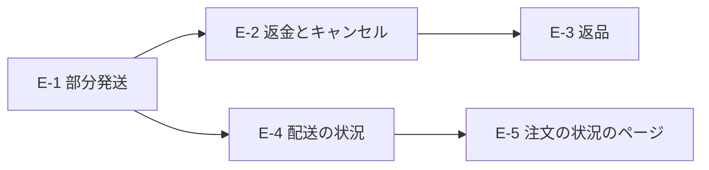

# 発送・返金・返品・配送の状況（グループ E）全体の設計の決定

> 日付: 2026-10-10（設計 1 の承認: 2026-10-09、設計 2〜7 の承認: 2026-10-10）
> 分類: architectural。大きいので5つの作業（E-1〜E-5）に分け、作業ごとに「仕様書 → 作業の計画 → 実装 → 本番への適用」を回す
> 直す指摘: [レビュー台帳](../../05_Quality/reviews/code/2026-09-25-working-diff-security-review.md) の R-06（注文に結び付かない返金の知らせが失敗を繰り返す）・R-16（未発送の全額返金で在庫を戻さない）・R-03（返金の重複防止キーが返金の操作ごとでない）。どれも E-2 で直す
> 方針: **Shopify と同じ形に近づける。Shopify の仕組みが見つからない所は、業界の定番（ベストプラクティス・デファクトスタンダード）に従う**（ユーザーの指示）。設計の節ごとに、出典を付けて Shopify と突き合わせた
> 関連: [グループ A 設計書](2026-09-26-order-payment-reconciliation-design.md)（照合と注文の状態）、[グループ B 設計書](2026-10-05-webhook-queue-operations-design.md)（キュー・worker・定期処理・店への知らせ）、[グループ D 設計書](2026-10-09-order-email-outbox-design.md)（注文のメール）
> 作業ごとの仕様書: [E-1 部分発送](2026-10-10-partial-fulfillment-design.md)。E-2〜E-5 の仕様書は、前の作業を本番に当ててから、この文書の決定をもとに書く

---

## 概要

この文書は、グループ E の設計の会話（2026-10-09〜10）でユーザーが承認した決定を、作業ごとの仕様書を書くまでなくさないために残す。作り方の細部は作業ごとの仕様書に書く。

グループ E は、初めは返金の知らせの反映（R-06・R-16・R-03）だけだった。Shopify に合わせる中で、ユーザーの指示により返品・注文のキャンセル・部分発送・配送の状況・注文の状況のページが加わった。

| 作業 | 中身 | 前提 |
|---|---|---|
| E-1 部分発送 | 発送を1回ごとに記録する。在庫の品を先に送れる。発送ごとのメール・発送の取消・在庫の4つの数 | なし |
| E-2 返金とキャンセル | 返金の記録・返金の画面・支払い済みの注文のキャンセル・Stripe の返金の取り込み・在庫の戻し・返金とキャンセルのメール。R-06・R-16・R-03 を直す | E-1 |
| E-3 返品 | 返品の記録・受け取り・返品の返金 | E-2 |
| E-4 配送の状況 | 追跡のサービスから配達中・配達済みなどを受け取り、お客様に見せてメールする。伝票番号の直し | E-1 |
| E-5 注文の状況のページ | ログインしていないお客様が、メールのリンクから注文の状況を見るページ | E-4 |

作る順番は E-1 → E-2 → E-3 → E-4 → E-5（ユーザーの決定）。

---

## 1. すべての作業で守る決まり

| 決まり | 中身 |
|---|---|
| Shopify に合わせる | 画面の流れ・状態の名前・最初のチェックの状態は Shopify に合わせる。違えるときは仕様書に理由と出典を書く |
| 状態を変える処理は DB の1回の処理 | 記録・在庫の台帳・メールを送る予定（グループ D の outbox）・要対応を、同じ処理で書く。途中で止まっても中途半端にならない |
| 外の値で決める | Stripe や追跡のサービスから届く知らせの中身は使わない。知らせは合図にして、今の値を読み直して決める（グループ A と同じ） |
| 二重にしない | お金・在庫・メールを動かす操作は、画面を開いた時に作る番号（重複防止キー）で二重を防ぐ。同じ番号で中身が違う頼みは断る |
| 表の守り | 新しい表は、DB の関数だけが書ける。アプリ（service_role）は読むだけ。お客様の画面からは直接読めない |
| 窓口の守り | 管理画面の窓口は、権限・なりすましの送信を防ぐ確かめ（CSRF）・回数の制限（送信元ごと・管理者ごと）を通す。監査の記録にお客様の個人情報を入れない |
| 鍵の順番 | 注文 → 色・サイズの在庫（番号の小さい順）の順に鍵をかける。今の在庫の処理と同じ |
| 確かめ方 | 計算の部品・窓口・DB（手元の Supabase）・画面（本番と同じ作り方の画面、手元の Supabase、390・768・1280 の3つの幅）で確かめる。作業ごとに要求の表へ FREQ の行を足し、e2e/FR-*.spec.ts を作る |
| 本番への適用 | push の後に、ユーザーの許可を得て、DB の変更を MCP で本番に当てる |

---

## 2. 商品ごとの数（全部の作業の土台）

Shopify の注文の商品（LineItem）と同じ数え方にする。

| 数 | 定義 | Shopify | 入れる作業 |
|---|---|---|---|
| 注文の数 | 注文した数。返金した分も含む | quantity | 今ある |
| 発送した数 | 取り消していない発送の数の合計 | 発送済み（fulfilled） | E-1 |
| 発送前に返金した数 | 未発送の品を返金した数（返事待ち・保留・成功の返金） | 外した数（removed） | E-2 |
| 発送後に返金した数 | 発送した品を返金した数 | — | E-2 |
| 今の数 | 注文の数 − 返金した数 | currentQuantity | E-2 |
| 未発送の数 | 注文の数 − 発送した数 − 発送前に返金した数 | unfulfilledQuantity | E-1（E-2 で返金を引く） |
| 返品できる数 | 発送した数 − 発送後に返金した数 − 返品中の数 | — | E-3 |

在庫の数（色・サイズごと）:

| 数 | 定義 | Shopify |
|---|---|---|
| すぐ出せる数 | 今の在庫数（item_variants.stock_quantity。変えない） | Available |
| 引き当て済み | 有効な注文で確保していて、まだ発送していない数 | Committed |
| 手元の数 | すぐ出せる数 ＋ 引き当て済み | On hand |
| 受注生産 | 未入金（コンビニ払いの入金待ち）と入金済みの注文の、受注生産の品の未発送の数。返金した分を除く | 在庫の無い Committed（Shopify では Available がマイナス） |

受注生産の数の数え方は Shopify の「引き当て済み」と同じにする（ユーザーの決定）。今は注文の状態に関係なく全部を足している（前からの不具合）ので、E-1 で直す。

---

## 3. E-1 部分発送（決定）

- **発送の記録**（Shopify の Fulfillment）: 注文・何回目か・配送業者・伝票番号・発送した時刻・お客様に知らせたか・実行した人。発送の商品（どの商品を何個）。1つの注文に発送がいくつあってもよい
- **注文の発送の状態**（Shopify の 未発送・一部発送済み・発送済み）: 注文の状態の値は増やさない。一部だけ送った間は「決済完了」のまま、未発送の数が全部0になったら「発送済み」にする。残りを返金して0になった時も同じ（E-2）
- **発送の画面**（Shopify の Mark as fulfilled）: 未発送の商品と数を並べ、今回送る数を入れる。最初に入る数は「在庫の品が残っている間は在庫の品だけ（受注生産の品は0）。在庫の品が残っていなければ残り全部」（ユーザーの決定）。配送業者・伝票番号・「お客様に発送のメールを送る」（最初から入っている）
- **DB が止めること**: 未発送の数を超える数・支払額の違いの要対応が残る注文・届け先の不足（今のまま）
- **発送のメール**（Shopify の Shipping confirmation）: 発送1回ごとに1通。その発送の商品と数・配送業者・伝票番号・追跡のリンク。未発送の品が残る時は「残りの商品は、準備ができ次第お送りします」
- **注文の確認のメール**: 在庫の品と受注生産の品が両方ある注文に「在庫の品を先にお送りし、受注生産の品は仕上がり次第お送りします」
- **発送の取消**（Shopify の Cancel fulfillment。ユーザーの決定で入れる）: 間違えて登録した発送を取り消し、その商品を未発送に戻す。返品や発送後の返金に使われた発送は取り消せない（E-2・E-3 で条件を足す）。お客様にメールは送らない
- **在庫の画面**: 4つの数（2 の表）を並べる。在庫の履歴は Shopify の在庫の調整の履歴に寄せ、誰が・どの注文・（E-2 以降は）どの返金・返品で動かしたか、変わった後の数を出す
- **画面**: 一覧に発送の状態の印（未発送・一部発送済み・発送済み）と、商品ごとの発送済みの数。注文の履歴に発送と発送の取消。お客様のアカウントの注文の画面に、発送ごとの商品・伝票番号・追跡のリンクと「準備中」
- **前からの発送済みの注文**: 移行の時に、全部の商品を1回で送った発送の記録を作る（配送業者・伝票番号・時刻は今の値）
- **Shopify と違う所**: 最初に入る数（Shopify は未発送の全部。Shopify は在庫の無い品に「発送の保留」を付ける仕組みで同じことをする）・伝票番号は必ず入れる（後から直すのは E-4）・発送の場所は1か所

---

## 4. E-2 返金とキャンセル（決定）

### 4-1 返金の記録と状態

- **返金**（Shopify の Refund）: 注文・メモ（店だけが見る。返金の理由もここ）・実行した人・お客様に知らせるか・返金額とそのうちの送料・計算との差（Shopify の orderAdjustments）・作った時刻・処理した時刻・どこからの返金か（管理画面／Stripe の画面）・Stripe の返金の番号・お金の動きの状態・Stripe の細かい状態（口座の入力待ちと期限）・前の分の写しの印・（E-3）どの返品の返金か
- **返金の商品**（Shopify の RefundLineItem）: 返金する数・発送前の品か発送後の品か・在庫の戻し方（戻さない NO_RESTOCK／発送前の取消 CANCEL。発送後の品を在庫に戻すのは返品の受け取りだけ）・在庫に戻したか・この商品の分の返金額（割引を割り振った額。サーバーが計算）・確保し直した数
- **お金の動きの状態**（Shopify の OrderTransactionStatus に合わせる）

| 状態 | Shopify | どんな時 | 在庫とメール |
|---|---|---|---|
| 返事待ち | AWAITING_RESPONSE・UNKNOWN | Stripe に頼み、答えをまだ確かめていない | 動かさない |
| エラー | ERROR | Stripe が受け付けなかった・作られなかった | 動かさない |
| 保留 | PENDING | Stripe が受け付けた（コンビニ払いの口座の入力待ちを含む） | 「保留」か「成功」に初めてなった時に1回だけ、在庫を戻し、メールの予定を書く |
| 成功 | SUCCESS | お金が戻った | 同上 |
| 失敗 | FAILURE | 口座の入力が45日来ない・カードが使えない・店が取り消した | 戻した在庫を確保し直し、要対応に記録し、店へ知らせる。その後は変わらない |

- 返金の記録は消さない・中身を直さない。進むのは状態だけ（Shopify も始めた返金は取り消せない）
- 返金のしすぎは DB が止める: 返事待ち・保留・成功の合計 ≤ 注文の合計。商品の数・送料も同じ（Shopify の allowOverRefunding の既定）
- 注文の状態と返金済みの額は今の決まりのまま（成功した返金だけを数える。全額でキャンセル）
- 今回の変更より前に Stripe で作られた返金は、写しだけ記録し、在庫とメールは動かさない（Shopify の LEGACY_RESTOCK と同じ考え）
- 二重の返金を防ぐ番号は、画面を開いた時に作り、返金の記録の別の欄に持つ。Stripe への頼みの番号は返金の記録から作る。24時間を過ぎた確かめは、Stripe の返金に付けた印（返金の記録の番号）で探す

### 4-2 返金の画面（Shopify の返金の画面と同じ流れ）

- 「発送前の商品」と「発送済みの商品」を分けて並べ、商品ごとに返金する数を入れる（0は返金しない）
- 「在庫に戻す」は1つのチェック。発送前の注文の品だけに出し、最初から入っている。受注生産の品は確保していないので戻らないことを書く。発送済みの品は出さず「品物が戻る時は先に返品を作る」と書く
- 送料は額を入れる（上限はまだ返していない送料）。「すべて選ぶ」は残りの商品全部と送料の全額
- 理由: 店だけが見るメモ（Shopify の Reason for refund）と、Stripe に伝える理由（お客様の希望（最初）／重複した支払い／不正の疑い）
- 返金額は商品・割引の分・送料から出し、手で直せる（上限は返金できる上限）。割引は商品の値段の割合で割り、前の返金と合わせて計算して、最後の返金で合計とぴったり合わせる
- 「お客様に返金のメールを送る」は最初から入っている。ボタンは「¥X を返金する」
- コンビニ払いの注文は、口座の入力が要ることを画面の上に出す
- 番号は画面を開いた時に作る。エラーなら直して新しい番号で送り直せる。答えが分からない時は入力を止め、「もう一度確かめる」（同じ番号）だけを出す
- 返品の画面から開いた時は、受け取った数が最初から入る（E-3）
- スマホの幅では画面いっぱいに開く
- 窓口: 「返金の材料を読む」と「返金する」。管理者（admin）だけ。CSRF と回数の制限を足す。Stripe に付ける印は注文・返金の記録・実行した人の番号だけ。コンビニ払いの返金では注文の連絡先のメールを Stripe に渡す（instructions_email）

### 4-3 支払い済みの注文のキャンセル（Shopify の Cancel order）

- 1つも発送していない支払い済みの注文に「キャンセル」を出す（一部を発送した後はできない。Shopify と同じ）
- 理由（在庫切れ／お客様の依頼／不正の疑い／その他）・店のメモ・在庫に戻す（最初から入っている）・お客様に知らせる（最初から入っている）
- 中では全部の商品と送料の全額を返金する。不正の疑いの時は Stripe にも不正の疑いと伝える
- メールはキャンセルのお知らせ1通（返金のお知らせは別に送らない）
- 注文が「キャンセル」になるのは返金が成功した時（今の決まり）。口座の入力待ちの間は「キャンセルの手続き中」と出す
- Shopify と違う所: 「あとで返金する」と返金先の選択は無い・理由は今の4つ

### 4-4 Stripe の返金の取り込み

- 返金の知らせ（refund.created・refund.updated・refund.failed・charge.refunded）が届いたら、その支払いの返金の一覧を Stripe から読み直し、1つずつ記録に合わせる。印がある返金は結び付け、印の無い返金は「Stripe の画面からの返金」として記録する（商品の行は無い。全額で発送前なら残りの商品を全部「発送前の取消」で在庫に戻す。お客様に返金のメールを送る）
- 記録・在庫・メールの予定・注文の返金済みの額と状態を1回の処理で書き、書いた後に Stripe を読み直して変わっていたらやり直す（最大3回）
- R-06 の残り: 支払いの番号の無い返金、注文が支払い手続き中・未入金・失敗・放棄の時の返金は、記録だけして終える（照合と毎晩の照合が後で合わせる）
- 毎時の見回り: 15分より前からの返事待ちを Stripe で探し、あれば合わせ、無ければエラーにする
- 毎晩の照合: 返金がある支払いは毎晩必ず合わせる
- 返金の失敗: 要対応（新しい理由「返金の失敗」）に記録し、店へメールする。確保し直せなかった商品があれば注文に要確認の印を付け、メールに書く。キャンセルのメールを送っていた注文が戻った時は、店から連絡が要ることを書く。お客様へは自動のメールを送らない

### 4-5 在庫

- 発送前の品の返金・キャンセルで「在庫に戻す」を選んだ時、Stripe が受け付けた時に、確保していた数だけ戻す。台帳の理由は「返金で在庫に戻した」、どの返金かを残す
- 返金が失敗したら確保し直す（台帳の理由は「返金の失敗で確保し直した」）。足りなければある分だけ確保し、要確認と店への知らせ
- 返金した発送前の品は発送しない。未発送の数が0になった注文は、画面でも DB でも発送させない

### 4-6 メール

- 返金のお知らせ（Shopify の Order refund）: Stripe が受け付けた時に送る。件名は決まった文と注文番号だけ。本文は返金額・返金した商品と数・送料・お金が戻る時期（カードは5〜10営業日、コンビニ払いは Stripe からのお願いのメールで口座を入れることと期限の日付）・「残りの商品はお送りしません」（該当する時）。返品の返金は「返品をお受け取りしました」を足す（E-3）。再送は作らない
- キャンセルのお知らせ（Shopify の Order canceled）: 今の「ご注文取消のお知らせ」の形。理由は在庫切れ（「商品をご用意できなくなったため」）とお客様の依頼（「ご依頼により」）の時だけ書く。全額の返金と戻る時期を書く
- Stripe の管理画面の「顧客に返金のメールを送信する」は開店前に切る。コンビニ払いの口座の入力のお願いのメールは切らない

### 4-7 画面

- 一覧の支払いの印: 未入金・支払い済み・一部返金・返金済み・支払いの失敗。「返金の手続き中」「返金の失敗」の小さな印
- 注文の履歴: 返金（額・商品・在庫に戻した数・実行した人・状態の移り変わり）とキャンセル
- お客様の注文の画面: 返金した額と状態（手続き中・完了）、キャンセル
- 要対応の一覧: 返金の失敗、在庫を確保し直せなかった注文

---

## 5. E-3 返品（決定）

店の決まり（特定商取引法の表記・利用規約）: お客様の都合の返品は原則として受けない。初期不良と誤送だけ、到着から7日以内の連絡で受ける（その返送料は店が持つ）。

- **返品**（Shopify の Return）: 注文・状態（受付中 OPEN／完了 CLOSED／取消 CANCELED）・作った人・返送の配送業者と伝票番号（任意）・作った時刻・完了の時刻
- **返品の商品**（Shopify の ReturnLineItem）: 返品する数・理由（Shopify の10の理由。初期不良・破損と誤送を上に置く）・理由のメモ（「その他」は必須）・受け取った数（在庫に戻した数・戻さなかった数）・返金した数
- **作る**: 発送済みの注文から。返品できるのは発送した数のうち返金していない数だけ（Shopify と同じ）。画面に「到着から N 日」（E-4 で配達済みの時刻が分かるまでは「発送から N 日」）を出す。止めはしない。お客様にメールは送らない（Shopify も無い）
- **受け取る**（Shopify の Process return）: 届いた商品と数を選ぶ（一部だけでもよい）。商品ごとに「在庫に戻す／戻さない」を選ぶ（最初の値は置かない）。台帳の理由は「返品の受け取り」、どの返品かを残す
- **返金する**: 受け取った後に「今返金する／あとで」。今なら返金の画面が受け取った数で開く。返金は返品に結び付ける（Shopify の Refund.return）
- **終える**: 全部を受け取り全部を返金したら自動で完了。手で完了・開き直しもできる。取消は何も受け取っておらず返金もしていない時だけ（Shopify と同じ）
- **画面**: 一覧の返品の印（返品の受付中・返品済み）、注文の履歴、お客様の注文の画面
- **Shopify と違う所**: お客様からの返品の申し込み・返品の手数料と返送料の差し引き・交換・送り状の作成は作らない（店の決まりと日本で使えないため）

---

## 6. E-4 配送の状況（決定）

- **出どころ**: 運送会社をまとめて追跡するサービス（AfterShip・17TRACK など）。ヤマト・佐川・日本郵便は小さな店向けの追跡の API を公開していない。発送を登録したら、サービスに運送会社と伝票番号だけを登録する（名前・住所は送らない）
- **受け取り方**（ユーザーの決定）: サービスからの知らせ（Webhook）を受ける。知らせは合図にだけ使い、サービスに今の状況を問い合わせて記録する（Stripe と同じ）。署名を出すサービスなら署名も確かめる。数時間ごとの見回りで取りこぼしを拾う（配達済みか30日でやめる）
- **状況**（Shopify の発送の状況に合わせた8種類）: 受付済み・輸送中・配達中・不在で持ち帰り・受け取り待ち・配達済み・遅れ・問題あり。発送ごとに移り変わりを時刻つきで記録する
- **メール**（Shopify と同じ）: 配達中のお知らせ・配達済みのお知らせ（不具合の連絡は到着から7日以内、の案内を1行）・発送の更新（伝票番号・配送業者を直した時）。その発送で「お客様に発送のメールを送る」を選んでいた時だけ、同じ種類は1通だけ。配達済みの後の配達中は送らない
- **管理画面**: 伝票番号を直せる（直すとサービスに登録し直し、発送の更新のメール）。手で「配達済みにする」（状況が取れない時の逃げ道）。問題あり・不在で持ち帰りに印。要対応の一覧に配送の問題
- **お客様の画面**: 発送ごとに今の状況・最後に変わった時刻・移り変わり・伝票番号と追跡のリンク。進み具合の「配達」まで進む
- **海外の運送会社**: 日本通運・EMS・DHL なども同じサービスで追える。海外への発送そのもの（住所・送料・関税）は範囲の外
- **決めること**: サービスは無料のお試しで日本の3社が追えるかを確かめてから決める。契約と鍵の登録はユーザー。外のサービスに伝票番号を渡すことをプライバシーポリシーに書く文案も用意する

---

## 7. E-5 注文の状況のページ（決定: 作る）

- ログインしていないお客様が、メールのリンクから注文の状況（発送・配送の状況・返金）を見るページ（Shopify の注文の状況のページ）
- リンクを開いた人が本当にそのお客様かを確かめる仕組みは、E-5 の仕様書で決める（セキュリティを優先する）
- できたら、どのメールにもこのページへのリンクを足す

---

## 8. 開店前の設定に足す物（グループ E の分）

| 設定 | 作業 |
|---|---|
| Stripe の Webhook で受ける知らせに refund.created・refund.updated・refund.failed を入れる | E-2 |
| Stripe の管理画面の「顧客に返金のメールを送信する」を切る | E-2 |
| 追跡のサービスの契約・鍵・知らせの受け口の登録 | E-4 |
| プライバシーポリシーの追跡のサービスの記述 | E-4 |

---

## 9. 決め事の記録

| 日付 | 決めたこと |
|---|---|
| 2026-10-09 | グループ E の範囲: R-06 の残り・R-16・R-03・返金のメール。未発送の全額返金は在庫を自動で戻す。Stripe の画面からの返金もメールを送る。一部返金もできる画面にする |
| 2026-10-09 | Shopify に寄せた案（返金を1件ずつ記録し、商品ごとの在庫の戻し方を持つ）で進める |
| 2026-10-09 | 設計 1（返金の記録と状態。Shopify の Refund・RefundLineItem・お金の動きの5つの状態に合わせる） |
| 2026-10-10 | 返品も作る（念のため）。支払い済み・発送前の注文のキャンセルを入れる |
| 2026-10-10 | 設計 2（返金の画面・キャンセルの画面・返品）、設計 3（Stripe の知らせ・毎時の見回り・毎晩の照合） |
| 2026-10-10 | 受注生産の数は Shopify の引き当て済みと同じ数え方にする。在庫の画面に4つの数と、Shopify に寄せた履歴を出す |
| 2026-10-10 | 在庫の品を先に送れる部分発送にする。発送の画面の最初の数は在庫の品だけ。発送の取消を入れる。作る順番は部分発送から |
| 2026-10-10 | 設計 4（部分発送・在庫・発送） |
| 2026-10-10 | 配達中・配達済み・発送の更新をお客様に見せる。受け取り方はサービスからの知らせ＋読み直し＋見回り。海外の運送会社も同じ仕組みで追える。ログインしていないお客様の注文の状況のページも作る（E-5） |
| 2026-10-10 | 設計 5（メール）、設計 6（配送の状況）、設計 7（画面の表示とテスト） |
