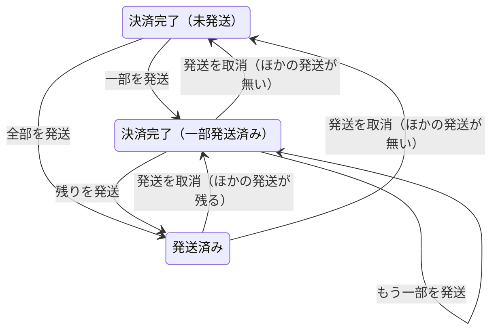

# 部分発送（グループ E-1）設計書

> 日付: 2026-10-10（設計の承認: 2026-10-10）
> 分類: architectural（新しい表、発送の DB の処理の作り直し、注文のメールの表の変更、管理画面とお客様の画面の変更を含むため）
> 要望: 在庫の品と受注生産の品が両方ある注文で、在庫の品だけを先に発送できるようにする（ユーザーの要望 2026-10-10）
> 方針: **Shopify と同じ形に近づける。Shopify の仕組みが見つからない所は、業界の定番（ベストプラクティス・デファクトスタンダード）に従う**（ユーザーの指示）
> 全体の決定: [グループ E 全体の設計の決定](2026-10-10-group-e-overview-design.md) の 1〜3。この設計書は、その決定を E-1 の作りに落としたもの
> 関連: [グループ A 設計書](2026-09-26-order-payment-reconciliation-design.md)（注文の状態）、[グループ D 設計書](2026-10-09-order-email-outbox-design.md)（注文のメール。この設計で発送のメールの決まりを変える）

---

## 概要

今は、1つの注文を1回で全部発送する作りになっている。注文の行に配送業者と伝票番号が1組だけある。受注生産の品は仕上がるまで数週間〜2か月以上かかるので、同じ注文の在庫の品まで待たせてしまう。

この設計は、発送を Shopify の Fulfillment と同じく「1回ごとの記録」にして、商品ごとに発送した数を数える。在庫の品を先に送り、受注生産の品は仕上がってから送れるようにする。

| 項目 | 決定 | 根拠 |
|---|---|---|
| 発送の記録 | 発送の表と発送の商品の表を足す。1つの注文に何回でも発送できる | Shopify の Fulfillment（1回の出荷。分けて送ると複数になる） |
| 注文の状態 | 値は増やさない。全部送ったら「発送済み」。途中は「決済完了」のまま、画面に「一部発送済み」と出す | Shopify は支払いの状態と発送の状態を別に持つ（Partially fulfilled） |
| 発送の画面 | 商品と未発送の数を並べ、今回送る数を入れる。最初は在庫の品だけが入る | Shopify の Mark as fulfilled。最初の数はユーザーの決定 |
| 二重の発送を防ぐ | 画面を開いた時に作る番号（重複防止キー） | Shopify と Stripe の重複防止キー |
| 発送のメール | 発送ごとに1通。その発送の商品と数、残りがある時は残りの案内 | Shopify の Shipping confirmation |
| 発送の取消 | 注文の履歴から取り消せる。その商品は未発送に戻る | Shopify の Cancel fulfillment |
| 在庫の画面 | すぐ出せる数・引き当て済み・手元の数・受注生産の4つと、誰が・どの注文で動かしたかが分かる履歴 | Shopify の在庫の状態と在庫の調整の履歴、NetSuite の Back Ordered |
| 受注生産の数 | 未入金と入金済みの注文の、まだ発送していない数（返金した分を引くのは E-2） | Shopify の Committed |
| 前からの発送済みの注文 | 全部の商品を1回で送った発送の記録を、移行の時に作る | 前の注文の履歴・お客様の画面・メールの再送を今と同じに動かすため |

---

## 1. 目的と範囲

### 1-1 要望

- 在庫の品と受注生産の品が両方ある注文で、在庫の品だけを先に送りたい（2026-10-10）
- 作りは Shopify と同じ形に近づける

### 1-2 ユーザーが決めたこと（2026-10-10）

| 決めたこと | 中身 |
|---|---|
| 部分発送にする | 在庫の品を先に送れるようにする |
| 発送の画面の最初の数 | 在庫の品が残っている間は、在庫の品だけが入る（受注生産の品は0）。在庫の品が残っていなければ、残りが全部入る |
| 発送の取消 | 入れる |
| 受注生産の数 | Shopify の「引き当て済み（Committed）」と同じ数え方にする |
| 在庫の画面 | 4つの数と、Shopify の在庫の調整の履歴に寄せた履歴を出す |
| 作る順番 | E-1（この設計）を、グループ E の中で最初に作る |

### 1-3 成功の基準

1. 在庫の品と受注生産の品がある注文で、在庫の品だけを発送できる。発送の後も注文は「決済完了」のままで、一覧に「一部発送済み」と出る
2. 残りを発送すると、注文が「発送済み」になる
3. 未発送の数より多くは発送できない（画面と DB の両方で止める）
4. 発送ごとに、発送のメールが1通だけ届く。そのメールには、その発送の商品と数・配送業者・伝票番号が書いてある。未発送の品が残る時は、残りの案内も書いてある
5. 発送を取り消すと、その商品は未発送に戻る。「発送済み」の注文は「決済完了」に戻る。まだ送っていないその発送のメールは送られない
6. 同じ発送の画面から二重に押しても、発送は1回だけ記録される
7. お客様の注文の画面に、発送ごとの配送業者・伝票番号・追跡のリンクと、準備中の商品が出る
8. 在庫の画面に4つの数が出る。受注生産の数には、発送済み・キャンセル・放棄の注文と、支払い手続き中の注文は入らない
9. 前からの発送済みの注文も、移行の後に注文の履歴・お客様の画面・発送のメールの再送が今と同じに動く

### 1-4 範囲の外

| 項目 | どこで扱うか |
|---|---|
| 返金した数を未発送の数から引く、返金の画面、支払い済みの注文のキャンセル | E-2 |
| 返品 | E-3 |
| 伝票番号の直し、配達中・配達済みなどの配送の状況 | E-4 |
| ログインしなくても見られる注文の状況のページ | E-5 |
| 海外への発送 | 範囲の外 |
| 発送の記録を法令のアーカイブ（電子帳簿の保存）に入れる | 法令対応は後回しの方針。後で足す |
| 発送済みの注文が売上の集計（KPI・管理会計）から外れる前からの不具合 | 別の作業として切り出した |
| 在庫の手の調整の窓口に、CSRF の確かめと回数の制限が無い前からの穴 | 範囲の外（全体の入口の Origin の確かめはある） |

---

## 2. 実装前の状態（2026-10-10）

- 発送は `public.admin_ship_paid_order(_order_id, _actor_id, _shipping_carrier, _tracking_number, _notify_customer)`（`supabase/migrations/20261009095736_order_email_enqueue.sql`）が、注文の行を「決済完了 → 発送済み」にし、配送業者と伝票番号を注文の行に書く。商品の数は見ない。発送できない時は空の結果を返すだけで、理由が分からない
- 注文の商品（`order_items`）は、法令のため一切変えられない（変更を拒むトリガーがある）。発送した数は別の表に持つしかない
- 発送のメールは、注文のメールの表（`private.order_email_outbox`）の「1注文1種類1行」の索引のため、1注文に1通しか書けない。2通目の予定は黙って捨てられる。メールの材料は、注文の行の配送業者・伝票番号と、注文の全部の商品
- 発送のメールの再送は、注文が「発送済み」の時だけ（DB の関数・TS の表・結合テストの3か所が同じ決まりを持つ）。再送の窓口の中身は `{ kind }` だけ
- 管理画面の「この注文の履歴」は、注文の状態が変わった時の行と、メールの行だけ。状態が変わらない一部の発送は出せない
- 管理画面の一覧の窓口は、商品の名前と数だけを返す。「発送済み」の絞り込みが窓口に渡っていない（前からの小さな不具合）
- お客様の注文の画面は、注文の行の配送業者・伝票番号を1組だけ出す
- 受注生産の数（view `variant_backorder_summary`）は、注文の状態に関係なく、全部の受注生産の行を足している（前からの不具合）
- 在庫の履歴は、最後の50件の理由・増減・備考・時刻だけで、誰が・どの注文・変わった後の数は無い
- 全額返金の取り消しで注文を戻す時は、`orders.shipped_at` の有無で「発送済み」か「決済完了」かを決める（SQL の `apply_order_refund_projection` と TS の `order-refund-sync.ts`）
- `orders` の更新のトリガー `reject_shipping_without_address` は、状態が「発送済み」に変わる時に配送先を確かめる
- 保留中の SQL `supabase/pending/harden_order_state_transitions.sql`（まだ当てていない）に、注文の状態の移り方の表がある

---

## 3. 発送の記録（設計1）

### 3-1 表

`public.order_fulfillments`（発送。Shopify の Fulfillment）

| 列 | 型と決まり | 中身 |
|---|---|---|
| id | uuid、主キー | 発送の番号 |
| order_id | uuid NOT NULL、`orders(id)` ON DELETE RESTRICT | 注文 |
| number | integer NOT NULL、1以上、`(order_id, number)` で一意 | その注文の何回目の発送か。取り消した分の番号は使い回さない |
| request_key | uuid NOT NULL、一意 | 発送の画面を開いた時に作る重複防止キー。移行で作る行は新しく作る |
| shipping_carrier | text、yamato・sagawa・japanpost | 配送業者 |
| tracking_number | text、`^[0-9A-Za-z-]{1,64}$` | 伝票番号 |
| notify_customer | boolean NOT NULL | 発送のメールを送るか |
| completes_order | boolean NOT NULL | この発送で未発送の数が全部0になったか。メールの残りの案内に使う |
| shipped_at | timestamptz NOT NULL、既定は今 | 発送した時刻 |
| created_by | uuid、`auth.users(id)` ON DELETE SET NULL | 実行した人。前からの記録では空のことがある |
| cancelled_at | timestamptz | 取り消した時刻 |
| cancelled_by | uuid、`auth.users(id)` ON DELETE SET NULL | 取り消した人。取り消していない時は空 |
| legacy | boolean NOT NULL、既定は false | 移行で作った記録 |

- CHECK: `legacy OR (shipping_carrier IS NOT NULL AND tracking_number IS NOT NULL)`（新しい発送は必ず両方を持つ）
- CHECK: `cancelled_by IS NULL OR cancelled_at IS NOT NULL`

`public.order_fulfillment_lines`（発送の商品。Shopify の FulfillmentLineItem）

| 列 | 型と決まり | 中身 |
|---|---|---|
| fulfillment_id | uuid NOT NULL、`order_fulfillments(id)` ON DELETE RESTRICT | 発送 |
| order_item_id | uuid NOT NULL、`order_items(id)` ON DELETE RESTRICT | 注文の商品 |
| quantity | integer NOT NULL、1以上 | 送った数 |

- 主キー: `(fulfillment_id, order_item_id)`。`order_item_id` に索引を付ける

### 3-2 商品ごとの数

数え方は DB の関数 `private.order_line_fulfillment(_order_id uuid)` の1か所にまとめる。発送の関数・窓口・在庫の数・お客様の画面は、全部この関数の数を使う。

| 返す列 | 中身 |
|---|---|
| order_item_id・variant_id・fulfillment_type・quantity | 注文の商品の値 |
| shipped | 取り消していない発送の、その商品の数の合計 |
| unshipped | quantity − shipped（E-2 で、発送前に返金した数も引く） |

### 3-3 注文の状態と発送の状態



- 注文の状態の値（`order_status`）は増やさない。一部だけ送った間は「決済完了」のまま
- 画面に出す発送の状態は、記録から出す
  - 決済完了で、取り消していない発送が無い: 未発送
  - 決済完了で、取り消していない発送がある: 一部発送済み
  - 発送済み: 発送済み
- 未発送の数が全部0になる発送（最後の発送）で、注文を「発送済み」にする
  - `shipped_at` にその時刻、`shipping_carrier`・`tracking_number` にその発送の値を書く
  - 今の列の意味（全部を送った時の値）を守る。全額返金の取り消しの戻し先の決まりと、配送先を確かめるトリガーが、そのまま使える
- 発送を取り消して未発送が出たら、「発送済み」の注文を「決済完了」に戻し、`shipped_at`・`shipping_carrier`・`tracking_number` を空にする
- 注文の改訂（`order_revisions`）に残す理由は、`admin_create_fulfillment` と `admin_cancel_fulfillment`

### 3-4 守り

- 2つの表は `public` に置き、行の守り（RLS）を有効にする。お客様とログインした人（anon・authenticated）からは全部拒み、権限も外す
- アプリ（service_role）には読むこと（SELECT）だけを許す。書くのは、SECURITY DEFINER の DB の関数だけ（在庫の台帳 `stock_movements` と同じ考え）
- 発送の商品は追記だけ（変更と削除をトリガーで拒む）。発送の行は削除をトリガーで拒む
- 発送の商品を書く時に、その商品の注文と発送の注文が同じかを、トリガーでも確かめる（関数の確かめに重ねる守り）

### 3-5 突き合わせ

| 所 | Shopify | この設計 |
|---|---|---|
| 発送の単位 | Fulfillment は1回の出荷。分けて送ると複数になる | 同じ |
| 発送の商品 | FulfillmentLineItem（商品と数） | 同じ |
| 発送の状態 | Unfulfilled・Partially fulfilled・Fulfilled | 未発送・一部発送済み・発送済み。注文の状態の値は増やさず、記録から出す |
| 発送の場所 | location を持つ | 持たない（店の発送の場所は1か所） |
| 発送の状況（輸送中など） | FulfillmentEvent | E-4 で足す |

---

## 4. 発送する（設計2）

### 4-1 発送の画面（Shopify の Mark as fulfilled）

- 一覧の「発送済みにする」で開く（ボタンと画面の題は今のまま）
- 開いた時に「発送の材料」を窓口から読み、重複防止キー（UUID）を作る
- 未発送の数が1以上の商品ごとに、次を並べる
  - 商品名・色・サイズ
  - 「在庫」か「受注生産」の印
  - 未発送の数
  - 今回送る数の入力（0〜未発送の数）
- 最初に入る数
  - 在庫の品で、未発送が残る商品がある: 在庫の品は未発送の数、受注生産の品は0
  - 在庫の品で、未発送が残る商品が無い: 全部の商品を未発送の数にする
- 今回送る数の合計を出す。合計が0で「発送する」を押した時は、理由を画面に出す
- 配送業者・伝票番号・「お客様に発送のメールを送る」（最初からチェックが入っている）は今のまま
- 誤りは、開いている画面の中に出す（`role="alert"`）
- 答えが分からない時（通信が切れた・時間が切れた・500番台）
  - 入力を変えられないようにする
  - 「もう一度確かめる」（同じ番号で送り直す）と「閉じる」だけを出す
- 成功したら画面を閉じ、一覧を読み直す（今は手元の表示を変えるだけだが、一部発送では残りの数が変わるため）
- スマホの幅（390）では、画面いっぱいに開く

### 4-2 窓口

| 窓口 | 中身 |
|---|---|
| GET `/api/admin/orders/[id]/fulfillments` | 発送の材料。注文番号・注文の状態・商品ごとの数（3-2）・発送の一覧（取り消した分も含む）・発送できない理由（配送先の不足・支払額の確かめ） |
| POST `/api/admin/orders/[id]/fulfillments` | 発送する |
| POST `/api/admin/orders/[id]/fulfillments/[fulfillmentId]/cancel` | 発送を取り消す（5章） |

発送する時の中身:

| 項目 | 決まり |
|---|---|
| requestKey | UUID |
| carrier | yamato・sagawa・japanpost |
| trackingNumber | 前後の空白を除いて1〜64文字、英数字とハイフン |
| notifyCustomer | 真偽。既定は送る |
| lines | 1〜100行。各行は orderItemId（UUID）と quantity（1〜999の整数）。同じ商品は1行だけ |

- 確かめる順番: 権限（`admin.orders.manage`）→ CSRF → 回数の制限（送信元ごと・管理者ごと、10分に60回）→ 注文の番号 → 中身 → DB の関数
- GET は `admin.orders.manage` の権限で読む（発送の操作と同じ人だけ）
- 今の `POST /api/admin/orders/[id]/status` の発送（`status: 'shipped'`）の道はなくす。この窓口は未入金の注文の取消だけになる

答え:

| 場合 | HTTP | 画面に出す言葉 |
|---|---|---|
| 発送した | 200 `{ fulfillmentId, number, completesOrder, orderStatus }` | — |
| 同じ番号の送り直し（同じ中身） | 200（前と同じ答え） | — |
| 注文が無い | 404 | 注文が見つかりません。 |
| 発送できる状態でない（決済完了でない・未発送が無い） | 409 | 発送できる状態ではありません。一覧を更新してください。 |
| 配送先が足りない | 409 | 配送先の必須項目が足りないため発送できません。 |
| 支払額の確かめが残っている | 409 | 支払額の確認（要対応）が済むまで発送できません。 |
| 未発送の数を超える・注文に無い商品 | 409 | 発送する数が未発送の数を超えています。一覧を更新してください。 |
| 同じ番号で中身が違う | 409 | 前の発送と内容が違います。画面を開き直してください。 |
| 入力の誤り | 400 | 入力を確かめてください。 |
| それ以外 | 500 | 発送の記録に失敗しました。 |

- 監査: `admin.orders.fulfillment.create`。結果・発送の番号・何回目か・配送業者・メールを送るか・全部送ったか・商品の行の数を残す。伝票番号とお客様の個人情報は入れない
- 成功の後に、注文のメールの worker を動かす（`scheduleOrderEmailDelivery()`）

### 4-3 DB の関数 `public.admin_create_fulfillment`

引数: `_order_id uuid, _actor_id uuid, _request_key uuid, _shipping_carrier text, _tracking_number text, _notify_customer boolean, _lines jsonb`
返す: `fulfillment_id uuid, number integer, completes_order boolean, order_status public.order_status, replayed boolean`

1. 引数を確かめる（空・形・行の数・同じ商品の重複）。誤りは決まった言葉で止める
2. 注文の行に鍵をかける（`FOR UPDATE`）。無ければ `ORDER_NOT_FOUND`
3. 同じ `request_key` の発送があれば、同じ注文・同じ中身（配送業者・伝票番号・メール・商品と数）なら前の結果を返す（`replayed = true`）。違えば `FULFILLMENT_REQUEST_MISMATCH`
4. 注文の状態を確かめる
   - 決済完了でなければ `ORDER_NOT_SHIPPABLE`
   - 配送先が足りなければ `SHIPPING_ADDRESS_INCOMPLETE`（`private.order_has_required_shipping_fields`。一部の発送でも毎回確かめる）
   - 支払額の違いの要対応が残っていれば `PAYMENT_REVIEW_REQUIRED`
5. 商品ごとに確かめる: 注文の商品でなければ `LINE_NOT_IN_ORDER`、未発送の数を超えれば `QUANTITY_EXCEEDS_UNSHIPPED`
6. 何回目かを決め（その注文の最大＋1）、発送と発送の商品を書く。`completes_order` は「この発送の後の未発送の合計が0か」
7. `completes_order` なら、注文を「発送済み」にする（3-3）
8. お客様に知らせるなら、この発送の発送のメールの予定を書く（6章）
9. 結果を返す

- 権限: service_role だけが実行できる。`search_path` は空にする
- 発送は在庫を動かさない（注文の時に確保済み）ので、色・サイズの在庫には鍵をかけない

### 4-4 突き合わせ

| 所 | Shopify | この設計 | 根拠 |
|---|---|---|---|
| 発送の画面で数を入れる | 入れる。一部だけの発送ができる | 同じ | — |
| 最初に入る数 | 未発送の全部（スマホのアプリの説明） | 在庫の品が残る間は在庫の品だけ | ユーザーの決定。Shopify では、在庫の無い品に発送の保留（理由: 在庫切れ）を付けて同じことをする |
| 伝票番号 | 入れなくてもよい | 必ず入れる（今のまま） | 店は追跡できる送り方だけを使う。直しは E-4 |
| 1つの発送の配送業者 | 1つ | 1つ | — |
| 二重の防止 | 在庫の調整と返金では、重複防止キーが必須（2026-04 から） | 発送にも同じキーを使う | 一部発送では、二重押しが2回の発送になってしまう |

---

## 5. 発送の取消（設計3）

### 5-1 画面

- 「この注文の履歴」の発送の行に、「この発送を取り消す」を出す（Shopify の発送済みの欄の Cancel fulfillment と同じく、注文の中の操作にする）
- 押すと確かめの画面を出す
  - 文: 「発送（n回目）を取り消し、その商品を未発送に戻します。お客様にメールは送りません。送った発送のメールがあれば、店からお客様に連絡してください。」
  - ボタン: 「取り消す」「やめる」
- 取り消せない時は、理由を確かめの画面の中に出す

### 5-2 窓口

- POST `/api/admin/orders/[id]/fulfillments/[fulfillmentId]/cancel`（中身は無い）
- 守りは 4-2 と同じ。回数の制限は10分に30回
- 答え: 200 `{ outcome: 'cancelled' | 'already_cancelled', orderStatus }`、404（注文か発送が無い）、409（取り消せない）、500
- 監査: `admin.orders.fulfillment.cancel`（結果・発送の番号・何回目か）

### 5-3 DB の関数 `public.admin_cancel_fulfillment`

引数: `_order_id uuid, _fulfillment_id uuid, _actor_id uuid`
返す: `outcome text, order_status public.order_status`

1. 注文の行に鍵をかける。発送がその注文の物でなければ `FULFILLMENT_NOT_FOUND`
2. もう取り消してあれば `already_cancelled` を返す（何度押しても同じ結果）
3. 注文が決済完了か発送済みでなければ `FULFILLMENT_CANCEL_NOT_ALLOWED`（E-2・E-3 で、返品や発送後の返金に使われた発送を拒む条件を足す）
4. 取り消した時刻と人を書く
5. 注文が「発送済み」なら「決済完了」に戻す（3-3）
6. この発送の、まだ送っていない発送のメール（送る前・やり直し待ち）を「取りやめ」（理由 `fulfillment_cancelled`）にする。送っている途中の行は、worker が中身を作る時に取消を見て取りやめる

### 5-4 突き合わせ

| 所 | Shopify | この設計 |
|---|---|---|
| 取消 | 発送済みの欄の Cancel fulfillment。注文は未発送に戻る | 同じ（注文は決済完了に戻る） |
| 送り状 | 買った送り状は、先に無効にする | 送り状は無い |
| お客様への知らせ | 資料には無い | 送らない。店から連絡する |

---

## 6. メール（設計4）

### 6-1 発送のお知らせを発送ごとにする

注文のメールの表（`private.order_email_outbox`）と関数を、次のように変える。

| 変える所 | 今 | 変えた後 |
|---|---|---|
| 発送の列 | 無い | `fulfillment_id uuid`（`order_fulfillments(id)` ON DELETE RESTRICT）を足す。CHECK: `(kind = 'shipped') = (fulfillment_id IS NOT NULL)` |
| 自動の行の一意 | `(order_id, kind)` で1行 | 発送のメール以外は今のまま。発送のメールは `(fulfillment_id)` で1行 |
| 手の再送の一意 | `(order_id, kind)` で送信待ち1行 | `(order_id, kind, fulfillment_id)` で送信待ち1行（`NULLS NOT DISTINCT`） |
| 予定を書く関数 | `private.enqueue_order_email(_order_id, _kind, _variant)` | `_fulfillment_id` を足す。発送のメールは必ず渡す |
| 取り出しの関数 | `claim_order_email` は発送の番号を返さない | `fulfillment_id` を返す |
| 履歴の関数 | `list_order_email_history` | `fulfillment_id` と何回目の発送かを返す |
| 取りやめの関数 | `skip_order_email` の理由 | 発送のメールに `fulfillment_cancelled` を許す |

- worker は、取り出した行の `fulfillment_id` で材料を読む
  - 発送のメールの材料: 注文の行（宛名・宛先）、発送（配送業者・伝票番号・全部送ったか・取消）、発送の商品（名前・色・サイズ・数）
  - 発送が取り消されていたら、送らずに「取りやめ」（`fulfillment_cancelled`）にする
- 発送のメールの中身

```text
件名: 【Le Fil des Heures】商品を発送いたしました（注文番号）

（宛名）

ご注文の商品を発送いたしました。

注文番号: （注文番号）

発送した商品:
・（商品名）（色 / サイズ） x（数）

配送業者: （配送業者）
追跡番号: （伝票番号）
追跡はこちら: （追跡のリンク）

※ 追跡情報は反映までに数時間かかる場合があります。
（未発送の品が残る時だけ）残りの商品は、準備ができ次第お送りします。

（お問い合わせの案内）

Le Fil des Heures
```

- 値段は書かない。一部だけ送ると、注文の行の値段と送った数が合わないため（Shopify の発送のお知らせも、商品と数を並べる）
- 件名は、決まった文と注文番号だけ（グループ D の決まり）

### 6-2 再送

- 再送の窓口の中身を `{ kind, fulfillmentId? }` にする。発送のメールは `fulfillmentId` が要る
- DB の `request_order_email_resend` に `_fulfillment_id` を足す。発送のメールを再送できるのは、次を全部満たす時だけ
  - 発送がその注文の物で、取り消していない
  - 注文が決済完了か発送済み
  - その発送のメールに、送った（または送れなかった）行がある
- TS の再送できる状態の表は、発送のメールを「決済完了・発送済み」にする。発送が取り消されていないことは、DB の関数と履歴の組み立てで見る
- 履歴の画面では、発送のメールの行に「発送（n回目）」と出し、その発送のメールを再送する

### 6-3 注文の確認のメールに1行足す

- 在庫の品と受注生産の品が両方ある注文に、ご注文内容の下へ「在庫の品を先にお送りし、受注生産の品は仕上がり次第お送りします。」を足す。入金待ちのメールにも同じ1行を足す
- 在庫を確保し直せなかった注文（`review_reason = 'stock_not_reserved'`）は、引き渡しの時期を書かない今の決まりに合わせて、この1行も書かない

### 6-4 前からのメール

- 移行で作る前からの発送の記録に、前の発送のメールの行を結び付ける（6-1 の CHECK を満たすため）

### 6-5 突き合わせ

| 所 | Shopify | この設計 |
|---|---|---|
| 発送のお知らせ | 発送ごとに送る（Shipping confirmation） | 同じ |
| 再送 | 注文のタイムラインから送り直せる | 履歴から、発送ごとに送り直せる |
| 分けて送る案内 | 無い | 注文の確認に1行足す（グループ E 全体の決定） |

---

## 7. 画面（設計5）

### 7-1 注文の一覧

- 決済完了の注文に、発送の印「未発送」か「一部発送済み」を足す（発送済みは、今の状態の印のまま）
- 商品の欄は「ブラウス（白 / M）×2（発送済み 1）」と出す。発送済みの数が0の時は今と同じ
- 「発送済みにする」を出すのは、決済完了で、未発送の数があり、配送先がそろい、支払額の確かめが残っていない時
- 窓口は、商品の行の番号・色・サイズ・在庫か受注生産か・発送済みの数と、注文の発送の状態を返す。発送の数は、アプリが service_role で読む
- 「発送済み」の絞り込みを、窓口に渡す（前からの小さな不具合を直す）
- CSV の書き出しの商品の欄は、未発送の数にする（一部発送済みの注文で、送った品をもう一度詰めないため）
- 商品の行の React の key を、注文の商品の番号にする（同じ商品の色違いで重なるため）

### 7-2 注文の履歴

- 発送の行: 「発送（n回目）」、配送業者、伝票番号、商品と数、操作した人、メールを送るか、全部送ったか、取り消し済みの印。取り消せる時は「この発送を取り消す」
- 発送の取消の行: 「発送（n回目）を取り消しました」、操作した人
- 発送のメールの行: 「発送（n回目）のメール」
- 状態の行で「発送済み → 決済完了」（発送の取消）は、説明を「発送の取消」にする
- 窓口: 履歴の材料に、発送の一覧を足す（新しい DB の関数 `public.list_order_fulfillments`。操作した人と取り消した人のメールを含む）

### 7-3 お客様の画面

- 注文の詳しい画面
  - 「配送情報」を発送ごとに出す: 何回目、発送日、配送業者、追跡番号、追跡のリンク、その発送の商品と数
  - 未発送の商品があれば、「準備中の商品」として出す
  - 取り消した発送は出さない
  - 状態は、一部発送済みの注文を「一部発送済み」と出す。進み具合の表示は今のまま（決済完了は「受注」まで）
- 窓口 GET `/api/orders/[id]`
  - 持ち主を確かめた後に、アプリ（service_role）でその注文の発送を読む
  - `shipments`（取り消していない分）と、商品ごとの発送済みの数を返す
  - 注文の行の `shippedAt`・`shippingCarrier`・`trackingNumber` は返すのをやめる（`shipments` に置き換える）
- 一覧の窓口 GET `/api/orders`: 一部発送済みの注文の状態の言葉を「一部発送済み」にする

### 7-4 突き合わせ

| 所 | Shopify | この設計 |
|---|---|---|
| 一覧の発送の状態 | Fulfillment status の印 | 同じ考え |
| 注文のタイムライン | 発送と発送の取消が並ぶ | 同じ |
| お客様の注文の状況 | 発送ごとに分けて出す | 同じ |

---

## 8. 在庫（設計6）

### 8-1 4つの数

| 数 | 求め方 |
|---|---|
| すぐ出せる数 | `item_variants.stock_quantity`（今のまま） |
| 引き当て済み | その色・サイズの注文の商品ごとに、max(0, 確保中の数 − 発送した数) を足す。確保中の数は、台帳の purchase と cancel から出す今の決まり（`private.order_line_reservations`） |
| 手元の数 | すぐ出せる数 ＋ 引き当て済み |
| 受注生産 | 受注生産の注文の商品のうち、注文が未入金（`pending`）か入金済み（`paid`）のものの、未発送の数の合計 |

- DB の関数 `public.list_variant_stock_states(_variant_ids bigint[])` で、引き当て済みと受注生産を返す（service_role だけが実行できる）
- view `variant_backorder_summary` は消す（使っているのは在庫の窓口だけ）
- 画面では、色・サイズごとに4つの数を並べる。言葉の説明を画面に1回だけ書く
  - すぐ出せる数: 今すぐ売れる数
  - 引き当て済み: 注文のために取ってある数
  - 手元の数: 棚に実際にある数
  - 受注生産: これから作る数
- 支払い手続き中の注文も在庫を確保しているので、引き当て済みには入る（品は棚にあるため）。受注生産の数には入れない（Shopify では、支払いが済むまで注文にならないため）

### 8-2 在庫の履歴

- DB の関数 `public.list_item_stock_history(_item_id bigint, _limit integer)` で、新しい順に次を返す
  - 日時、理由、増減、変わった後の数、備考
  - 誰が（管理者のメール。空なら「自動」）
  - どの注文か
- 変わった後の数は、今の在庫数から、その行より後の動きの合計を引いて出す（色・サイズごとに数える）
- 理由の言葉は今のまま（販売・取消・返金・入荷・棚卸調整）。E-2・E-3 で足す
- 注文は、画面で注文番号の形（`toOrderNumber`）にして出す

### 8-3 突き合わせ

| 所 | Shopify | この設計 | 根拠 |
|---|---|---|---|
| 状態の数 | Available・Committed・On hand（ほかに Unavailable・Incoming） | すぐ出せる・引き当て済み・手元・受注生産 | 使えない数と入荷待ちの数は、この店に無い |
| 在庫切れのまま売った数 | Available をマイナスにする | 受注生産として別に持つ | NetSuite も受注残（Back Ordered）を別に持つ。在庫を0より下にしない台帳の作りを守る |
| 履歴 | 日時・できごと・誰・状態ごとの増減と、変わった後の数 | 日時・理由・誰・注文・増減と、変わった後の数（すぐ出せる数の動きだけ） | 発送で台帳を動かさない作りのため |

---

## 9. 前からのデータ（移行）

- 発送した時刻（`orders.shipped_at`）がある注文ごとに、発送の記録を1つ作る（状態が「発送済み」の注文と、発送した後に全額返金で「キャンセル」になった注文）

| 列 | 値 |
|---|---|
| number | 1 |
| shipping_carrier・tracking_number・shipped_at | 注文の行の値 |
| notify_customer | その注文に発送のメールの行があれば true |
| completes_order | true |
| created_by | 注文の改訂で、状態が発送済みになった時の人（無ければ空） |
| legacy | true |
| request_key | 新しく作る |

- 発送の商品は、その注文の全部の商品と数
- 前の発送のメールの行（`kind = 'shipped'`）に、その発送の番号を書く
- 移行の後に確かめること
  - 「発送した時刻がある注文の数」と「前からの発送の記録の数」が同じ
  - 発送のメールの行は、全部が発送の番号を持つ
- 本番に当てる前に、本番の DB で次の数を数える。どちらも0の見込み。0でなければ、当てる前にユーザーに見せる
  - 発送した時刻があるのに、配送業者か伝票番号が空の注文
  - 発送した時刻が無いのに、発送のメールの行がある注文

---

## 10. DB の変更のまとめ

### 10-1 移行の分け方

| 移行 | 中身 |
|---|---|
| A（発送の記録） | 2つの表と守り・トリガー、`order_line_fulfillment`、`admin_create_fulfillment`、`admin_cancel_fulfillment`、`list_order_fulfillments`、`list_variant_stock_states`、`list_item_stock_history`、前からの発送の記録 |
| B（発送のメール） | 注文のメールの表の列・CHECK・索引、`enqueue_order_email`・`claim_order_email`・`list_order_email_history`・`request_order_email_resend`・`skip_order_email` の変更、前の発送のメールの行の結び付け、`admin_ship_paid_order` と `variant_backorder_summary` を消す |

### 10-2 関数

| 関数 | 新規・変更・削除 | 実行できる人 |
|---|---|---|
| `private.order_line_fulfillment(uuid)` | 新規 | 関数の中だけ |
| `public.admin_create_fulfillment(uuid, uuid, uuid, text, text, boolean, jsonb)` | 新規 | service_role |
| `public.admin_cancel_fulfillment(uuid, uuid, uuid)` | 新規 | service_role |
| `public.list_order_fulfillments(uuid)` | 新規 | service_role |
| `public.list_variant_stock_states(bigint[])` | 新規 | service_role |
| `public.list_item_stock_history(bigint, integer)` | 新規 | service_role |
| `private.enqueue_order_email` | 変更（`_fulfillment_id` を足す） | 関数の中だけ |
| `public.claim_order_email` | 変更（返す列に `fulfillment_id`） | service_role |
| `public.list_order_email_history` | 変更（返す列に発送の番号と何回目か） | service_role |
| `public.request_order_email_resend` | 変更（`_fulfillment_id` を足す） | service_role |
| `public.skip_order_email` | 変更（`fulfillment_cancelled` を許す） | service_role |
| `public.admin_ship_paid_order` | 削除 | — |
| view `public.variant_backorder_summary` | 削除 | — |

- 新しい関数は全部 SECURITY DEFINER、`search_path` は空。PUBLIC・anon・authenticated から実行の権限を外す
- 返す列を変える関数は、消してから作り直し、権限を付け直す

### 10-3 保留の SQL の直し

- `supabase/pending/harden_order_state_transitions.sql` の状態の移り方の表に、「発送済み → 決済完了（発送の取消）」を足す。`admin_ship_paid_order` の名前を新しい関数に直す
- `tests/unit/migrations/order-state-transition-hardening.test.ts` も合わせる

---

## 11. 試験

- **計算の部品**
  - 発送の画面の最初の数（在庫の品だけ・残り全部）
  - 商品ごとの数の出し方
  - 発送のメールの文面（残りあり・なし・前からの記録）
  - 注文の確認の1行（両方ある・片方だけ・在庫を確保し直せなかった）
  - 履歴の組み立て（発送・取消・発送ごとのメール・再送できるか）
  - 在庫の4つの数の出し方と、履歴の変わった後の数
- **窓口**
  - 権限・CSRF・回数の制限・入力の検証
  - DB のエラーの言葉から HTTP と画面の言葉への対応
  - 同じ番号の送り直し
  - 監査に伝票番号と個人情報を入れないこと
- **DB**（手元の Supabase で、DB の確かめを全部流す）
  - 一部の発送 → 残りの発送 → 発送済み
  - 未発送を超える数・注文に無い商品・同じ番号の送り直し・中身の違う同じ番号
  - 配送先の不足・支払額の要対応
  - 発送の取消（未発送に戻る・発送済みが決済完了に戻る・送っていないメールの取りやめ・2回目は `already_cancelled`）
  - 同じ注文に同時に2つの発送（鍵で1つずつ進む）
  - 発送のメールが発送ごとに1行・再送の条件
  - 前からのデータの写し
  - 在庫の4つの数と受注生産の数（注文の状態ごと）・履歴の変わった後の数
  - 権限（service_role だけが関数を実行でき、表を読める。anon・authenticated は読めない）
- **E2E**: 12章の表。本番と同じ作り方の画面、手元の Supabase、390・768・1280 の3つの幅で流す

---

## 12. 要求と E2E

| 要求 | 中身 | 主な受け付け基準 | E2E |
|---|---|---|---|
| FREQ-439 | 在庫の品を先に送れる部分発送 | 発送の画面に商品と未発送の数が出る／最初は在庫の品だけが入る／一部の発送で「一部発送済み」と残りの発送のボタンが出る／残りの発送で「発送済み」になる／未発送を超える数は断られる | `e2e/FR-ADMIN-068-partial-fulfillment.spec.ts` |
| FREQ-440 | 発送ごとの発送のお知らせ | 発送ごとに1通／その発送の商品と数が書いてある／残りの案内がある／知らせない発送には送らない | `e2e/FR-ADMIN-069-fulfillment-shipping-email.spec.ts`（手元の DB と Mailpit） |
| FREQ-441 | 発送の取消 | 履歴から取り消せる／未発送に戻る／発送済みが決済完了に戻る／お客様にメールが行かない | `e2e/FR-ADMIN-070-fulfillment-cancel.spec.ts` |
| FREQ-442 | お客様の注文の画面の、発送ごとの配送情報 | 発送ごとの配送業者・追跡番号・リンク・商品が出る／準備中の商品が出る／取り消した発送は出ない | `e2e/FR-ACCOUNT-032-order-shipments.spec.ts` |
| FREQ-443 | 在庫の4つの数と在庫の履歴 | 4つの数が出る／受注生産は発送済み・キャンセル・放棄・支払い手続き中を数えない／履歴に誰・注文・変わった後の数が出る | `e2e/FR-ADMIN-071-inventory-states.spec.ts` |
| FREQ-444 | 注文の確認のメールの、分けて送る案内 | 在庫の品と受注生産の品が両方ある注文だけに1行が入る | `e2e/FR-CHECKOUT-050-split-shipment-notice.spec.ts`（手元の DB と Mailpit） |

- 合わせて直す今の E2E: FR-ADMIN-050（発送の画面）、FR-ADMIN-066（DB の関数の名前と発送ごとのメール）、FR-ADMIN-051・065（一覧と履歴の形）、FR-ACCOUNT-031（配送情報の形）
- 今の FREQ-267（発送と伝票番号）・FREQ-438（発送のメールを送るかの選択）の受け付け基準は、新しい要求の行と E2E に引き継ぐ

---

## 13. 文書の直し

| 文書 | 直す所 |
|---|---|
| `docs/02_Requirements/requirements.md` | FREQ-439〜444 の行を足す |
| `docs/03_BasicDesign/data/er.md` | 発送の2つの表と外部キー、表の数、受注生産の view を消したこと |
| `docs/03_BasicDesign/api/api-spec.md` | 発送の窓口、注文の状態の窓口から発送を除くこと、お客様の注文の詳しい窓口の答えの形 |
| `docs/03_BasicDesign/api/route-inventory.md` | 発送の窓口の一覧 |
| `docs/04_DetailDesign/states/order-payment.md` | 一部発送の間は決済完了のまま・発送の取消で発送済みから決済完了に戻る・`shipped_at` の意味 |
| `docs/04_DetailDesign/sequence/order-administration.md` | 入金済みの注文の出荷の記録（発送ごと・取消） |
| `docs/04_DetailDesign/pages/16_admin.md` | 発送の画面・履歴・在庫の画面 |
| `docs/04_DetailDesign/pages/13_checkout.md` | 注文のメールは1注文1種類1通（発送のメールは発送ごとに1通） |
| `docs/06_Operations/order-email-operations.md` | 発送のメールは発送ごと・再送は発送ごと |
| `docs/superpowers/specs/2026-10-09-order-email-outbox-design.md` | 発送のメールの決まりがこの設計で変わることを書き足す |

---

## 14. 本番への出し方

1. 全部の確かめ（計算の部品・窓口・DB・E2E の全件）の後に、ユーザーに push の許可を得る
2. push の後に、本番の DB で 9章の数を数えてユーザーに見せ、許可を得てから、移行 A・B を MCP で当てる。版の名前は、当てた版に合わせて改名する
3. 当てた後に、関数・表・索引・権限の指紋を手元と比べる。前からの発送の記録の数を確かめる
4. 注意: 普段の開発は本番の DB を使う。当てた後に開発で発送を試すと、本番に発送のメールの予定が溜まる（グループ D の注意と同じ）。公開前の確かめで件数を見る

---

## 15. 決め事の記録（仕様書を書く時に決めたこと）

| 決めたこと | 理由 |
|---|---|
| 2つの表は `public` に置き、service_role は読むだけ、書くのは DB の関数だけ | 窓口から読みやすく、書く時は必ず関数の確かめを通る（`stock_movements` と同じ） |
| 注文の行の `shipped_at`・`shipping_carrier`・`tracking_number` は、「全部を送った時」の値として残す | 全額返金の取り消しの戻し先、配送先を確かめるトリガー、保留の SQL がこの意味に頼っている |
| 発送ごとに重複防止キーを使う | 一部発送では、二重押しが2回の発送になってしまう |
| 発送の DB の関数は、発送できない理由を決まった言葉で返す（今の空の結果をやめる） | 画面に、発送できない理由を正しく出すため |
| 発送の取消は、注文の履歴の画面から行う | Shopify も発送済みの欄の中の操作。一覧を込み入らせない |
| 発送のメールに値段を書かない | 一部だけ送ると、行の値段と送った数が合わない |
| お客様の窓口から、注文の行の配送の列をやめる | 発送ごとの `shipments` に置き換える。古い1組だけの情報が残ると食い違う |
| 受注生産の数に支払い手続き中を入れず、引き当て済みには入れる | Shopify では支払いの後に注文になる。棚の品は確保している |
| 前からの記録の配送業者・伝票番号は、空を許す | 古い記録が欠けていても移行を止めないため（当てる前に数える） |
